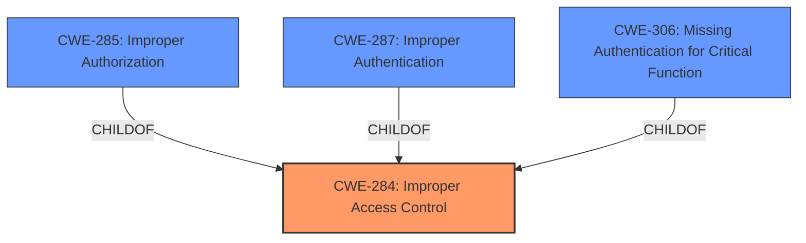

# Raw Analyzer Response for CVE-2021-28814

# Summary
| CWE ID | CWE Name | Confidence | CWE Abstraction Level | CWE Vulnerability Mapping Label | CWE-Vulnerability Mapping Notes |
|---|---|---|---|---|---|
| CWE-284 | Improper Access Control | 0.9 | Pillar | Discouraged | Frequent Misuse, Abstraction |

## Evidence and Confidence

*   **Confidence Score:** 0.9
*   **Evidence Strength:** HIGH

## Relationship Analysis
The primary relationship considered was the hierarchical structure, particularly the parent-child relationship with CWE-284 as a Pillar. While many children of CWE-284 were considered, the provided information was too general to select a more specific CWE.

## Vulnerability Chain
The vulnerability chain is straightforward: a remote attacker exploits an **improper access control** (**rootcause**), leading to a compromise in the security of the software (**impact**).

## Summary of Analysis
The initial assessment centered on identifying a CWE that accurately reflects the **improper access control** vulnerability. The vulnerability description and CVE reference summary clearly point to this **weakness**, but lack specific details to choose a more specific CWE.

The primary CWE match is CWE-284 (Improper Access Control), a Pillar. While the MITRE mapping guidance discourages the use of CWE-284 due to its high-level nature and potential for misuse, the provided vulnerability description lacks the specificity required to select a more detailed Base or Variant CWE. The description simply states "**improper access control**" without specifying the type of access control issue (e.g., authentication, authorization, privilege assignment).

Given the limited information, mapping to a more specific child of CWE-284 would be speculative. Therefore, despite the discouragement, CWE-284 remains the most accurate representation of the vulnerability based on the available evidence.

Other CWEs Considered but Not Used:
- CWE-285 (Improper Authorization): Considered but not used because the description doesn't specifically point to an authorization issue.
- CWE-287 (Improper Authentication): Considered but not used because the description doesn't specifically point to an authentication issue.
- CWE-306 (Missing Authentication for Critical Function): Considered but not used because the description doesn't specifically point to missing authentication.
- CWE-862 (Missing Authorization): Considered but not used because the description doesn't specifically point to missing authorization.
- CWE-863 (Incorrect Authorization): Considered but not used because the description doesn't specifically point to incorrect authorization.
- CWE-732 (Incorrect Permission Assignment for Critical Resource): Considered but not used because the description doesn't specifically point to incorrect permission assignment.

The decision to use CWE-284 is based on the explicit mention of "**improper access control**" in the vulnerability description and CVE reference summary. While the MITRE mapping guidance advises against using such a high-level CWE, the lack of further details necessitates its selection.

Relevant CWE Information:

# Enhanced Context (25 CWEs)
The following CWEs were identified as potentially relevant to this vulnerability:

## CWE-284: Improper Access Control
**Abstraction:** Pillar

### Description
The product does not restrict or incorrectly restricts access to a resource from an unauthorized actor.