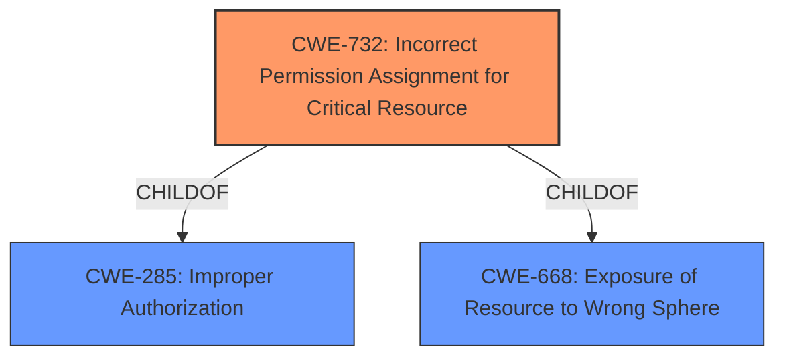

# Analysis for CVE-2021-28821

# Summary
| CWE ID | CWE Name | Confidence | CWE Abstraction Level | CWE Vulnerability Mapping Label | CWE-Vulnerability Mapping Notes |
|---|---|---|---|---|---|
| CWE-732 | Incorrect Permission Assignment for Critical Resource | 0.9 | Class | Allowed-with-Review | Primary CWE. The product specifies permissions for a security-critical resource in a way that allows that resource to be read or modified by unintended actors. |
| CWE-285 | Improper Authorization | 0.6 | Class | Discouraged | Secondary CWE. The product does not perform or incorrectly performs an authorization check when an actor attempts to access a resource or perform an action. |

## Evidence and Confidence

*   **Confidence Score:** 0.9
*   **Evidence Strength:** HIGH

## Relationship Analysis
The primary CWE is CWE-732, which is a child of CWE-285 and CWE-668. This hierarchical relationship shows that CWE-732 is a specific type of authorization issue (CWE-285). While CWE-285 could be used, CWE-732 is more specific to incorrect permission assignments for resources, which aligns better with the vulnerability description.

## Vulnerability Chain
The vulnerability chain starts with the **lack of access restrictions** (CWE-732), which allows a low-privileged attacker to insert malicious software, leading to the execution of that software with elevated privileges.

## Summary of Analysis
The analysis indicates that the primary weakness is CWE-732 (Incorrect Permission Assignment for Critical Resource). This is based on the vulnerability description that highlights a **lack of access restrictions on certain files and/or folders**. The retriever results also list CWE-732 as the top candidate. The description of CWE-732 states: "The product specifies permissions for a security-critical resource in a way that allows that resource to be read or modified by unintended actors." This aligns directly with the **lack of access restrictions** mentioned in the vulnerability description.

CWE-285 (Improper Authorization) was considered as a secondary CWE because CWE-732 is a child of CWE-285. However, CWE-732 provides a more specific description of the vulnerability, focusing on the incorrect assignment of permissions.

The evidence from the vulnerability description: "This vulnerability results from a **lack of access restrictions on certain files and/or folders** in the installation" directly supports the selection of CWE-732. The selection of CWE-732 is at the optimal level of specificity because it directly addresses the root cause of the vulnerability, which is the incorrect assignment of permissions on critical resources.

Other CWEs Considered and Rejected:

*   CWE-798 (Use of Hard-coded Credentials): This was not selected because the vulnerability description does not mention any hard-coded credentials.
*   CWE-284 (Improper Access Control): This was not selected because it is a high-level pillar, and CWE-732 provides a more specific description of the vulnerability.
*   CWE-1386 (Insecure Operation on Windows Junction / Mount Point): While the vulnerability affects Windows, there is no mention of junctions or mount points in the description.
*   CWE-276 (Incorrect Default Permissions): This is similar to CWE-732, but CWE-732 is more general and covers more cases of incorrect permission assignments, not just default permissions.
*   CWE-269 (Improper Privilege Management): This is too broad and doesn't specifically address the permission assignment issue.
*   CWE-502 (Deserialization of Untrusted Data): This is not applicable as the vulnerability doesn't involve deserialization of data.
*   CWE-94 (Improper Control of Generation of Code ('Code Injection')): This is not applicable as the vulnerability doesn't involve code injection.