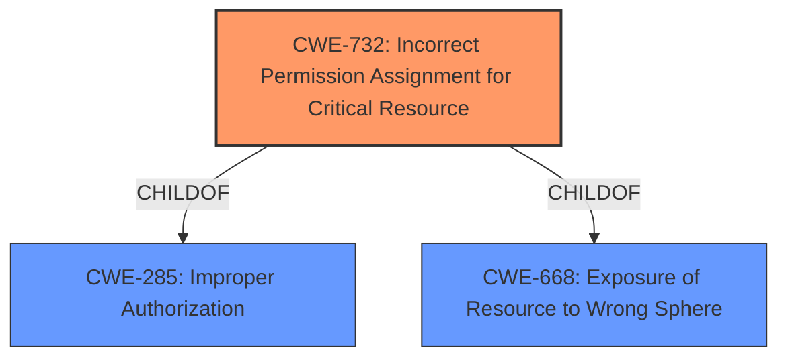

# Analysis Report for CVE-2021-28823

# Vulnerability Analysis Report: CVE-2021-28823

## Description


## Analysis (with Relationship Data)

# Summary
| CWE ID  | CWE Name | Confidence | CWE Abstraction Level | CWE Vulnerability Mapping Label | CWE-Vulnerability Mapping Notes |
|-----------------|-------------------------------------------------------------------|-------------------|-------------------------|-----------------------------------|------------------------------------------------------------------|
| CWE-732 | Incorrect Permission Assignment for Critical Resource | 0.9 | Class | Allowed-with-Review | Primary CWE: The vulnerability stems from a **lack of access restrictions** on certain files/folders in the installation, leading to incorrect permission assignment. |

## Evidence and Confidence

*   **Confidence Score:** 0.9
*   **Evidence Strength:** HIGH

## Relationship Analysis
The primary CWE is CWE-732, which is a Class-level CWE. CWE-732 is a child of CWE-285 (Improper Authorization) and CWE-668 (Exposure of Resource to Wrong Sphere). This indicates a hierarchical relationship where CWE-732 is a more specific case of improper authorization or resource exposure due to incorrect permission assignments.



## Vulnerability Chain
The vulnerability chain starts with a **lack of access restrictions** on files/folders (root cause), leading to incorrect permission assignments (CWE-732), which allows a low-privileged attacker to insert malicious software and execute it with elevated privileges (impact).

## Summary of Analysis
The initial analysis points to CWE-732 as the primary weakness due to the **lack of access restrictions** resulting in incorrect permission assignments. This aligns with the vulnerability description, which mentions that the vulnerability "results from a **lack of access restrictions** on certain files and/or folders in the installation."

The retriever results also list CWE-732 as the top candidate. While CWE-863 (Incorrect Authorization) is listed as the primary CWE match for similar CVE descriptions, the description of CWE-732 more closely aligns with the root cause of the vulnerability as described. CWE-863, while related, is a more general class of weakness. CWE-732 specifies the incorrect permission assignment as the root cause.

The evidence supporting this decision is:
- Vulnerability Description Key Phrases: "**lack of access restrictions**"
- Vulnerability Description: "This vulnerability results from a **lack of access restrictions** on certain files and/or folders in the installation."

CWE-732 is chosen because it is more specific than its parent CWEs and directly addresses the root cause described in the vulnerability.

Other CWEs considered but not used:
- CWE-863 (Incorrect Authorization): While relevant, it is a broader category than CWE-732, which specifically focuses on permission assignment issues.
- CWE-285 (Improper Authorization): Similar to CWE-863, it's a higher-level class and doesn't pinpoint the permission assignment aspect.
- CWE-284 (Improper Access Control): This is a Pillar-level CWE and too general for this vulnerability.
- CWE-427 (Uncontrolled Search Path Element): This could be a secondary weakness if the attacker is placing the malicious software in an uncontrolled search path. But the primary weakness is the **lack of access restrictions**.
- CWE-798 (Use of Hard-coded Credentials): This is irrelevant to the vulnerability description.
- CWE-94 (Improper Control of Generation of Code ('Code Injection')): This is irrelevant to the vulnerability description.


## CWE Relationship Analysis

Current CWEs represent these abstraction levels: .


### Vulnerability Chain Analysis

**Chain starting from CWE-732:**
- 732 (Incorrect Permission Assignment for Critical Resource) - ROOT


**Chain starting from CWE-284:**
- 284 (Improper Access Control) - ROOT


### CWE Relationship Diagram

```mermaid
graph TD
    classDef primary fill:#f96,stroke:#333,stroke-width:2px
    classDef secondary fill:#69f,stroke:#333
    classDef tertiary fill:#9e9,stroke:#333
```


*Report generated on 2025-04-02 04:41:20*
