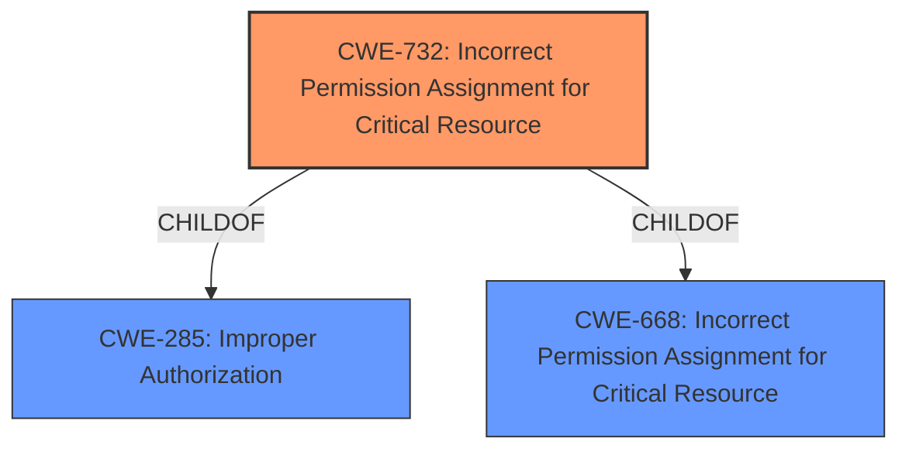

# Raw Analyzer Response for CVE-2021-28825

# Summary
| CWE ID | CWE Name | Confidence | CWE Abstraction Level | CWE Vulnerability Mapping Label | CWE-Vulnerability Mapping Notes |
|---|---|---|---|---|---|
| CWE-732 | Incorrect Permission Assignment for Critical Resource | 0.9 | Class | Allowed-with-Review | Primary CWE |

## Evidence and Confidence

*   **Confidence Score:** 0.9
*   **Evidence Strength:** HIGH

## Relationship Analysis
The primary identified CWE is CWE-732, which is a Class-level CWE. CWE-732 is related to CWE-285 (Improper Authorization) and CWE-668 (Incorrect Permission Assignment for Critical Resource) via ChildOf relationships. Due to the **lack of access restrictions** on certain files and/or folders, CWE-732 is the most appropriate.

## Vulnerability Chain
The vulnerability chain starts with the **lack of access restrictions** on certain files and/or folders, leading to the ability for a low-privileged attacker to insert malicious software, which is then executed with elevated privileges due to the incorrect permission assignment.

## Summary of Analysis
The initial assessment focused on identifying the root cause of the vulnerability, which is a **lack of access restrictions** leading to the Incorrect Permission Assignment. The key phrase "lack of access restrictions" strongly suggests that the files/folders are not correctly configured.

The evidence supporting this assessment is primarily derived from the vulnerability description, which states: "This vulnerability results from a **lack of access restrictions** on certain files and/or folders in the installation."

The graph relationships helped solidify the selection of CWE-732 by placing it in the context of broader access control issues (CWE-285) and resource management (CWE-668).

CWE-732 is chosen because it directly addresses the core issue of incorrect permission assignments on critical resources. While other CWEs like CWE-285 (Improper Authorization) are related, CWE-732 provides a more specific and accurate representation of the vulnerability.

CWE-863 was listed as the primary match for similar CVE Descriptions and was considered. CWE-863's description states "The product performs an authorization check when an actor attempts to access a resource or perform an action, but it does not correctly perform the check." The vulnerability does not state that a check was performed, but that there was a **lack of access restrictions** on certain files and/or folders in the installation.

Relevant CWE Information:

# Enhanced Context (25 CWEs)

## CWE-732: Incorrect Permission Assignment for Critical Resource
**Abstraction:** Class
**Similarity Score**: 1.336
**Source**: sparse

**Description**:
The product specifies permissions for a security-critical resource in a way that allows that resource to be read or modified by unintended actors.

**Mapping Guidance**:
- Usage: Allowed-with-Review
- Rationale: While the name itself indicates an assignment of permissions for resources, this is often misused for vulnerabilities in which "permissions" are not checked, which is an "authorization" weakness (CWE-285 or descendants) within CWE's model [REF-1287].