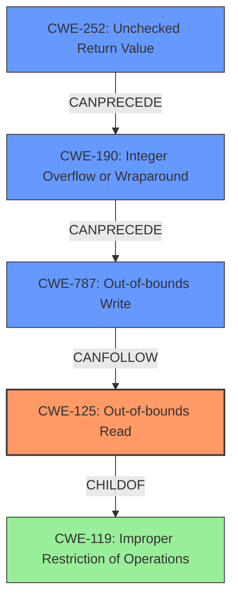

# Analysis Report for CVE-2021-28875

# Vulnerability Analysis Report: CVE-2021-28875

## Description


## Analysis (with Relationship Data)

# Summary
| CWE ID | CWE Name | Confidence | CWE Abstraction Level | CWE Vulnerability Mapping Label | CWE-Vulnerability Mapping Notes |
|---|---|---|---|---|---|
| **CWE-125** | **Out-of-bounds Read** | 0.9 | Base | Primary | Allowed |
| CWE-787 | Out-of-bounds Write | 0.7 | Base | Secondary | Allowed |
| CWE-190 | Integer Overflow or Wraparound | 0.6 | Base | Secondary | Allowed |
| CWE-252 | Unchecked Return Value | 0.5 | Base | Secondary | Allowed |

## Evidence and Confidence

*   **Confidence Score:** 0.8
*   **Evidence Strength:** HIGH

## Relationship Analysis
The primary relationship is between CWE-125 **(Out-of-bounds Read)** and its parent CWE-119 **(Improper Restriction of Operations within the Bounds of a Memory Buffer)**. While CWE-119 is a class-level CWE and generally discouraged, CWE-125 is a base-level CWE and a more specific representation of the **buffer over-read** vulnerability. The other CWEs are related in a chain, starting potentially with CWE-252 **(Unchecked Return Value)**, leading to CWE-190 **(Integer Overflow or Wraparound)**, and ultimately resulting in CWE-787 **(Out-of-bounds Write)**. These relationships help to understand the progression of the vulnerability.



## Vulnerability Chain
The vulnerability chain starts with the **unchecked return value** from the `read` method (CWE-252). This can potentially lead to an **integer overflow** (CWE-190) if the returned value is not properly validated. The overflowed value is then used to increment a length counter beyond the buffer's capacity, potentially leading to an **out-of-bounds write** (CWE-787). The initial **buffer over-read** (CWE-125) might be a more accurate description as the root cause, with the overflow and out-of-bounds write being consequences.

## Summary of Analysis
The analysis initially considered the **buffer overflow** aspect described in the Vulnerability Description. However, after analyzing the CVE Reference Links Content Summary, it's clear that the root cause is the **improper validation** of the return value from the `read` method, which can lead to reading beyond the bounds of the buffer.

The most relevant evidence comes from the "CVE Reference Links Content Summary" section, specifically:

*   "A malicious implementation of the `Read` trait could return a value from its `read` method that is larger than the provided buffer."
*   "The `read_to_end_with_reservation()` function increments an internal length counter (`g.len`) by the return value of the `read` method, without properly checking if the result remains within the bounds of the buffer."
*   "Heap Buffer Overflow: When a malicious `Read` implementation returns a length greater than the available buffer space, `g.len` can be increased beyond the capacity of the underlying `Vec<u8>`. This leads to an out-of-bounds write during the next read operation or a double free due to length exceeding capacity."

This evidence supports the selection of CWE-125 **(Out-of-bounds Read)** as the primary CWE because the return value of the `read` function is not validated, leading to a read operation outside the buffer's intended boundary. CWE-787 **(Out-of-bounds Write)** is a secondary CWE as the **over-read** can trigger an **out-of-bounds write**. CWE-190 **(Integer Overflow or Wraparound)** is included because the vulnerability description mentions the length counter (`g.len`) being incremented without proper bounds checking, which can lead to an integer overflow. CWE-252 **(Unchecked Return Value)** represents the initial oversight of not validating the return value from the read function.

The selected CWEs are at the optimal level of specificity. CWE-125 is a Base-level CWE, providing a detailed description of the **buffer over-read** vulnerability. The other CWEs elaborate the chain of events and are at the Base or Variant level as well.

# Relevant CWE Information:

## CWE-125: Out-of-bounds Read
**Technical Explanation:** The vulnerability occurs because the `read_to_end()` function in Rust does not properly validate the return value from the `Read` trait's `read` method. A malicious or faulty `Read` implementation can return a value larger than the provided buffer, causing the function to read beyond the buffer's boundaries.
**Security Implications:** This can lead to information disclosure, denial of service, or potentially arbitrary code execution if sensitive data is read or if the read operation corrupts memory.
**Relationship:** CWE-125 is a child of CWE-119 **(Improper Restriction of Operations within the Bounds of a Memory Buffer)**.
**Mapping Guidance Influence:** The selection of CWE-125 aligns with the MITRE mapping guidance, which encourages the use of more specific Base or Variant level CWEs over Class level CWEs like CWE-119.

## CWE-787: Out-of-bounds Write
**Technical Explanation:** The `read_to_end_with_reservation()` function increments an internal length counter without checking if the result remains within the bounds of the buffer. When a malicious `Read` implementation returns a length greater than the available buffer space, the internal length counter can be increased beyond the capacity of the underlying `Vec<u8>`, leading to an out-of-bounds write.
**Security Implications:** This can lead to memory corruption, denial of service, or potentially arbitrary code execution.
**Relationship:** Out-of-bounds write is a consequence of the initial read exceeding the bounds of the buffer and the length counter being improperly incremented.
**Mapping Guidance Influence:** The selection of CWE-787 aligns with the MITRE mapping guidance, which encourages the use of more specific Base or Variant level CWEs.

## CWE-190: Integer Overflow or Wraparound
**Technical Explanation:** If the return value from the `read` method is sufficiently large, incrementing the internal length counter can cause an integer overflow, leading to unexpected behavior.
**Security Implications:** An integer overflow can cause the length counter to wrap around to a small value, leading to an out-of-bounds write or read.
**Relationship:** Integer overflow is a consequence of the initial read exceeding the bounds of the buffer and the length counter being improperly incremented.
**Mapping Guidance Influence:** The selection of CWE-190 aligns with the MITRE mapping guidance, which encourages the use of more specific Base or Variant level CWEs.

## CWE-252: Unchecked Return Value
**Technical Explanation:** The `read_to_end()` function in Rust does not check the return value from the `Read` trait's `read` method, which can prevent it from detecting unexpected states and conditions.
**Security Implications:** If an attacker can force the function to fail or otherwise return a value that is not expected, then the subsequent program logic could lead to a vulnerability, because the product is not in a state that the programmer assumes.
**Relationship:** Unchecked Return Value can lead to Integer Overflow or Wraparound and Out-of-bounds Write
**Mapping Guidance Influence:** The selection of CWE-252 aligns with the MITRE mapping guidance, which encourages the use of more specific Base or Variant level CWEs.

## Considered but not used:

*   **CWE-119 (Improper Restriction of Operations within the Bounds of a Memory Buffer):** This CWE is a class-level CWE and is too general for this vulnerability. The more specific CWE-125 **(Out-of-bounds Read)** better describes the root cause.
*   **CWE-121 (Stack-based Buffer Overflow) and CWE-122 (Heap-based Buffer Overflow):** These are variants of buffer overflows, but the provided description doesn't give enough information to determine whether the buffer is allocated on the stack or heap. Since the CVE Reference Links


## CWE Relationship Analysis

Current CWEs represent these abstraction levels: .


### Vulnerability Chain Analysis

**Chain starting from CWE-787:**
- 787 (Out-of-bounds Write) - ROOT


**Chain starting from CWE-121:**
- 121 (Stack-based Buffer Overflow) - ROOT


### CWE Relationship Diagram

```mermaid
graph TD
    classDef primary fill:#f96,stroke:#333,stroke-width:2px
    classDef secondary fill:#69f,stroke:#333
    classDef tertiary fill:#9e9,stroke:#333
```


*Report generated on 2025-04-02 15:38:31*
