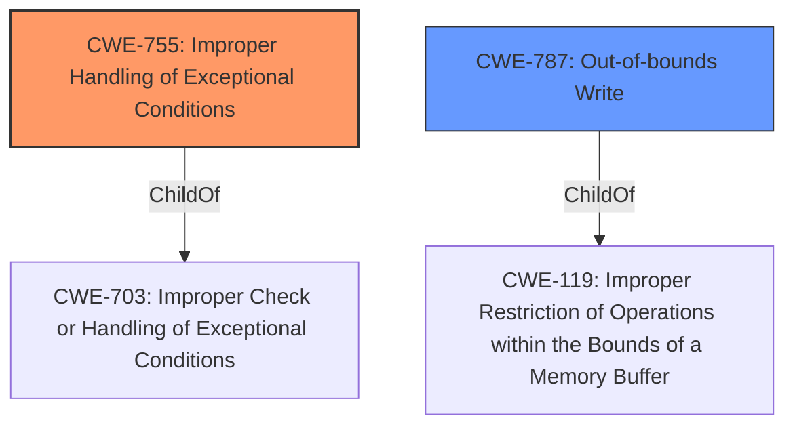

# Enhanced Analysis for CVE-2021-28876

# Summary
| CWE ID | CWE Name | Confidence | CWE Abstraction Level | CWE Vulnerability Mapping Label | CWE-Vulnerability Mapping Notes |
|---|---|---|---|---|---|
| CWE-755 | Improper Handling of Exceptional Conditions | 0.8 | Class | Allowed-with-Review | Primary CWE |
| CWE-787 | Out-of-bounds Write | 0.5 | Base | Allowed | Secondary Candidate |

## Evidence and Confidence

*   **Confidence Score:** 0.8
*   **Evidence Strength:** HIGH

## Relationship Analysis
The primary CWE is CWE-755, a Class-level weakness describing **improper handling of exceptional conditions**. While a more specific Base or Variant CWE would be preferable, the provided information focuses on the failure to properly handle a panic. CWE-787, a Base-level weakness, is considered as a secondary candidate due to the potential for a memory safety violation resulting from the unhandled panic, which could lead to out-of-bounds writes.



## Vulnerability Chain
The vulnerability chain starts with a **panic safety issue** in the `Zip::next()` implementation due to a failure to properly handle a panic. This leads to calling `__iterator_get_unchecked()` more than once for the same index. The chain culminates in a memory safety violation, potentially leading to undefined behavior.

## Summary of Analysis
The initial assessment focused on identifying the root cause of the memory safety violation in Rust's standard library. The vulnerability description highlights a **panic safety issue** within the `Zip::next()` implementation. When the `__iterator_get_unchecked()` call panics, the index isn't incremented, causing subsequent calls to reuse the same index, violating the `TrustedRandomAccess` trait's safety requirement.

The primary CWE selected is CWE-755, **Improper Handling of Exceptional Conditions**. This is based on the description of the **panic safety issue** and the fact that the code **does not properly** handle the panic scenario. The "Vulnerability Description Key Phrases" section identifies "**panic safety issue**" as the **weakness**.

CWE-787, **Out-of-bounds Write**, was also considered because the **impact** is a memory safety violation, but is secondary since there is no direct evidence of an out-of-bounds write occuring, only a memory safety violation.

Ultimately, CWE-755 is the more appropriate choice because it directly addresses the **root cause** of the vulnerability: the **improper handling** of the panic condition. This decision is further supported by the "CVE Reference Links Content Summary" which states the "`Zip::next()` implementation ... has a panic safety issue. If the `__iterator_get_unchecked()` call within `next()` panics, the index is not incremented, and a subsequent call to `next()` will reuse the same index."

Relevant CWE Information:

# Enhanced Context (25 CWEs)
The following CWEs were identified as potentially relevant to this vulnerability:

## CWE-667: Improper Locking
**Abstraction Level**: Class
**Similarity Score**: 0.80
**Source**: dense

**Description**:
The product does not properly acquire or release a lock on a resource, leading to unexpected resource state changes and behaviors.

**Mapping Guidance**:
- Usage: Allowed-with-Review
- Rationale: This CWE entry is a Class and might have Base-level children that would be more appropriate

*Reason for Exclusion:* This CWE is not relevant because the vulnerability does not involve locking mechanisms.

## CWE-404: Improper Resource Shutdown or Release
**Abstraction Level**: Class
**Similarity Score**: 0.77
**Source**: dense

**Description**:
The product does not release or incorrectly releases a resource before it is made available for re-use.

**Mapping Guidance**:
- Usage: Allowed-with-Review
- Rationale: This CWE entry is a Class and might have Base-level children that would be more appropriate

*Reason for Exclusion:* This CWE is not relevant because the vulnerability does not involve resource shutdown or release.

## CWE-833: Deadlock
**Abstraction Level**: Base
**Similarity Score**: 0.76
**Source**: dense

**Description**:
The product contains multiple threads or executable segments that are waiting for each other to release a necessary lock, resulting in deadlock.

**Mapping Guidance**:
- Usage: Allowed
- Rationale: This CWE entry is at the Base level of abstraction, which is a preferred level of abstraction for mapping to the root causes of vulnerabilities.

*Reason for Exclusion:* This CWE is not relevant because the vulnerability does not involve deadlock.

## CWE-662: Improper Synchronization
**Abstraction Level**: Class
**Similarity Score**: 0.76
**Source**: dense

**Description**:
The product utilizes multiple threads or processes to allow temporary access to a shared resource that can only be exclusive to one process at a time, but it does not properly synchronize these actions, which might cause simultaneous accesses of this resource by multiple threads or processes.

**Mapping Guidance**:
- Usage: Discouraged
- Rationale: This CWE entry is a level-1 Class (i.e., a child of a Pillar). It might have lower-level children that would be more appropriate

*Reason for Exclusion:* This CWE is not relevant because the vulnerability is not directly related to synchronization issues between threads or processes.

## CWE-754: Improper Check for Unusual or Exceptional Conditions
**Abstraction Level**: Class
**Similarity Score**: 0.75
**Source**: dense

**Description**:
The product does not check or incorrectly checks for unusual or exceptional conditions that are not expected to occur frequently during day to day operation of the product.

**Mapping Guidance**:
- Usage: Allowed-with-Review
- Rationale: This CWE entry is a Class and might have Base-level children that would be more appropriate

*Reason for Exclusion:* While related to exception handling, CWE-755 is a more direct match to the panic condition described in the vulnerability.

## CWE-226: Sensitive Information in Resource Not Removed Before Reuse
**Abstraction Level**: Base
**Similarity Score**: 0.75
**Source**: dense

**Description**:
The product releases a resource such as memory or a file so that it can be made available for reuse, but it does not clear or "zeroize" the information contained in the resource before the product performs a critical state transition or makes the resource available for reuse by other entities.

**Mapping Guidance**:
- Usage: Allowed
- Rationale: This CWE entry is at the Base level of abstraction, which is a preferred level of abstraction for mapping to the root causes of vulnerabilities.

*Reason for Exclusion:* This CWE is not relevant because the vulnerability does not involve the reuse of resources containing sensitive information.

## CWE-703: Improper Check or Handling of Exceptional Conditions
**Abstraction Level**: Pillar
**Similarity Score**: 0.75
**Source**: dense

**Description**:
The product does not properly anticipate or handle exceptional conditions that rarely occur during normal operation of the product.

**Mapping Guidance**:
- Usage: Discouraged
- Rationale: This CWE entry is extremely high-level, a Pillar.

*Reason for Exclusion:* CWE-755 is a child of this Pillar and is a more appropriate match.

## CWE-367: Time-of-check Time-of-use (TOCTOU) Race Condition
**Abstraction Level**: Base
**Similarity Score**: 0.74
**Source**: dense

**Description**:
The product checks the state of a resource before using that resource, but the resource's state can change between the check and the use in a way that invalidates the results of the check. This can cause the product to perform invalid actions when the resource is in an unexpected state.

**Mapping Guidance**:
- Usage: Allowed
- Rationale: This CWE entry is at the Base level of abstraction, which is a preferred level of abstraction for mapping to the root causes of vulnerabilities.

*Reason for Exclusion:* This CWE is not relevant because the vulnerability does not involve a TOCTOU race condition.

## CWE-755: Improper Handling of Exceptional Conditions
**Abstraction Level**: Class
**Similarity Score**: 0.74
**Source**: dense

**Description**:
The product does not handle or incorrectly handles an exceptional condition.

**Mapping Guidance**:
- Usage: Discouraged
- Rationale: This CWE entry is a level-1 Class (i.e., a child of a Pillar). It might have lower-level children that would be more appropriate

*Reason for Inclusion:* This is the primary CWE because the **weakness** is a **panic safety issue**.


## CWE Relationship Analysis

Current CWEs represent these abstraction levels: .


### Vulnerability Chain Analysis

**Chain starting from CWE-667:**
- 667 (Improper Locking) - ROOT


**Chain starting from CWE-787:**
- 787 (Out-of-bounds Write) - ROOT


### CWE Relationship Diagram

```mermaid
graph TD
    classDef primary fill:#f96,stroke:#333,stroke-width:2px
    classDef secondary fill:#69f,stroke:#333
    classDef tertiary fill:#9e9,stroke:#333
```