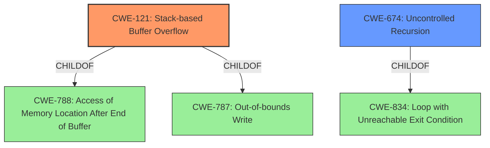

# Raw Analyzer Response for CVE-2021-28903

# Summary
| CWE ID | CWE Name | Confidence | CWE Abstraction Level | CWE Vulnerability Mapping Label | CWE-Vulnerability Mapping Notes |
|---|---|---|---|---|---|
| CWE-121 | Stack-based Buffer Overflow | 1.0 | Variant | Allowed | Primary CWE |
| CWE-674 | Uncontrolled Recursion | 0.7 | Class | Allowed-with-Review | Secondary Candidate |

## Evidence and Confidence

*   **Confidence Score:** 0.9
*   **Evidence Strength:** HIGH

## Relationship Analysis
The primary CWE identified is CWE-121 (Stack-based Buffer Overflow), which is a variant of CWE-788 (Access of Memory Location After End of Buffer) and CWE-787 (Out-of-bounds Write). The vulnerability description clearly indicates a stack overflow due to recursive function calls, making CWE-121 the most specific and appropriate choice. CWE-674 (Uncontrolled Recursion) is a class-level CWE and a parent of CWE-776 (Improper Restriction of Recursive Entity References in DTDs ('XML Entity Expansion')). While recursion is the mechanism, the resulting stack overflow is the direct weakness. The hierarchical relationship supports considering CWE-674 but ultimately favoring the more specific CWE-121.

## Vulnerability Chain
The vulnerability chain starts with **uncontrolled recursion** due to the `lyxml_parse_elem()` function being called recursively without proper limits. This leads to excessive consumption of stack memory, resulting in a **stack overflow**. The final impact is a **denial of service**.

## Summary of Analysis
The primary weakness is a **stack overflow** (CWE-121) caused by **uncontrolled recursion** (CWE-674). The vulnerability description explicitly states "**stack overflow** in libyang <= v1.0.225 can cause a denial of service through function lyxml_parse_mem(). lyxml_parse_elem() function will be called recursively, which will consume stack space and lead to crash." The CVE Reference Links Content Summary confirms this: "The vulnerability is caused by a recursive call to the `lyxml_parse_elem` function...leading to excessive consumption of stack memory."

CWE-121 is at the Variant level of abstraction and is ALLOWED. While CWE-674 is also relevant, it is at the Class level, and the resulting **stack overflow** is a more precise characterization of the weakness. The graph relationships show CWE-121 as a child of CWE-787 (Out-of-bounds Write), which aligns with the nature of a **stack overflow**. The decision to prioritize CWE-121 is based on its specificity and the explicit mention of "**stack overflow**" in the vulnerability description.

Other CWEs Considered and Rejected:

*   CWE-190 (Integer Overflow or Wraparound): While integer overflows can sometimes lead to memory corruption, this vulnerability is directly related to uncontrolled recursion and **stack overflow**, not integer manipulation.
*   CWE-770 (Allocation of Resources Without Limits or Throttling) and CWE-789 (Memory Allocation with Excessive Size Value): These CWEs relate to allocating excessive memory in general, but the specific issue here is related to the stack, making CWE-121 a better fit.
*   CWE-1325 (Improperly Controlled Sequential Memory Allocation): This CWE is similar to CWE-770 and CWE-789 but less directly related to the **stack overflow** than CWE-121.
*   CWE-776 (Improper Restriction of Recursive Entity References in DTDs ('XML Entity Expansion')): This is related to XML entity expansion and is less applicable since the vulnerability occurs due to general recursive calls, not specifically XML entities.
* CWE-835 (Loop with Unreachable Exit Condition ('Infinite Loop')): This describes infinite loops and isn't as accurate as describing uncontrolled recursion.
* CWE-1284 (Improper Validation of Specified Quantity in Input): The quantity of stack space used by the recursive calls is not validated, but the more direct issue is that of recursion.

Relevant CWE Information:

# Enhanced Context (25 CWEs)
The following CWEs were identified as potentially relevant to this vulnerability:

## CWE-789: Memory Allocation with Excessive Size Value
**Abstraction Level**: Variant
**Similarity Score**: 0.78
**Source**: dense

**Description**:
The product allocates memory based on an untrusted, large size value, but it does not ensure that the size is within expected limits, allowing arbitrary amounts of memory to be allocated.

**Mapping Guidance**:
- Usage: Allowed
- Rationale: This CWE entry is at the Variant level of abstraction, which is a preferred level of abstraction for mapping to the root causes of vulnerabilities.

## CWE-1325: Improperly Controlled Sequential Memory Allocation
**Abstraction Level**: Base
**Similarity Score**: 0.78
**Source**: dense

**Description**:
The product manages a group of objects or resources and performs a separate memory allocation for each object, but it does not properly limit the total amount of memory that is consumed by all of the combined objects.

**Mapping Guidance**:
- Usage: Allowed
- Rationale: This CWE entry is at the Base level of abstraction, which is a preferred level of abstraction for mapping to the root causes of vulnerabilities.

## CWE-674: Uncontrolled Recursion
**Abstraction Level**: Class
**Similarity Score**: 0.76
**Source**: dense

**Description**:
The product does not properly control the amount of recursion that takes place,  consuming excessive resources, such as allocated memory or the program stack.

**Mapping Guidance**:
- Usage: Allowed-with-Review
- Rationale: This CWE entry is a Class and might have Base-level children that would be more appropriate

## CWE-131: Incorrect Calculation of Buffer Size
**Abstraction Level**: Base
**Similarity Score**: 0.76
**Source**: dense

**Description**:
The product does not correctly calculate the size to be used when allocating a buffer, which could lead to a buffer overflow.

**Mapping Guidance**:
- Usage: Allowed
- Rationale: This CWE entry is at the Base level of abstraction, which is a preferred level of abstraction for mapping to the root causes of vulnerabilities.

## CWE-191: Integer Underflow (Wrap or Wraparound)
**Abstraction Level**: Base
**Similarity Score**: 0.75
**Source**: dense

**Description**:
The product subtracts one value from another, such that the result is less than the minimum allowable integer value, which produces a value that is not equal to the correct result.

**Mapping Guidance**:
- Usage: Allowed
- Rationale: This CWE entry is at the Base level of abstraction, which is a preferred level of abstraction for mapping to the root causes of vulnerabilities.

## CWE-404: Improper Resource Shutdown or Release
**Abstraction Level**: Class
**Similarity Score**: 0.75
**Source**: dense

**Description**:
The product does not release or incorrectly releases a resource before it is made available for re-use.

**Mapping Guidance**:
- Usage: Allowed-with-Review
- Rationale: This CWE entry is a Class and might have Base-level children that would be more appropriate

## CWE-125: Out-of-bounds Read
**Abstraction Level**: Base
**Similarity Score**: 0.75
**Source**: dense

**Description**:
The product reads data past the end, or before the beginning, of the intended buffer.

**Mapping Guidance**:
- Usage: Allowed
- Rationale: This CWE entry is at the Base level of abstraction, which is a preferred level of abstraction for mapping to the root causes of vulnerabilities.

## CWE-226: Sensitive Information in Resource Not Removed Before Reuse
**Abstraction Level**: Base
**Similarity Score**: 0.74
**Source**: dense

**Description**:
The product releases a resource such as memory or a file so that it can be made available for reuse, but it does not clear or "zeroize" the information contained in the resource before the product performs a critical state transition or makes the resource available for reuse by