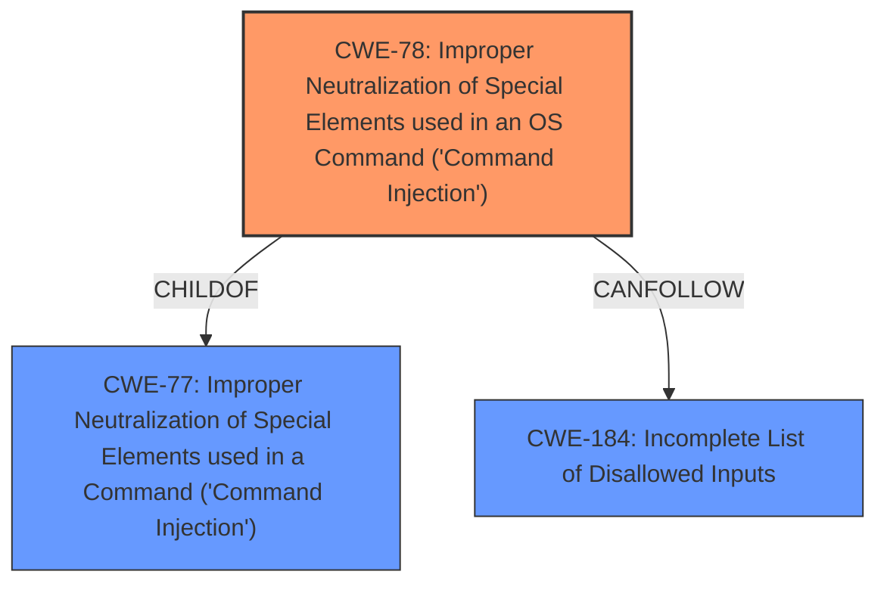

# Analysis for CVE-2021-28927

# Summary
| CWE ID | CWE Name | Confidence | CWE Abstraction Level | CWE Vulnerability Mapping Label | CWE-Vulnerability Mapping Notes |
|---|---|---|---|---|---|
| CWE-78 | Improper Neutralization of Special Elements used in an OS Command ('Command Injection') | 1.00 | Base | Primary | Allowed |
| CWE-184 | Incomplete List of Disallowed Inputs | 0.75 | Base | Secondary | Allowed |

## Evidence and Confidence

*   **Confidence Score:** 0.90
*   **Evidence Strength:** HIGH

## Relationship Analysis
The primary CWE is CWE-78, which is a Base level CWE and a child of CWE-77. CWE-184 is included as a secondary CWE because the root cause is **improper input sanitization**, which can mean that the list of disallowed inputs is incomplete.

## Vulnerability Chain
The vulnerability chain starts with **improper input sanitization**, leading to **command injection** and ultimately resulting in arbitrary code execution. The **lack of proper sanitization** allows attackers to inject malicious commands into the PowerShell command, leading to code execution.

## Summary of Analysis
The initial analysis identified CWE-78 as the primary weakness due to the **command injection** vulnerability. The supporting evidence lies in the vulnerability description stating that the RetroArch text-to-speech engine passes unsanitized input to PowerShell, enabling attackers to execute code via **command injection**. The CVE reference link summary further confirms this, specifying that the `accessibility_speak_windows` function in `platform_win32.c` does not sanitize input, which leads to **command injection**. The **root cause** is **improper input sanitization**.

The analysis also considered CWE-184 (Incomplete List of Disallowed Inputs) as a potential secondary weakness. The connection is that the **improper input sanitization** might stem from an incomplete list of disallowed inputs. This is a reasonable assumption given the nature of the vulnerability.

The final decision is to include CWE-78 as the primary weakness, with CWE-184 as a secondary contributing factor. This aligns with the evidence provided and the relationships between the CWEs.

Relevant CWE Information:

# Enhanced Context (25 CWEs)
The following CWEs were identified as potentially relevant to this vulnerability:

## CWE-1289: Improper Validation of Unsafe Equivalence in Input
**Abstraction Level**: Base
**Similarity Score**: 0.74

## CWE-1288: Improper Validation of Consistency within Input
**Abstraction Level**: Base
**Similarity Score**: 0.72

## CWE-184: Incomplete List of Disallowed Inputs
**Abstraction Level**: Base
**Similarity Score**: 0.71

## CWE-183: Permissive List of Allowed Inputs
**Abstraction Level**: Base
**Similarity Score**: 0.71

## CWE-807: Reliance on Untrusted Inputs in a Security Decision
**Abstraction Level**: Base
**Similarity Score**: 0.71

## CWE-179: Incorrect Behavior Order: Early Validation
**Abstraction Level**: Base
**Similarity Score**: 0.70

## CWE-138: Improper Neutralization of Special Elements
**Abstraction Level**: Class
**Similarity Score**: 0.69

## CWE-1173: Improper Use of Validation Framework
**Abstraction Level**: Base
**Similarity Score**: 0.69

## CWE-838: Inappropriate Encoding for Output Context
**Abstraction Level**: Base
**Similarity Score**: 0.69

## CWE-115: Misinterpretation of Input
**Abstraction Level**: Base
**Similarity Score**: 0.69

## CWE-427: Uncontrolled Search Path Element
**Abstraction Level**: Base
**Similarity Score**: 11304.89

## CWE-22: Improper Limitation of a Pathname to a Restricted Directory ('Path Traversal')
**Abstraction Level**: Base
**Similarity Score**: 11056.54

## CWE-116: Improper Encoding or Escaping of Output
**Abstraction Level**: Class
**Similarity Score**: 10751.18

## CWE-184: Incomplete List of Disallowed Inputs
**Abstraction Level**: Base
**Similarity Score**: 10655.35

## CWE-88: Improper Neutralization of Argument Delimiters in a Command ('Argument Injection')
**Abstraction Level**: Base
**Similarity Score**: 10539.31

## CWE-78: Improper Neutralization of Special Elements used in an OS Command ('OS Command Injection')
**Abstraction Level**: base
**Similarity Score**: 5.03

## CWE-98: Improper Control of Filename for Include/Require Statement in PHP Program ('PHP Remote File Inclusion')
**Abstraction Level**: variant
**Similarity Score**: 4.53

## CWE-94: Improper Control of Generation of Code ('Code Injection')
**Abstraction Level**: base
**Similarity Score**: 4.33

## CWE-79: Improper Neutralization of Input During Web Page Generation ('Cross-site Scripting')
**Abstraction Level**: base
**Similarity Score**: 4.33

## CWE-434: Unrestricted Upload of File with Dangerous Type
**Abstraction Level**: base
**Similarity Score**: 4.33

## CWE-22: Improper Limitation of a Pathname to a Restricted Directory ('Path Traversal')
**Abstraction Level**: base
**Similarity Score**: 4.33

## CWE-770: Allocation of Resources Without Limits or Throttling
**Abstraction Level**: base
**Similarity Score**: 4.33

## CWE-190: Integer Overflow or Wraparound
**Abstraction Level**: base
**Similarity Score**: 4.33

## CWE-59: Improper Link Resolution Before File Access ('Link Following')
**Abstraction Level**: base
**Similarity Score**: 4.33

## CWE-88: Improper Neutralization of Argument Delimiters in a Command ('Argument Injection')
**Abstraction Level**: base
**Similarity Score**: 3.64

### CWE Details

*   **CWE-78: Improper Neutralization of Special Elements used in an OS Command ('OS Command Injection')**

    *   The product constructs an OS command using externally-influenced input but does not neutralize special elements.
    *   This allows attackers to modify the intended OS command, leading to arbitrary code execution.
    *   The vulnerability can lead to arbitrary code execution with the privileges of the RetroArch user.
    *   This is a Base level CWE, providing a specific classification of the weakness.
    *   Mapping Guidance: Allowed.
*   **CWE-184: Incomplete List of Disallowed Inputs**

    *   The product implements a protection mechanism using a list of disallowed inputs, but the list is incomplete.
    *   This incompleteness allows attackers to bypass the protection mechanism.
    *   This is a Base level CWE.
    *   Mapping Guidance: Allowed.

### Rejected CWEs

*   **CWE-77: Improper Neutralization of Special Elements used in a Command ('Command Injection')**: While related, CWE-78 is more specific as it involves OS commands.
*   **CWE-22: Improper Limitation of a Pathname to a Restricted Directory ('Path Traversal')**: Not applicable as the vulnerability is not related to path traversal.
*   **CWE-427: Uncontrolled Search Path Element**: Not applicable as the vulnerability is not related to uncontrolled search paths.
*   **CWE-94: Improper Control of Generation of Code ('Code Injection')**: While code execution is the impact, the vulnerability is not due to improper generation of code but rather the injection of commands.
*   **CWE-20: Improper Input Validation**: Too generic; CWE-78 and CWE-184 provide more specific classifications.

The choice of CWE-78 is at the optimal level of specificity as it directly addresses the OS command injection vulnerability.