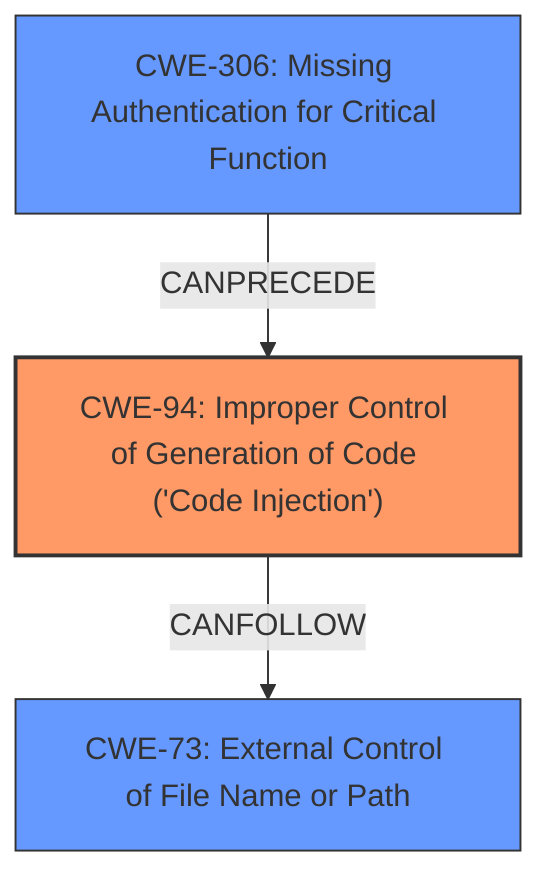

# Raw Analyzer Response for CVE-2021-28958

# Summary
| CWE ID | CWE Name | Confidence | CWE Abstraction Level | CWE Vulnerability Mapping Label | CWE-Vulnerability Mapping Notes |
|---|---|---|---|---|---|
| CWE-94 | Improper Control of Generation of Code ('Code Injection') | 0.9 | Base | Primary | Allowed-with-Review |
| CWE-73 | External Control of File Name or Path | 0.7 | Base | Secondary | Allowed |
| CWE-306 | Missing Authentication for Critical Function | 0.6 | Base | Secondary | Allowed |

## Evidence and Confidence

*   **Confidence Score:** 0.8
*   **Evidence Strength:** HIGH

## Relationship Analysis
The primary CWE is CWE-94, which is a parent of CWE-95 and CWE-96, indicating more specific types of code injection. CWE-73 and CWE-306 are included as they relate to file handling and authentication respectively, potentially preceding the code injection.

## Vulnerability Chain
The vulnerability chain starts with a **missing authentication** (CWE-306), followed by **external control of file name or path** (CWE-73) due to **improper sanitization of user-supplied input**, leading to **improper control of code generation** (CWE-94) and resulting in Remote Code Execution.

## Summary of Analysis
The initial assessment identified the **Remote Code Execution** as a key impact, pointing towards a code injection vulnerability. The provided evidence from the "CVE Reference Links Content Summary" confirms the root cause as "**improper sanitization of user-supplied input**" that allows for arbitrary code injection into a PowerShell script.

CWE-94 **Improper Control of Generation of Code ('Code Injection')** is the most suitable primary CWE because the vulnerability allows an attacker to inject arbitrary code into a PowerShell script, leading to remote code execution. The key evidence is the "**PowerShell Script Injection**" and "**Lack of Input Validation/Sanitization**" as stated in the CVE Reference. While CWE-94 has a usage of "Allowed-with-Review," it's applicable because the root cause is directly related to the **improper generation of code** due to the missing sanitization.

CWE-73 **External Control of File Name or Path** is considered as a secondary CWE, as the **improper sanitization of user-supplied input** in the password change request could potentially lead to control over file names or paths used by the PowerShell script. The evidence for this lies in the vulnerability description mentioning the lack of sanitization during password change requests.

CWE-306 **Missing Authentication for Critical Function** is also considered as a secondary CWE because the exploit occurs through an unauthenticated HTTP GET request, suggesting that the password change functionality lacks proper authentication. This is supported by the vulnerability description stating the attacker is "**unauthenticated**".

The Retriever Results suggested other CWEs, but they were not as directly relevant as CWE-94, CWE-73, and CWE-306:
*   CWE-620 **Unverified Password Change** and CWE-306 **Missing Authentication for Critical Function** were considered but not selected as primary because the root cause is more directly related to the code injection aspect rather than just a simple password change issue.
*   CWE-918 **Server-Side Request Forgery (SSRF)**, CWE-425 **Direct Request ('Forced Browsing')**, CWE-204 **Observable Response Discrepancy** were not selected as they did not directly relate to the **improper sanitization of user-supplied input** or the **PowerShell Script Injection**.
*   CWE-74 **Improper Neutralization of Special Elements in Output Used by a Downstream Component ('Injection')** was discarded because it is a Class-level CWE, and CWE-94 is a more specific Base-level CWE.

The final selection is based on the direct evidence of code injection, the lack of sanitization, and the unauthenticated nature of the exploit, leading to a high confidence in the selected CWEs.

Relevant CWE Information:

# Enhanced Context (25 CWEs)

## CWE-204: Observable Response Discrepancy
**Abstraction Level**: Base
**Similarity Score**: 0.80
**Source**: dense

**Description**:
The product provides different responses to incoming requests in a way that reveals internal state information to an unauthorized actor outside of the intended control sphere.

**Mapping Guidance**:
- Usage: Allowed
- Rationale: This CWE entry is at the Base level of abstraction, which is a preferred level of abstraction for mapping to the root causes of vulnerabilities.

## CWE-918: Server-Side Request Forgery (SSRF)
**Abstraction Level**: Base
**Similarity Score**: 0.80
**Source**: dense

**Description**:
The web server receives a URL or similar request from an upstream component and retrieves the contents of this URL, but it does not sufficiently ensure that the request is being sent to the expected destination.

**Mapping Guidance**:
- Usage: Allowed
- Rationale: This CWE entry is at the Base level of abstraction, which is a preferred level of abstraction for mapping to the root causes of vulnerabilities.

## CWE-74: Improper Neutralization of Special Elements in Output Used by a Downstream Component ('Injection')
**Abstraction Level**: Class
**Similarity Score**: 0.79
**Source**: dense

**Description**:
The product constructs all or part of a command, data structure, or record using externally-influenced input from an upstream component, but it does not neutralize or incorrectly neutralizes special elements that could modify how it is parsed or interpreted when it is sent to a downstream component.

**Mapping Guidance**:
- Usage: Discouraged
- Rationale: CWE-74 is high-level and often misused when lower-level weaknesses are more appropriate.

## CWE-807: Reliance on Untrusted Inputs in a Security Decision
**Abstraction Level**: Base
**Similarity Score**: 0.79
**Source**: dense

**Description**:
The product uses a protection mechanism that relies on the existence or values of an input, but the input can be modified by an untrusted actor in a way that bypasses the protection mechanism.

**Mapping Guidance**:
- Usage: Allowed
- Rationale: This CWE entry is at the Base level of abstraction, which is a preferred level of abstraction for mapping to the root causes of vulnerabilities.

## CWE-41: Improper Resolution of Path Equivalence
**Abstraction Level**: Base
**Similarity Score**: 0.79
**Source**: dense

**Description**:
The product is vulnerable to file system contents disclosure through path equivalence. Path equivalence involves the use of special characters in file and directory names. The associated manipulations are intended to generate multiple names for the same object.

**Mapping Guidance**:
- Usage: Allowed
- Rationale: This CWE entry is at the Base level of abstraction, which is a preferred level of abstraction for mapping to the root causes of vulnerabilities.

## CWE-425: Direct Request ('Forced Browsing')
**Abstraction Level**: Base
**Similarity Score**: 0.79
**Source**: dense

**Description**:
The web application does not adequately enforce appropriate authorization on all restricted URLs, scripts, or files.

**Mapping Guidance**:
- Usage: Allowed
- Rationale: This CWE entry is at the Base level of abstraction, which is a preferred level of abstraction for mapping to the root causes of vulnerabilities.

## CWE-472: External Control of Assumed-Immutable Web Parameter
**Abstraction Level**: Base
**Similarity Score**: 0.78
**Source**: dense

**Description**:
The web application does not sufficiently verify inputs that are assumed to be immutable but are actually externally controllable, such as hidden form fields.

**Mapping Guidance**:
- Usage: Allowed
- Rationale: This CWE entry is at the Base level of abstraction, which is a preferred level of abstraction for mapping to the root causes of vulnerabilities.

## CWE-668: Exposure of Resource to Wrong Sphere
**Abstraction Level**: Class
**Similarity Score**: 0.78
**Source**: dense

**Description**:
The product exposes a resource to the wrong control sphere, providing unintended actors with inappropriate access to the resource.

**Mapping Guidance**:
- Usage: Discouraged
- Rationale: CWE-668 is high-level and is often misused as a catch-all when lower-level CWE IDs might be applicable. It is sometimes used for low-information vulnerability reports [REF-1287]. It is a level-1 Class (i.e., a child