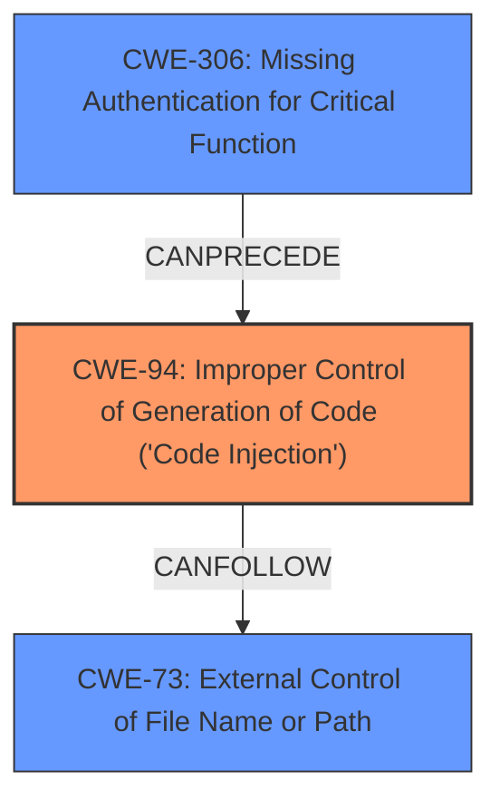

# Analysis for CVE-2021-28958

# Summary
| CWE ID | CWE Name | Confidence | CWE Abstraction Level | CWE Vulnerability Mapping Label | CWE-Vulnerability Mapping Notes |
|---|---|---|---|---|---|
| CWE-94 | Improper Control of Generation of Code ('Code Injection') | 0.9 | Base | Primary | Allowed-with-Review |
| CWE-73 | External Control of File Name or Path | 0.7 | Base | Secondary | Allowed |
| CWE-306 | Missing Authentication for Critical Function | 0.6 | Base | Secondary | Allowed |

## Evidence and Confidence

*   **Confidence Score:** 0.8
*   **Evidence Strength:** HIGH

## Relationship Analysis
The primary CWE is CWE-94, which is a parent of CWE-95 and CWE-96, indicating more specific types of code injection. CWE-73 and CWE-306 are included as they relate to file handling and authentication respectively, potentially preceding the code injection.

## Vulnerability Chain
The vulnerability chain starts with a **missing authentication** (CWE-306), followed by **external control of file name or path** (CWE-73) due to **improper sanitization of user-supplied input**, leading to **improper control of code generation** (CWE-94) and resulting in Remote Code Execution.

## Summary of Analysis
The initial assessment identified the **Remote Code Execution** as a key impact, pointing towards a code injection vulnerability. The provided evidence from the "CVE Reference Links Content Summary" confirms the root cause as "**improper sanitization of user-supplied input**" that allows for arbitrary code injection into a PowerShell script.

CWE-94 **Improper Control of Generation of Code ('Code Injection')** is the most suitable primary CWE because the vulnerability allows an attacker to inject arbitrary code into a PowerShell script, leading to remote code execution. The key evidence is the "**PowerShell Script Injection**" and "**Lack of Input Validation/Sanitization**" as stated in the CVE Reference. While CWE-94 has a usage of "Allowed-with-Review," it's applicable because the root cause is directly related to the **improper generation of code** due to the missing sanitization.

CWE-73 **External Control of File Name or Path** is considered as a secondary CWE, as the **improper sanitization of user-supplied input** in the password change request could potentially lead to control over file names or paths used by the PowerShell script. The evidence for this lies in the vulnerability description mentioning the lack of sanitization during password change requests.

CWE-306 **Missing Authentication for Critical Function** is also considered as a secondary CWE because the exploit occurs through an unauthenticated HTTP GET request, suggesting that the password change functionality lacks proper authentication. This is supported by the vulnerability description stating the attacker is "**unauthenticated**".

The Retriever Results suggested other CWEs, but they were not as directly relevant as CWE-94, CWE-73, and CWE-306:
*   CWE-620 **Unverified Password Change** and CWE-306 **Missing Authentication for Critical Function** were considered but not selected as primary because the root cause is more directly related to the code injection aspect rather than just a simple password change issue.
*   CWE-918 **Server-Side Request Forgery (SSRF)**, CWE-425 **Direct Request ('Forced Browsing')**, CWE-204 **Observable Response Discrepancy** were not selected as they did not directly relate to the **improper sanitization of user-supplied input** or the **PowerShell Script Injection**.
*   CWE-74 **Improper Neutralization of Special Elements in Output Used by a Downstream Component ('Injection')** was discarded because it is a Class-level CWE, and CWE-94 is a more specific Base-level CWE.

The final selection is based on the direct evidence of code injection, the lack of sanitization, and the unauthenticated nature of the exploit, leading to a high confidence in the selected CWEs.

Relevant CWE Information:

# Enhanced Context (25 CWEs)

## CWE-204: Observable Response Discrepancy
**Abstraction Level**: Base
**Similarity Score**: 0.80
**Source**: dense

**Description**:
The product provides different responses to incoming requests in a way that reveals internal state information to an unauthorized actor outside of the intended control sphere.

**Mapping Guidance**:
- Usage: Allowed
- Rationale: This CWE entry is at the Base level of abstraction, which is a preferred level of abstraction for mapping to the root causes of vulnerabilities.

## CWE-918: Server-Side Request Forgery (SSRF)
**Abstraction Level**: Base
**Similarity Score**: 0.80
**Source**: dense

**Description**:
The web server receives a URL or similar request from an upstream component and retrieves the contents of this URL, but it does not sufficiently ensure that the request is being sent to the expected destination.

**Mapping Guidance**:
- Usage: Allowed
- Rationale: This CWE entry is at the Base level of abstraction, which is a preferred level of abstraction for mapping to the root causes of vulnerabilities.

## CWE-74: Improper Neutralization of Special Elements in Output Used by a Downstream Component ('Injection')
**Abstraction Level**: Class
**Similarity Score**: 0.79
**Source**: dense

**Description**:
The product constructs all or part of a command, data structure, or record using externally-influenced input from an upstream component, but it does not neutralize or incorrectly neutralizes special elements that could modify how it is parsed or interpreted when it is sent to a downstream component.

**Mapping Guidance**:
- Usage: Discouraged
- Rationale: CWE-74 is high-level and often misused when lower-level weaknesses are more appropriate.

## CWE-807: Reliance on Untrusted Inputs in a Security Decision
**Abstraction Level**: Base
**Similarity Score**: 0.79
**Source**: dense

**Description**:
The product uses a protection mechanism that relies on the existence or values of an input, but the input can be modified by an untrusted actor in a way that bypasses the protection mechanism.

**Mapping Guidance**:
- Usage: Allowed
- Rationale: This CWE entry is at the Base level of abstraction, which is a preferred level of abstraction for mapping to the root causes of vulnerabilities.

## CWE-41: Improper Resolution of Path Equivalence
**Abstraction Level**: Base
**Similarity Score**: 0.79
**Source**: dense

**Description**:
The product is vulnerable to file system contents disclosure through path equivalence. Path equivalence involves the use of special characters in file and directory names. The associated manipulations are intended to generate multiple names for the same object.

**Mapping Guidance**:
- Usage: Allowed
- Rationale: This CWE entry is at the Base level of abstraction, which is a preferred level of abstraction for mapping to the root causes of vulnerabilities.

## CWE-425: Direct Request ('Forced Browsing')
**Abstraction Level**: Base
**Similarity Score**: 0.79
**Source**: dense

**Description**:
The web application does not adequately enforce appropriate authorization on all restricted URLs, scripts, or files.

**Mapping Guidance**:
- Usage: Allowed
- Rationale: This CWE entry is at the Base level of abstraction, which is a preferred level of abstraction for mapping to the root causes of vulnerabilities.

## CWE-472: External Control of Assumed-Immutable Web Parameter
**Abstraction Level**: Base
**Similarity Score**: 0.78
**Source**: dense

**Description**:
The web application does not sufficiently verify inputs that are assumed to be immutable but are actually externally controllable, such as hidden form fields.

**Mapping Guidance**:
- Usage: Allowed
- Rationale: This CWE entry is at the Base level of abstraction, which is a preferred level of abstraction for mapping to the root causes of vulnerabilities.

## CWE-668: Exposure of Resource to Wrong Sphere
**Abstraction Level**: Class
**Similarity Score**: 0.78
**Source**: dense

**Description**:
The product exposes a resource to the wrong control sphere, providing unintended actors with inappropriate access to the resource.

**Mapping Guidance**:
- Usage: Discouraged
- Rationale: CWE-668 is high-level and is often misused as a catch-all when lower-level CWE IDs might be applicable. It is sometimes used for low-information vulnerability reports [REF-1287]. It is a level-1 Class (i.e., a child

# Enhanced Query for CVE-2021-28958

## Vulnerability Description
Zoho ManageEngine ADSelfService Plus through 6101 is vulnerable to unauthenticated Remote Code Execution while changing the password.

### Vulnerability Description Key Phrases
- **impact:** Remote Code Execution
- **attacker:** unauthenticated
- **product:** Zoho ManageEngine ADSelfService Plus
- **version:** through 6101
- **component:** password change functionality

## CVE Reference Links Content Summary
Based on the provided content, here's a breakdown of the vulnerability associated with CVE-2021-28958:

**1. Verification of CVE Relevance:**

The provided content explicitly mentions "CVE-2021-28958" and describes a vulnerability in ManageEngine ADSelfService Plus related to an unauthenticated RCE via password change functionality. This aligns with the CVE description (when available).

**2. Root Cause of the Vulnerability:**
The root cause is **improper sanitization of user-supplied input** when processing password change requests. Specifically, double quotes within the new password field were not properly escaped when constructing a PowerShell script used internally by the application to handle the password change.

**3. Weaknesses/Vulnerabilities Present:**

*   **PowerShell Script Injection:** The vulnerability allows for arbitrary code injection into a PowerShell script.
*   **Lack of Input Validation/Sanitization:** The application fails to properly sanitize user-provided input (specifically, the new password field), which enables the injection.

**4. Impact of Exploitation:**

*   **Remote Code Execution (RCE):** Successful exploitation enables an attacker to execute arbitrary commands on the server where ManageEngine ADSelfService Plus is installed. This allows for a complete compromise of the server, leading to data breaches, malware deployment, or denial of service.

**5. Attack Vectors:**

*   **HTTP GET Request:** The exploit is triggered through an unauthenticated HTTP GET request to the `/RestAPI/ChangePasswordAPI` endpoint.
*   **Malicious Payload in `newPassword` parameter:** A crafted `newPassword` parameter containing injected PowerShell commands is sent within the request.

**6. Required Attacker Capabilities/Position:**

*   **Network Access:** The attacker needs network access to the ManageEngine ADSelfService Plus server.
*   **No Authentication Required:** The vulnerability is unauthenticated, meaning the attacker doesn't need any valid credentials to exploit it.
*   **Knowledge of AD Domain:** The attacker must know the Active Directory domain name configured within ADSelfService Plus.
*   **Target System:** The target system must be running a vulnerable version of ManageEngine ADSelfService Plus.

**Technical Details:**

The provided exploit script demonstrates the attack by:

1.  Constructing a URL with the `ChangePasswordAPI` endpoint.
2.  Adding parameters:
    *   `operation`: `UMCP`
    *   `loginName`: A valid username (e.g. 'krbtgt').
    *   `domainName`: The Active Directory domain.
    *   `umcp`: `true`
    *   `IS_ENCRYPTED`: `false`
    *  `oldPassword`: arbitrary value
    *   `newPassword`: A long string with injected code
3.  Sending the request. The `newPassword` parameter includes a string that will cause the injected PowerShell to be executed by the server in context of the application.

**Affected Versions:**

*   The content indicates that versions of ManageEngine ADSelfService Plus **prior to 6102** are vulnerable.

**Mitigation:**

*   Upgrade ManageEngine ADSelfService Plus to version 6102 or higher, which contains the fix for this vulnerability.

**Summary:**

CVE-2021-28958 is a critical vulnerability in ManageEngine ADSelfService Plus that allows for unauthenticated remote code execution via PowerShell script injection. It's caused by a lack of input sanitization in the `newPassword` parameter during password change requests. This allows attackers to completely compromise vulnerable servers.

## Retriever Results

### Top Combined Results

| Rank | CWE ID | Name | Abstraction | Usage  | Retrievers | Individual Scores |
|------|--------|------|-------------|-------|------------|-------------------|
| 1 | 55 | Path Equivalence: '/./' (Single Dot Directory) | Variant | Allowed | sparse | 0.042 |
| 2 | 602 | Client-Side Enforcement of Server-Side Security | Class | Allowed-with-Review | sparse | 0.037 |
| 3 | 348 | Use of Less Trusted Source | Base | Allowed | sparse | 0.036 |
| 4 | 306 | Missing Authentication for Critical Function | Base | Allowed | sparse | 0.034 |
| 5 | 425 | Direct Request ('Forced Browsing') | Base | Allowed | sparse | 0.031 |
| 6 | 620 | Unverified Password Change | Base | Allowed | dense | 0.626 |
| 7 | 613 | Insufficient Session Expiration | Base | Allowed | graph | 0.002 |
| 8 | 219 | Storage of File with Sensitive Data Under Web Root | Variant | Allowed | sparse | 0.031 |
| 9 | 204 | Observable Response Discrepancy | Base | Allowed | sparse | 0.030 |
| 10 | 918 | Server-Side Request Forgery (SSRF) | Base | Allowed | sparse | 0.030 |

# Complete CWE Specifications

## CWE-55: Path Equivalence: '/./' (Single Dot Directory)
**Abstraction:** Variant
**Status:** Incomplete

### Description
The product accepts path input in the form of single dot directory exploit ('/./') without appropriate validation, which can lead to ambiguous path resolution and allow an attacker to traverse the file system to unintended locations or access arbitrary files.

### Extended Description
Not provided

### Alternative Terms
None

### Relationships
ChildOf -> CWE-41

### Mapping Guidance
**Usage:** Allowed
**Rationale:** This CWE entry is at the Variant level of abstraction, which is a preferred level of abstraction for mapping to the root causes of vulnerabilities.
**Comments:** Carefully read both the name and description to ensure that this mapping is an appropriate fit. Do not try to 'force' a mapping to a lower-level Base/Variant simply to comply with this preferred level of abstraction.
**Reasons:**
- Acceptable-Use

### Observed Examples
- **CVE-2000-0004:** Server allows remote attackers to read source code for executable files by inserting a . (dot) into the URL.
- **CVE-2002-0304:** Server allows remote attackers to read password-protected files via a /./ in the HTTP request.
- **CVE-1999-1083:** Possibly (could be a cleansing error)

## CWE-602: Client-Side Enforcement of Server-Side Security
**Abstraction:** Class
**Status:** Draft

### Description
The product is composed of a server that relies on the client to implement a mechanism that is intended to protect the server.

### Extended Description
When the server relies on protection mechanisms placed on the client side, an attacker can modify the client-side behavior to bypass the protection mechanisms, resulting in potentially unexpected interactions between the client and server. The consequences will vary, depending on what the mechanisms are trying to protect.

### Alternative Terms
None

### Relationships
ChildOf -> CWE-693
CanPrecede -> CWE-471
PeerOf -> CWE-290
PeerOf -> CWE-300

### Mapping Guidance
**Usage:** Allowed-with-Review
**Rationale:** This CWE entry is a Class and might have Base-level children that would be more appropriate
**Comments:** Examine children of this entry to see if there is a better fit
**Reasons:**
- Abstraction

### Observed Examples
- **CVE-2022-33139:** SCADA system only uses client-side authentication, allowing adversaries to impersonate other users.
- **CVE-2006-6994:** ASP program allows upload of .asp files by bypassing client-side checks.
- **CVE-2007-0163:** steganography products embed password information in the carrier file, which can be extracted from a modified client.

## CWE-348: Use of Less Trusted Source
**Abstraction:** Base
**Status:** Draft

### Description
The product has two different sources of the same data or information, but it uses the source that has less support for verification, is less trusted, or is less resistant to attack.

### Extended Description
Not provided

### Alternative Terms
None

### Relationships
ChildOf -> CWE-345

### Mapping Guidance
**Usage:** Allowed
**Rationale:** This CWE entry is at the Base level of abstraction, which is a preferred level of abstraction for mapping to the root causes of vulnerabilities.
**Comments:** Carefully read both the name and description to ensure that this mapping is an appropriate fit. Do not try to 'force' a mapping to a lower-level Base/Variant simply to comply with this preferred level of abstraction.
**Reasons:**
- Acceptable-Use

### Observed Examples
- **CVE-2001-0860:** Product uses IP address provided by a client, instead of obtaining it from the packet headers, allowing easier spoofing.
- **CVE-2004-1950:** Web product uses the IP address in the X-Forwarded-For HTTP header instead of a server variable that uses the connecting IP address, allowing filter bypass.
- **CVE-2001-0908:** Product logs IP address specified by the client instead of obtaining it from the packet headers, allowing information hiding.

## CWE-306: Missing Authentication for Critical Function
**Abstraction:** Base
**Status:** Draft

### Description
The product does not perform any authentication for functionality that requires a provable user identity or consumes a significant amount of resources.

### Extended Description
Not provided

### Alternative Terms
None

### Relationships
ChildOf -> CWE-287
ChildOf -> CWE-287

### Mapping Guidance
**Usage:** Allowed
**Rationale:** This CWE entry is at the Base level of abstraction, which is a preferred level of abstraction for mapping to the root causes of vulnerabilities.
**Comments:** Carefully read both the name and description to ensure that this mapping is an appropriate fit. Do not try to 'force' a mapping to a lower-level Base/Variant simply to comply with this preferred level of abstraction.
**Reasons:**
- Acceptable-Use

### Observed Examples
- **CVE-2022-31260:** Chain: a digital asset management program has an undisclosed backdoor in the legacy version of a PHP script (CWE-912) that could allow an unauthenticated user to export metadata (CWE-306)
- **CVE-2022-29951:** TCP-based protocol in Programmable Logic Controller (PLC) has no authentication.
- **CVE-2022-29952:** Condition Monitor firmware uses a protocol that does not require authentication.

## CWE-425: Direct Request ('Forced Browsing')
**Abstraction:** Base
**Status:** Incomplete

### Description
The web application does not adequately enforce appropriate authorization on all restricted URLs, scripts, or files.

### Extended Description
Web applications susceptible to direct request attacks often make the false assumption that such resources can only be reached through a given navigation path and so only apply authorization at certain points in the path.

### Alternative Terms
forced browsing: The "forced browsing" term could be misinterpreted to include weaknesses such as CSRF or XSS, so its use is discouraged.

### Relationships
ChildOf -> CWE-862
ChildOf -> CWE-862
ChildOf -> CWE-288
ChildOf -> CWE-424
CanPrecede -> CWE-471
CanPrecede -> CWE-98

### Mapping Guidance
**Usage:** Allowed
**Rationale:** This CWE entry is at the Base level of abstraction, which is a preferred level of abstraction for mapping to the root causes of vulnerabilities.
**Comments:** Carefully read both the name and description to ensure that this mapping is an appropriate fit. Do not try to 'force' a mapping to a lower-level Base/Variant simply to comply with this preferred level of abstraction.
**Reasons:**
- Acceptable-Use

### Additional Notes
**[Relationship]** Overlaps Modification of Assumed-Immutable Data (MAID), authorization errors, container errors; often primary to other weaknesses such as XSS and SQL injection.

**[Theoretical]** "Forced browsing" is a step-based manipulation involving the omission of one or more steps, whose order is assumed to be immutable. The application does not verify that the first step was performed successfully before the second step. The consequence is typically "authentication bypass" or "path disclosure," although it can be primary to all kinds of weaknesses, especially in languages such as PHP, which allow external modification of assumed-immutable variables.

### Observed Examples
- **CVE-2022-29238:** Access-control setting in web-based document collaboration tool is not properly implemented by the code, which prevents listing hidden directories but does not prevent direct requests to files in those directories.
- **CVE-2022-23607:** Python-based HTTP library did not scope cookies to a particular domain such that "supercookies" could be sent to any domain on redirect.
- **CVE-2004-2144:** Bypass authentication via direct request.

## CWE-620: Unverified Password Change
**Abstraction:** Base
**Status:** Draft

### Description
When setting a new password for a user, the product does not require knowledge of the original password, or using another form of authentication.

### Extended Description
This could be used by an attacker to change passwords for another user, thus gaining the privileges associated with that user.

### Alternative Terms
None

### Relationships
ChildOf -> CWE-1390

### Mapping Guidance
**Usage:** Allowed
**Rationale:** This CWE entry is at the Base level of abstraction, which is a preferred level of abstraction for mapping to the root causes of vulnerabilities.
**Comments:** Carefully read both the name and description to ensure that this mapping is an appropriate fit. Do not try to 'force' a mapping to a lower-level Base/Variant simply to comply with this preferred level of abstraction.
**Reasons:**
- Acceptable-Use

### Observed Examples
- **CVE-2007-0681:** Web app allows remote attackers to change the passwords of arbitrary users without providing the original password, and possibly perform other unauthorized actions.
- **CVE-2000-0944:** Web application password change utility doesn't check the original password.

## CWE-613: Insufficient Session Expiration
**Abstraction:** Base
**Status:** Incomplete

### Description
According to WASC, "Insufficient Session Expiration is when a web site permits an attacker to reuse old session credentials or session IDs for authorization."

### Extended Description
Not provided

### Alternative Terms
None

### Relationships
ChildOf -> CWE-672
ChildOf -> CWE-672
CanPrecede -> CWE-287

### Mapping Guidance
**Usage:** Allowed
**Rationale:** This CWE entry is at the Base level of abstraction, which is a preferred level of abstraction for mapping to the root causes of vulnerabilities.
**Comments:** Carefully read both the name and description to ensure that this mapping is an appropriate fit. Do not try to 'force' a mapping to a lower-level Base/Variant simply to comply with this preferred level of abstraction.
**Reasons:**
- Acceptable-Use

### Additional Notes
**[Other]** The lack of proper session expiration may improve the likely success of certain attacks. For example, an attacker may intercept a session ID, possibly via a network sniffer or Cross-site Scripting attack. Although short session expiration times do not help if a stolen token is immediately used, they will protect against ongoing replaying of the session ID. In another scenario, a user might access a web site from a shared computer (such as at a library, Internet cafe, or open work environment). Insufficient Session Expiration could allow an attacker to use the browser's back button to access web pages previously accessed by the victim.

## CWE-219: Storage of File with Sensitive Data Under Web Root
**Abstraction:** Variant
**Status:** Draft

### Description
The product stores sensitive data under the web document root with insufficient access control, which might make it accessible to untrusted parties.

### Extended Description
Besides public-facing web pages and code, products may store sensitive data, code that is not directly invoked, or other files under the web document root of the web server. If the server is not configured or otherwise used to prevent direct access to those files, then attackers may obtain this sensitive data.

### Alternative Terms
None

### Relationships
ChildOf -> CWE-552

### Mapping Guidance
**Usage:** Allowed
**Rationale:** This CWE entry is at the Variant level of abstraction, which is a preferred level of abstraction for mapping to the root causes of vulnerabilities.
**Comments:** Carefully read both the name and description to ensure that this mapping is an appropriate fit. Do not try to 'force' a mapping to a lower-level Base/Variant simply to comply with this preferred level of abstraction.
**Reasons:**
- Acceptable-Use

### Observed Examples
- **CVE-2005-1835:** Data file under web root.
- **CVE-2005-2217:** Data file under web root.
- **CVE-2002-1449:** Username/password in data file under web root.

## CWE-204: Observable Response Discrepancy
**Abstraction:** Base
**Status:** Incomplete

### Description
The product provides different responses to incoming requests in a way that reveals internal state information to an unauthorized actor outside of the intended control sphere.

### Extended Description
This issue frequently occurs during authentication, where a difference in failed-login messages could allow an attacker to determine if the username is valid or not. These exposures can be inadvertent (bug) or intentional (design).

### Alternative Terms
None

### Relationships
ChildOf -> CWE-203

### Mapping Guidance
**Usage:** Allowed
**Rationale:** This CWE entry is at the Base level of abstraction, which is a preferred level of abstraction for mapping to the root causes of vulnerabilities.
**Comments:** Carefully read both the name and description to ensure that this mapping is an appropriate fit. Do not try to 'force' a mapping to a lower-level Base/Variant simply to comply with this preferred level of abstraction.
**Reasons:**
- Acceptable-Use

### Additional Notes
**[Relationship]** can overlap errors related to escalated privileges

### Observed Examples
- **CVE-2002-2094:** This, and others, use ".." attacks and monitor error responses, so there is overlap with directory traversal.
- **CVE-2001-1483:** Enumeration of valid usernames based on inconsistent responses
- **CVE-2001-1528:** Account number enumeration via inconsistent responses.

## CWE-918: Server-Side Request Forgery (SSRF)
**Abstraction:** Base
**Status:** Incomplete

### Description
The web server receives a URL or similar request from an upstream component and retrieves the contents of this URL, but it does not sufficiently ensure that the request is being sent to the expected destination.

### Extended Description
Not provided

### Alternative Terms
XSPA: Cross Site Port Attack
SSRF: Server-Side Request Forgery

### Relationships
ChildOf -> CWE-441
ChildOf -> CWE-610

### Mapping Guidance
**Usage:** Allowed
**Rationale:** This CWE entry is at the Base level of abstraction, which is a preferred level of abstraction for mapping to the root causes of vulnerabilities.
**Comments:** Carefully read both the name and description to ensure that this mapping is an appropriate fit. Do not try to 'force' a mapping to a lower-level Base/Variant simply to comply with this preferred level of abstraction.
**Reasons:**
- Acceptable-Use

### Additional Notes
**[Relationship]** CWE-918 (SSRF) and CWE-611 (XXE) are closely related, because they both involve web-related technologies and can launch outbound requests to unexpected destinations. However, XXE can be performed client-side, or in other contexts in which the software is not acting directly as a server, so the "Server" portion of the SSRF acronym does not necessarily apply.

### Observed Examples
- **CVE-2023-32786:** Chain: LLM integration framework has prompt injection (CWE-1427) that allows an attacker to force the service to retrieve data from an arbitrary URL, essentially providing SSRF (CWE-918) and potentially injecting content into downstream tasks.
- **CVE-2021-26855:** Server Side Request Forgery (SSRF) in mail server, as exploited in the wild per CISA KEV.
- **CVE-2021-21973:** Server Side Request Forgery in cloud platform, as exploited in the wild per CISA KEV.

