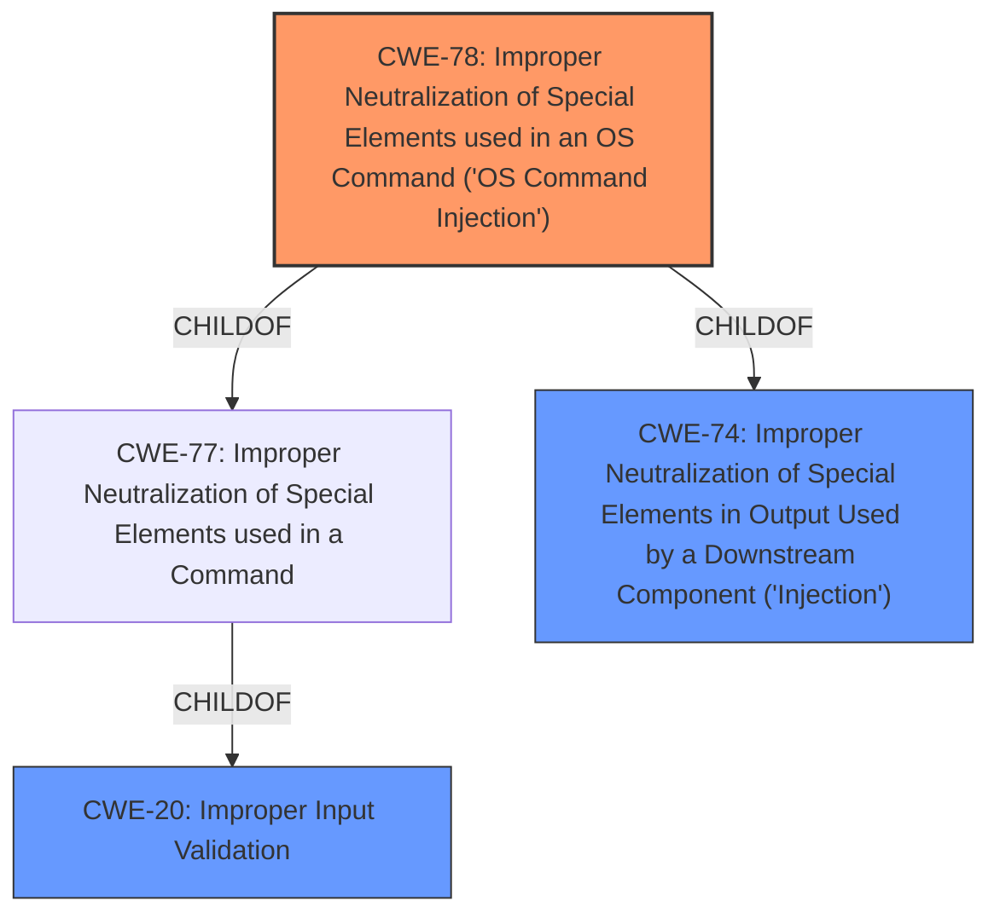

# Enhanced Analysis for CVE-2021-28961

# Summary
| CWE ID  | CWE Name                                                                              | Confidence | CWE Abstraction Level | CWE Vulnerability Mapping Label | CWE-Vulnerability Mapping Notes |
|---------|---------------------------------------------------------------------------------------|------------|-----------------------|-----------------------------------|------------------------------------|
| CWE-78  | Improper Neutralization of Special Elements used in an OS Command ('OS Command Injection') | 1          | Base                  | Primary CWE                       | Allowed                            |
| CWE-74 | Improper Neutralization of Special Elements in Output Used by a Downstream Component ('Injection') | 0.7        | Class                  | Secondary Candidate                       | Discouraged (but considered due to parent relationship) |
| CWE-20 | Improper Input Validation                                                              | 0.6         | Class                  | Secondary Candidate                       | Discouraged                       |

## Evidence and Confidence

*   **Confidence Score:** 0.9
*   **Evidence Strength:** HIGH

## Relationship Analysis
The primary CWE is CWE-78, which is a base-level weakness describing **improper neutralization of special elements used in an OS command**. It's a child of CWE-77 and CWE-74, which represent broader classes of injection vulnerabilities. While CWE-74 could be considered due to its parent relationship, CWE-78 is more specific and therefore preferred. CWE-20 is also a parent of CWE-78, but it is too general.



## Vulnerability Chain
The vulnerability chain starts with the application's failure to properly sanitize user-supplied input. This **improper handling** allows an attacker to inject arbitrary commands into the system's shell, leading to remote code execution.
  - Input from POST requests is not validated.
  - **Improper Neutralization** of the input to prevent command injection.
  - OS executes the injected commands.

## Summary of Analysis
The initial analysis pointed towards command injection due to the ability to execute arbitrary commands via POST requests. The CVE Reference Links Content Summary confirmed this, stating that the **root cause** is the `luci-app-ddns` application passing unsanitized user-supplied input directly to the system's shell via `sys.call()`. The vulnerability allows remote authenticated users to inject arbitrary commands.

The Retriever Results strongly suggested CWE-78 (Improper Neutralization of Special Elements used in an OS Command ('OS Command Injection')), which aligns perfectly with the vulnerability description and the identified root cause. The analysis also considered CWE-74 (Improper Neutralization of Special Elements in Output Used by a Downstream Component ('Injection')) because CWE-78 is a child of CWE-74, but determined that CWE-78 is the more specific and appropriate choice. CWE-20 (Improper Input Validation) was also considered, but it is too general, and the specific type of **improper input validation** is command injection.

The decision to use CWE-78 is based on the following evidence:

*   The Vulnerability Description states that remote authenticated users can inject arbitrary commands.
*   The CVE Reference Links Content Summary confirms that the application passes unsanitized user-supplied input directly to the system's shell.
*   The fix involved proper sanitization using the `UTIL.shellquote()` function before executing shell commands.

The selected CWE is at the optimal level of specificity because it directly addresses the **root cause** of the vulnerability: the **improper neutralization** of special elements used in an OS command.

Relevant CWE Information:

# Enhanced Context (25 CWEs)

## CWE-78: Improper Neutralization of Special Elements used in an OS Command ('OS Command Injection')
**Abstraction:** Base
**Similarity Score**: 5.03

**Description**:
The product constructs all or part of an OS command using externally-influenced input from an upstream component, but it does not neutralize or incorrectly neutralizes special elements that could modify the intended OS command when it is sent to a downstream component.

**Technical Explanation:**
The vulnerability matches CWE-78 because the `luci-app-ddns` application constructs OS commands using user-supplied input without proper sanitization, allowing attackers to inject arbitrary commands.

**Security Implications:**
This vulnerability can lead to remote code execution, allowing an attacker to gain full control over the affected system.

**Relationships:**
CWE-78 is a base-level weakness and a child of CWE-77 (Improper Neutralization of Special Elements used in a Command) and CWE-74 (Improper Neutralization of Special Elements in Output Used by a Downstream Component ('Injection')).

**Mapping Guidance Influence:**
The MITRE mapping guidance recommends using base-level CWEs when possible, and CWE-78 accurately reflects the specific weakness in this case.

## CWE-74: Improper Neutralization of Special Elements in Output Used by a Downstream Component ('Injection')
**Abstraction**: Class
**Similarity Score**: 0.76

**Description**:
The product constructs all or part of a command, data structure, or record using externally-influenced input from an upstream component, but it does not neutralize or incorrectly neutralizes special elements that could modify how it is parsed or interpreted when it is sent to a downstream component.

**Technical Explanation:**
While CWE-74 is a broader category of injection vulnerabilities, it is relevant because the vulnerability involves constructing a command using external input without proper neutralization.

**Security Implications:**
Similar to CWE-78, this can lead to remote code execution, but it is less specific.

**Relationships:**
CWE-74 is a class-level weakness, and CWE-78 is a child of CWE-74.

**Mapping Guidance Influence:**
The MITRE mapping guidance discourages using class-level CWEs when more specific base-level CWEs are available, which is why CWE-78 is preferred.

## CWE-20: Improper Input Validation
**Abstraction**: Class
**Similarity Score**: 0.76

**Description**:
The product receives input or data, but it does not validate or incorrectly validates that the input has the properties that are required to process the data safely and correctly.

**Technical Explanation:**
The vulnerability stems from a lack of input validation, but CWE-20 is a general class. The specific issue is the lack of neutralization of special elements within the input.

**Security Implications:**
A lack of input validation can lead to various vulnerabilities, including command injection.

**Relationships:**
CWE-20 is a class-level weakness.

**Mapping Guidance Influence:**
The MITRE mapping guidance discourages using class-level CWEs when more specific base-level CWEs are available, which is why CWE-78 is preferred.


## CWE Relationship Analysis

Current CWEs represent these abstraction levels: .


### Vulnerability Chain Analysis

**Chain starting from CWE-78:**
- 78 (Improper Neutralization of Special Elements used in an OS Command ('OS Command Injection')) - ROOT


**Chain starting from CWE-77:**
- 77 (Improper Neutralization of Special Elements used in a Command ('Command Injection')) - ROOT


### CWE Relationship Diagram

```mermaid
graph TD
    classDef primary fill:#f96,stroke:#333,stroke-width:2px
    classDef secondary fill:#69f,stroke:#333
    classDef tertiary fill:#9e9,stroke:#333
```