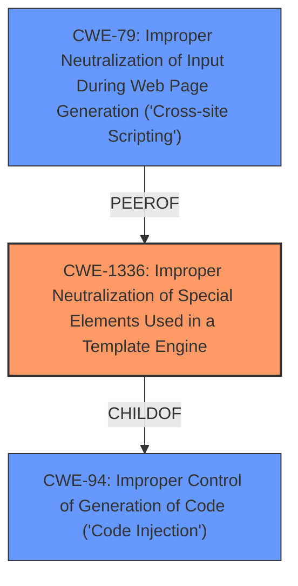

# Raw Analyzer Response for CVE-2021-28963

# Summary
| CWE ID | CWE Name | Confidence | CWE Abstraction Level | CWE Vulnerability Mapping Label | CWE-Vulnerability Mapping Notes |
|---|---|---|---|---|---|
| CWE-1336 | Improper Neutralization of Special Elements Used in a Template Engine | 1.0 | Base | Allowed | Primary CWE |
| CWE-79 | Improper Neutralization of Input During Web Page Generation ('Cross-site Scripting') | 0.7 | Base | Allowed | Secondary Candidate |

## Evidence and Confidence

*   **Confidence Score:** 0.9
*   **Evidence Strength:** HIGH

## Relationship Analysis
The primary CWE selected is CWE-1336, which falls under CWE-94 (Improper Control of Generation of Code). CWE-1336 directly addresses vulnerabilities arising from the use of template engines, while CWE-94 is a broader category of code injection. CWE-79 (Cross-site Scripting) was considered due to the potential for XSS-style attacks within template injection scenarios. The relationship between CWE-1336 and CWE-79 is that XSS can sometimes be a consequence or obscured manifestation of template injection. The chosen CWE is at the Base level, offering the most specific classification for this vulnerability.

## Vulnerability Chain
The vulnerability chain begins with **improper handling of attacker-controlled parameters** in template generation. This leads to **content injection**, where attackers can manipulate template placeholders using query parameters. This can be exploited for phishing attacks and brand spoofing by modifying elements like email addresses and logos. The chain highlights that the **root cause** is the **improper neutralization** in the template engine and the **impact** is content manipulation leading to phishing.

## Summary of Analysis
The initial analysis strongly points towards CWE-1336 as the primary weakness. The vulnerability description explicitly mentions that "template generation uses attacker-controlled parameters," which aligns perfectly with CWE-1336's description: "The product uses a template engine to insert or process externally-influenced input, but it does not neutralize or incorrectly neutralizes special elements or syntax that can be interpreted as template expressions or other code directives when processed by the engine." This is further supported by the CVE Reference Links Content Summary, which indicates that "the core vulnerability lies in the ability to manipulate template placeholders using query parameters in URLs."

CWE-79 was considered as a secondary candidate, but the root cause is more accurately described by CWE-1336. While the impact can manifest as XSS-like behavior (e.g., manipulating logos), the underlying issue is the template engine's **failure to neutralize special elements**.

The selection of CWE-1336 is based on the high level of specificity it provides, focusing directly on template engine vulnerabilities. This is at the base level which is optimal. The evidence provided directly supports this classification, and the relationship analysis confirms that it is the most relevant CWE in this context.

Relevant CWE Information:

# Enhanced Context (25 CWEs)

## CWE-80: Improper Neutralization of Script-Related HTML Tags in a Web Page (Basic XSS)
**Abstraction Level**: Variant
**Similarity Score**: 0.81
**Source**: dense

**Description**:
The product receives input from an upstream component, but it does not neutralize or incorrectly neutralizes special characters such as "<", ">", and "&" that could be interpreted as web-scripting elements when they are sent to a downstream component that processes web pages.

**Mapping Guidance**:
- Usage: Allowed
- Rationale: This CWE entry is at the Variant level of abstraction, which is a preferred level of abstraction for mapping to the root causes of vulnerabilities.

*Did not select because* While related to XSS, the issue isn't specifically about script-related HTML tags but rather a broader template injection issue.

## CWE-74: Improper Neutralization of Special Elements in Output Used by a Downstream Component ('Injection')
**Abstraction Level**: Class
**Similarity Score**: 0.79
**Source**: dense

**Description**:
The product constructs all or part of a command, data structure, or record using externally-influenced input from an upstream component, but it does not neutralize or incorrectly neutralizes special elements that could modify how it is parsed or interpreted when it is sent to a downstream component.

**Mapping Guidance**:
- Usage: Discouraged
- Rationale: CWE-74 is high-level and often misused when lower-level weaknesses are more appropriate.

*Did not select because* CWE-74 is too generic; CWE-1336 provides a more specific description of the vulnerability.

## CWE-611: Improper Restriction of XML External Entity Reference
**Abstraction Level**: Base
**Similarity Score**: 0.77
**Source**: dense

**Description**:
The product processes an XML document that can contain XML entities with URIs that resolve to documents outside of the intended sphere of control, causing the product to embed incorrect documents into its output.

**Mapping Guidance**:
- Usage: Allowed
- Rationale: This CWE entry is at the Base level of abstraction, which is a preferred level of abstraction for mapping to the root causes of vulnerabilities.

*Did not select because* This vulnerability doesn't involve XML or external entity references.

## CWE-116: Improper Encoding or Escaping of Output
**Abstraction Level**: Class
**Similarity Score**: 0.76
**Source**: dense

**Description**:
The product prepares a structured message for communication with another component, but encoding or escaping of the data is either missing or done incorrectly. As a result, the intended structure of the message is not preserved.

**Mapping Guidance**:
- Usage: Allowed-with-Review
- Rationale: This CWE entry is a Class and might have Base-level children that would be more appropriate

*Did not select because* While encoding issues are related, CWE-1336 is a more precise fit due to the use of a template engine.

## CWE-184: Incomplete List of Disallowed Inputs
**Abstraction Level**: Base
**Similarity Score**: 0.76
**Source**: dense

**Description**:
The product implements a protection mechanism that relies on a list of inputs (or properties of inputs) that are not allowed by policy or otherwise require other action to neutralize before additional processing takes place, but the list is incomplete.

**Mapping Guidance**:
- Usage: Allowed
- Rationale: This CWE entry is at the Base level of abstraction, which is a preferred level of abstraction for mapping to the root causes of vulnerabilities.

*Did not select because* The vulnerability is not about an incomplete list of disallowed inputs but rather the improper handling of template parameters.

## CWE-138: Improper Neutralization of Special Elements
**Abstraction Level**: Class
**Similarity Score**: 0.76
**Source**: dense

**Description**:
The product receives input from an upstream component, but it does not neutralize or incorrectly neutralizes special elements that could be interpreted as control elements or syntactic markers when they are sent to a downstream component.

**Mapping Guidance**:
- Usage: Discouraged
- Rationale: This CWE entry is a level-1 Class (i.e., a child of a Pillar). It might have lower-level children that would be more appropriate

*Did not select because* CWE-138 is too broad; CWE-1336 is more specific to template engines.

## CWE-917: Improper Neutralization of Special Elements used in an Expression Language Statement ('Expression Language Injection')
**Abstraction Level**: Base
**Similarity Score**: 0.76
**Source**: dense

**Description**:
The product constructs all or part of an expression language (EL) statement in a framework such as a Java Server Page (JSP) using externally-influenced input from an upstream component, but it does not neutralize or incorrectly neutralizes special elements that could modify the intended EL statement before it is executed.

**Mapping Guidance**:
- Usage: Allowed
- Rationale: This CWE entry is at the Base level of abstraction, which is a preferred level of abstraction for mapping to the root causes of vulnerabilities.

*Did not select because* While related, CWE-1336 is broader and covers template engines beyond just expression languages.

## CWE-1289: Improper Validation of Unsafe Equivalence in Input
**Abstraction Level**: Base
**Similarity Score**: 0.75
**Source**: dense

**Description**:
The product receives an input value that is used as a resource identifier or other type of reference, but it does not validate or incorrectly validates that the input is equivalent to