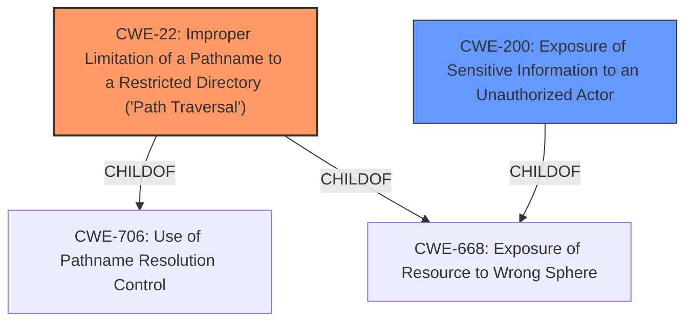

# Enhanced Analysis for CVE-2021-29006

# Summary
| CWE ID | CWE Name | Confidence | CWE Abstraction Level | CWE Vulnerability Mapping Label | CWE-Vulnerability Mapping Notes |
|---|---|---|---|---|---|
| CWE-22 | Improper Limitation of a Pathname to a Restricted Directory ('Path Traversal') | 1.0 | Base | Primary | Allowed |
| CWE-200 | Exposure of Sensitive Information to an Unauthorized Actor | 0.7 | Class | Secondary | Discouraged |

## Evidence and Confidence

*   **Confidence Score:** 0.9
*   **Evidence Strength:** HIGH

## Relationship Analysis
The primary CWE is CWE-22, which represents the **improper** limitation of a pathname to a restricted directory. The vulnerability description and the CVE details clearly indicate a path traversal issue. CWE-22 is a child of CWE-706 (Use of Pathname Resolution Control) and CWE-668 (Exposure of Resource to Wrong Sphere). CWE-200 is a class-level CWE related to exposure of sensitive information, which is a consequence of the path traversal.



## Vulnerability Chain
The vulnerability chain starts with the **improper** handling of user-controlled pathnames, leading to path traversal and ultimately resulting in the exposure of sensitive files on the server.

*   **Root Cause:** **Improper** limitation of pathname to a restricted directory (CWE-22).
*   **Impact:** Exposure of sensitive information to an unauthorized actor (CWE-200).

## Summary of Analysis
The initial assessment and the retriever results pointed towards several CWEs, but after a detailed analysis, CWE-22 was identified as the most accurate representation of the vulnerability's root cause. The vulnerability allows an authenticated user to download any file on the server due to **improper** path validation.

The following evidence supports this decision:

*   **Vulnerability Description Key Phrases:** "Local File Disclosure" indicates that the vulnerability leads to the exposure of files on the server.
*   **CVE Reference Links Content Summary:** "The vulnerability stems from an insecure implementation in the `ajaxGetFileByPath.php` script of rConfig, allowing for arbitrary file access." and "The `path` parameter in the `ajaxGetFileByPath.php` script is not properly sanitized, allowing an attacker to use path traversal sequences (e.g., `../`) to access files outside the intended directory." This clearly demonstrates a path traversal vulnerability.

The retriever results listed CWE-22 with a high similarity score, further supporting its selection. Other CWEs like CWE-200 (Exposure of Sensitive Information to an Unauthorized Actor) are consequences of the **improper** path handling (CWE-22), and are therefore not the primary weakness.

CWE-22 is at the optimal level of specificity (Base) because it directly describes the **improper** limitation of a pathname to a restricted directory, which is the root cause of the vulnerability.

Relevant CWE Information:

# Enhanced Context (25 CWEs)
The following CWEs were identified as potentially relevant to this vulnerability:

## CWE-36: Absolute Path Traversal
**Abstraction Level**: Base
**Similarity Score**: 0.76
**Source**: dense

**Description**:
The product uses external input to construct a pathname that should be within a restricted directory, but it does not properly neutralize absolute path sequences such as "/abs/path" that can resolve to a location that is outside of that directory.
This was considered, but the description mentions specifically relative path traversal, so CWE-23 or CWE-22 is a better fit.

## CWE-23: Relative Path Traversal
**Abstraction Level**: Base
**Similarity Score**: 0.76
**Source**: dense

**Description**:
The product uses external input to construct a pathname that should be within a restricted directory, but it does not properly neutralize sequences such as ".." that can resolve to a location that is outside of that directory.
This was considered and is a very close match. CWE-22 is selected since it is slightly more general.

## CWE-522: Insufficiently Protected Credentials
**Abstraction Level**: Class
**Similarity Score**: 0.78
**Source**: dense

**Description**:
The product transmits or stores authentication credentials, but it uses an insecure method that is susceptible to unauthorized interception and/or retrieval.
This was not selected because the vulnerability is not directly related to credentials.

## CWE-284: Improper Access Control
**Abstraction Level**: Pillar
**Similarity Score**: 0.75
**Source**: dense

**Description**:
The product does not restrict or incorrectly restricts access to a resource from an unauthorized actor.
This was not selected because it is too high-level.

## CWE-532: Insertion of Sensitive Information into Log File
**Abstraction Level**: Base
**Similarity Score**: 0.78
**Source**: dense

**Description**:
The product writes sensitive information to a log file.
This was not selected because the vulnerability is not directly related to log files.

## CWE-434: Unrestricted Upload of File with Dangerous Type
**Abstraction Level**: base
**Similarity Score**: 0.78
**Source**: graph

**Description**:
CWE-434: Unrestricted Upload of File with Dangerous Type
This was not selected because the vulnerability is not directly related to file uploads.

## CWE-200: Exposure of Sensitive Information to an Unauthorized Actor
**Abstraction Level**: Class
**Similarity Score**: 0.74
**Source**: dense

**Description**:
The product exposes sensitive information to an actor that is not explicitly authorized to have access to that information.
This was considered as a secondary impact. The primary issue is path traversal.

## CWE-552: Files or Directories Accessible to External Parties
**Abstraction Level**: Base
**Similarity Score**: 0.78
**Source**: dense

**Description**:
The product makes files or directories accessible to unauthorized actors, even though they should not be.
This was not selected because the vulnerability is more specifically related to path traversal.

## CWE-257: Storing Passwords in a Recoverable Format
**Abstraction Level**: Base
**Similarity Score**: 0.78
**Source**: dense

**Description**:
The storage of passwords in a recoverable format makes them subject to password reuse attacks by malicious users. In fact, it should be noted that recoverable encrypted passwords provide no significant benefit over plaintext passwords since they are subject not only to reuse by malicious attackers but also by malicious insiders. If a system administrator can recover a password directly, or use a brute force search on the available information, the administrator can use the password on other accounts.
This was not selected because the vulnerability is not directly related to password storage.


## CWE Relationship Analysis

Current CWEs represent these abstraction levels: .


### Vulnerability Chain Analysis

**Chain starting from CWE-36:**
- 36 (Absolute Path Traversal) - ROOT


**Chain starting from CWE-284:**
- 284 (Improper Access Control) - ROOT


### CWE Relationship Diagram

```mermaid
graph TD
    classDef primary fill:#f96,stroke:#333,stroke-width:2px
    classDef secondary fill:#69f,stroke:#333
    classDef tertiary fill:#9e9,stroke:#333
```