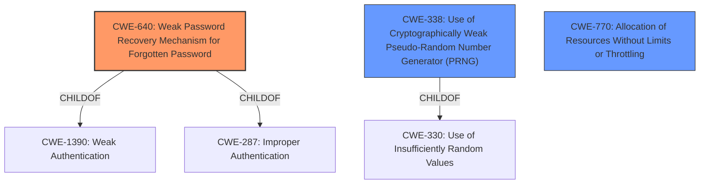

# Analysis Report for CVE-2021-29023

# Vulnerability Analysis Report: CVE-2021-29023

## Description


## Analysis (with Relationship Data)

# Summary
| CWE ID  | CWE Name                                                      | Confidence | CWE Abstraction Level | CWE Vulnerability Mapping Label | CWE-Vulnerability Mapping Notes |
| ------- | ------------------------------------------------------------- | ---------- | --------------------- | ------------------------------- | ------------------------------- |
| CWE-640 | Weak Password Recovery Mechanism for Forgotten Password       | 0.9        | Base                  | Primary                         | Allowed-with-Review           |
| CWE-338 | Use of Cryptographically Weak Pseudo-Random Number Generator (PRNG) | 0.8        | Base                  | Secondary                       | Allowed                       |
| CWE-770 | Allocation of Resources Without Limits or Throttling         | 0.7        | Base                  | Secondary                       | Allowed                       |

## Evidence and Confidence

*   **Confidence Score:** 0.8
*   **Evidence Strength:** HIGH

## Relationship Analysis
The primary CWE is CWE-640, which focuses on weaknesses in password recovery mechanisms. This has child relationships to CWE-1390 (Weak Authentication) and CWE-287 (Improper Authentication). The secondary CWE, CWE-338 (Use of Cryptographically Weak Pseudo-Random Number Generator (PRNG)), is a child of CWE-330 (Use of Insufficiently Random Values). CWE-770 (Allocation of Resources Without Limits or Throttling) is independent but related to the vulnerability through its impact. The choice of CWE-640 is based on its specific focus on password recovery, while CWE-338 identifies the root cause of weak token generation and CWE-770 represents the lack of rate limiting.



## Vulnerability Chain
The vulnerability chain starts with a **weak reset token generation** (CWE-338), leading to a **weak password recovery mechanism** (CWE-640). The absence of rate limiting (CWE-770) exacerbates the problem, allowing attackers to make multiple attempts to exploit the **predictable token**. The final impact is unauthorized access to user accounts.

## Summary of Analysis
The initial assessment identified CWE-640, CWE-338, and CWE-770 as potential matches based on the vulnerability description. The final conclusion, which includes CWE-640 as the primary weakness and CWE-338 and CWE-770 as secondary weaknesses, is strongly supported by the evidence provided in the "CVE Reference Links Content Summary" section:

*   "The password reset functionality in InvoicePlane v1.5.11 lacks rate limiting and uses a **predictable** method to generate password reset tokens."
*   "**CWE-640: Weak Password Recovery Mechanism for Forgotten Password:** The password reset token generation is flawed and predictable. It concatenates the current server time and user email, then generates an MD5 hash from this combination, making it relatively easy to guess."
*   "**CWE-770: Allocation of Resources Without Limits or Throttling:** There is no rate limiting on password reset requests."

CWE-640 is at the optimal level of specificity because it directly addresses the weakness in the password recovery mechanism, aligning with MITRE's guidance. CWE-338, while more granular, represents the root cause of the predictable token generation. CWE-770 identifies the lack of rate limiting which allows for multiple password reset attempts, amplifying the weakness.

Relevant CWE Information:

# Enhanced Context (25 CWEs)
The following CWEs were identified as potentially relevant to this vulnerability:

## CWE-799: Improper Control of Interaction Frequency
**Abstraction Level**: Class
**Similarity Score**: 0.77
**Source**: dense

**Description**:
The product does not properly limit the number or frequency of interactions that it has with an actor, such as the number of incoming requests.

**Mapping Guidance**:
- Usage: Allowed-with-Review
- Rationale: This CWE entry is a Class and might have Base-level children that would be more appropriate

## CWE-307: Improper Restriction of Excessive Authentication Attempts
**Abstraction Level**: Base
**Similarity Score**: 0.77
**Source**: dense

**Description**:
The product does not implement sufficient measures to prevent multiple failed authentication attempts within a short time frame.

**Mapping Guidance**:
- Usage: Allowed
- Rationale: This CWE entry is at the Base level of abstraction, which is a preferred level of abstraction for mapping to the root causes of vulnerabilities.

## CWE-1391: Use of Weak Credentials
**Abstraction Level**: Class
**Similarity Score**: 0.76
**Source**: dense

**Description**:
The product uses weak credentials (such as a default key or hard-coded password) that can be calculated, derived, reused, or guessed by an attacker.

**Mapping Guidance**:
- Usage: Allowed-with-Review
- Rationale: This CWE entry is a Class and might have Base-level children that would be more appropriate

## CWE-330: Use of Insufficiently Random Values
**Abstraction Level**: Class
**Similarity Score**: 0.76
**Source**: dense

**Description**:
The product uses insufficiently random numbers or values in a security context that depends on unpredictable numbers.

**Mapping Guidance**:
- Usage: Discouraged
- Rationale: This CWE entry is a level-1 Class (i.e., a child of a Pillar). It might have lower-level children that would be more appropriate

## CWE-1390: Weak Authentication
**Abstraction Level**: Class
**Similarity Score**: 0.74
**Source**: dense

**Description**:
The product uses an authentication mechanism to restrict access to specific users or identities, but the mechanism does not sufficiently prove that the claimed identity is correct.

**Mapping Guidance**:
- Usage: Allowed-with-Review
- Rationale: This CWE entry is a Class and might have Base-level children that would be more appropriate

## CWE-331: Insufficient Entropy
**Abstraction Level**: Base
**Similarity Score**: 0.74
**Source**: dense

**Description**:
The product uses an algorithm or scheme that produces insufficient entropy, leaving patterns or clusters of values that are more likely to occur than others.

**Mapping Guidance**:
- Usage: Allowed
- Rationale: This CWE entry is at the Base level of abstraction, which is a preferred level of abstraction for mapping to the root causes of vulnerabilities.

## CWE-807: Reliance on Untrusted Inputs in a Security Decision
**Abstraction Level**: Base
**Similarity Score**: 0.74
**Source**: dense

**Description**:
The product uses a protection mechanism that relies on the existence or values of an input, but the input can be modified by an untrusted actor in a way that bypasses the protection mechanism.

**Mapping Guidance**:
- Usage: Allowed
- Rationale: This CWE entry is at the Base level of abstraction, which is a preferred level of abstraction for mapping to the root causes of vulnerabilities.

## CWE-335: Incorrect Usage of Seeds in Pseudo-Random Number Generator (PRNG)
**Abstraction Level**: Base
**Similarity Score**: 0.74
**Source**: dense

**Description**:
The product uses a Pseudo-Random Number Generator (PRNG) but does not correctly manage seeds.

**Mapping Guidance**:
- Usage: Allowed
- Rationale: This CWE entry is at the Base level of abstraction, which is a preferred level of abstraction for mapping to the root causes of vulnerabilities.

## CWE-472: External Control of Assumed-Immutable Web Parameter
**Abstraction Level**: Base
**Similarity Score**: 0.73
**Source**: dense

**Description**:
The web application does not sufficiently verify inputs that are assumed to be immutable but are actually externally controllable, such as hidden form fields.

**Mapping Guidance**:
- Usage: Allowed
- Rationale: This CWE entry is at the Base level of abstraction, which is a preferred level of abstraction for mapping to the root causes of vulnerabilities.

## CWE-798: Use of Hard-coded Credentials
**Abstraction Level**: Base
**Similarity Score**: 0.73
**Source**: dense

**


## CWE Relationship Analysis

Current CWEs represent these abstraction levels: .


### Vulnerability Chain Analysis

**Chain starting from CWE-640:**
- 640 (Weak Password Recovery Mechanism for Forgotten Password) - ROOT


**Chain starting from CWE-331:**
- 331 (Insufficient Entropy) - ROOT


### CWE Relationship Diagram

```mermaid
graph TD
    classDef primary fill:#f96,stroke:#333,stroke-width:2px
    classDef secondary fill:#69f,stroke:#333
    classDef tertiary fill:#9e9,stroke:#333
```


*Report generated on 2025-04-01 22:30:20*
