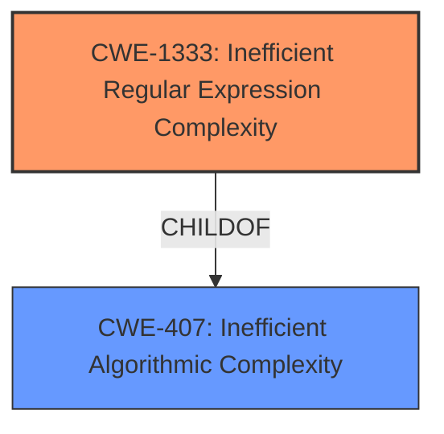

# Raw Analyzer Response for CVE-2021-29060

# Summary
| CWE ID    | CWE Name                                  | Confidence | CWE Abstraction Level | CWE Vulnerability Mapping Label | CWE-Vulnerability Mapping Notes |
| :-------- | :---------------------------------------- | :--------- | :-------------------- | :------------------------------ | :------------------------------ |
| CWE-1333  | Inefficient Regular Expression Complexity | 1.0        | Base                  | Allowed                         | Primary CWE                     |

## Evidence and Confidence

*   **Confidence Score:** 1.0
*   **Evidence Strength:** HIGH

## Relationship Analysis
The primary relationship that impacted my decision was the parent-child relationship between CWE-407 (Inefficient Algorithmic Complexity) and CWE-1333 (Inefficient Regular Expression Complexity). CWE-1333 is a specific type of algorithmic inefficiency involving regular expressions, making it a more precise fit for the vulnerability description.

## Vulnerability Chain
The chain of events is as follows:
1.  The root cause is the **inefficient regular expression** used to parse HWB color strings.
2.  This **inefficiency** leads to excessive backtracking and CPU consumption when processing long, crafted input strings.
3.  The excessive CPU consumption results in a denial-of-service condition.

## Summary of Analysis
The initial analysis identified CWE-1333 as the most relevant CWE due to the vulnerability description explicitly mentioning a "**regular expression denial of service**". The "CVE Reference Links Content Summary" further confirms that the vulnerability is due to an **inefficient regular expression** that causes excessive backtracking. The retriever results also list CWE-1333 as the top candidate with a score of 1.0.

CWE-1333 (Inefficient Regular Expression Complexity) is the optimal level of specificity because it directly addresses the root cause of the vulnerability: the use of an inefficient regular expression. The description of CWE-1333 matches the vulnerability details, including the excessive CPU consumption caused by backtracking.

Relevant CWE Information:

# Enhanced Context (25 CWEs)

## CWE-1333: Inefficient Regular Expression Complexity
**Abstraction Level**: Base
**Similarity Score**: 5529.87
**Source**: sparse

**Description**:
The product uses a regular expression with an inefficient, possibly exponential worst-case computational complexity that consumes excessive CPU cycles.

**Mapping Guidance**:
- Usage: Allowed
- Rationale: This CWE entry is at the Base level of abstraction, which is a preferred level of abstraction for mapping to the root causes of vulnerabilities.

### **CWE Selection Rationale:**
CWE-1333 is the best fit because the vulnerability is directly caused by an inefficient regular expression. The vulnerability description explicitly mentions "Regular Expression Denial of Service (ReDoS)". The "CVE Reference Links Content Summary" confirms that the root cause is the **inefficient regular expression** for parsing the hue value in hwb() strings, leading to excessive backtracking. This aligns perfectly with the CWE-1333 description.
The "Mapping Guidance" indicates that its **Usage** is **Allowed** and its **Abstraction** is **Base** which is the preferred level.

## CWE-407: Inefficient Algorithmic Complexity
**Abstraction Level**: Class
**Similarity Score**: 4884.94
**Source**: sparse

**Description**:
An algorithm in a product has an inefficient worst-case computational complexity that may be detrimental to system performance and can be triggered by an attacker, typically using crafted manipulations that ensure that the worst case is being reached.

**Mapping Guidance**:
- Usage: Allowed-with-Review
- Rationale: This CWE entry is a Class and might have Base-level children that would be more appropriate

### **CWE Rejection Rationale:**
CWE-407 is a more general class of weakness. While the ReDoS vulnerability does involve algorithmic inefficiency, CWE-1333 is a more specific and accurate representation of the root cause. The "Mapping Guidance" indicates that its **Usage** is **Allowed-with-Review** and its **Abstraction** is **Class** so there "might have Base-level children that would be more appropriate"

## CWE-617: Reachable Assertion
**Abstraction Level**: Base
**Similarity Score**: 4994.42
**Source**: sparse

**Description**:
The product contains an assert() or similar statement that can be triggered by an attacker, which leads to an application exit or other behavior that is more severe than necessary.

**Mapping Guidance**:
- Usage: Allowed
- Rationale: This CWE entry is at the Base level of abstraction, which is a preferred level of abstraction for mapping to the root causes of vulnerabilities.

### **CWE Rejection Rationale:**
CWE-617 is not applicable because the vulnerability doesn't involve triggering an assertion. The issue is with the processing time of the regular expression, not with an assertion failure.

## CWE-1284: Improper Validation of Specified Quantity in Input
**Abstraction Level**: base
**Similarity Score**: 4.33
**Source**: graph

**Description**:
CWE-1284: Improper Validation of Specified Quantity in Input

**Mapping Guidance**:
- Usage: Allowed
- Rationale: This CWE entry is at the Base level of abstraction, which is a preferred level of abstraction for mapping to the root causes of vulnerabilities.

### **CWE Rejection Rationale:**
CWE-1284 is not applicable because the vulnerability isn't related to the validation of an input quantity. The problem lies within the regular expression's inefficiency, not a failure to validate input size or length.