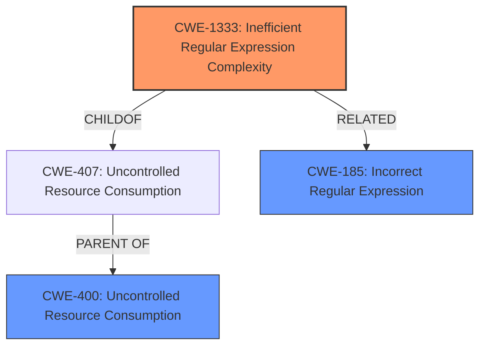

# Analysis Report for CVE-2021-29063

# Vulnerability Analysis Report: CVE-2021-29063

## Description


## Analysis (with Relationship Data)

# Summary
| CWE ID   | CWE Name                                         | Confidence | CWE Abstraction Level | CWE Vulnerability Mapping Label | CWE-Vulnerability Mapping Notes |
| -------- | ------------------------------------------------ | ---------- | --------------------- | ------------------------------- | ------------------------------- |
| CWE-1333 | Inefficient Regular Expression Complexity        | 1.0        | Base                  | Allowed                         | Primary CWE                     |
| CWE-400  | Uncontrolled Resource Consumption                | 0.75       | Class                  | Allowed-with-Review           | Secondary Candidate             |
| CWE-185  | Incorrect Regular Expression                     | 0.5        | Class                  | Allowed-with-Review           | Secondary Candidate             |

## Evidence and Confidence

*   **Confidence Score:** 0.85
*   **Evidence Strength:** HIGH

## Relationship Analysis
The primary CWE is CWE-1333, which is a base-level CWE and a child of CWE-407 (Uncontrolled Resource Consumption). The vulnerability description clearly indicates that the root cause is an inefficient regular expression that leads to excessive CPU consumption, aligning perfectly with CWE-1333. CWE-400 is a class-level CWE and represents the broader category of resource consumption issues. CWE-185, Incorrect Regular Expression, is a Class-level CWE, but it's considered since the regex itself is not written correctly, leading to the inefficiency.



## Vulnerability Chain
The vulnerability chain starts with the **inefficient regular expression** (CWE-1333) in the `mpmathify` function. This leads to excessive backtracking, which consumes excessive CPU cycles. The final impact is a denial of service (DoS) due to **uncontrolled resource consumption** (CWE-400).

## Summary of Analysis
The primary assessment is based on strong evidence from the vulnerability description and CVE Reference Links Content Summary. The **weakness** is explicitly stated as "**regular expression denial of service**," and the root cause is identified as an **inefficient regular expression**.

The CVE Reference Links Content Summary provides detailed technical information, including the vulnerable regex in `mpmath/ctx_mp.py` and the exploit string. This confirms that the vulnerability is indeed caused by an inefficient regular expression complexity (CWE-1333).

The relationship analysis further supports the selection of CWE-1333. It is a child of CWE-407 (Uncontrolled Resource Consumption), which aligns with the denial-of-service impact of the vulnerability.

The selection of CWE-1333 is at the optimal level of specificity because it directly addresses the root cause of the vulnerability. While CWE-400 (Uncontrolled Resource Consumption) is a relevant parent CWE, it is too general and does not capture the specific nature of the weakness (i.e., the inefficient regular expression). CWE-185 (Incorrect Regular Expression) could be considered, but the primary issue is the complexity and inefficiency rather than a simple incorrectness. The mitigation, which involves simplifying the regex, further supports the selection of CWE-1333.

Relevant CWE Information:

# Enhanced Context (25 CWEs)
The following CWEs were identified as potentially relevant to this vulnerability:

## CWE-674: Uncontrolled Recursion
**Abstraction Level**: Class
**Similarity Score**: 0.76
**Source**: dense

**Description**:
The product does not properly control the amount of recursion that takes place,  consuming excessive resources, such as allocated memory or the program stack.

**Mapping Guidance**:
- Usage: Allowed-with-Review
- Rationale: This CWE entry is a Class and might have Base-level children that would be more appropriate
**Justification for not choosing CWE-674:** While recursion can be a factor in ReDoS, the primary cause here is the inefficient regular expression, not uncontrolled recursion in the general sense.

## CWE-131: Incorrect Calculation of Buffer Size
**Abstraction Level**: Base
**Similarity Score**: 0.76
**Source**: dense

**Description**:
The product does not correctly calculate the size to be used when allocating a buffer, which could lead to a buffer overflow.

**Mapping Guidance**:
- Usage: Allowed
- Rationale: This CWE entry is at the Base level of abstraction, which is a preferred level of abstraction for mapping to the root causes of vulnerabilities.
**Justification for not choosing CWE-131:** This CWE is related to buffer overflows, which is not the case in this vulnerability.

## CWE-129: Improper Validation of Array Index
**Abstraction Level**: Variant
**Similarity Score**: 0.75
**Source**: dense

**Description**:
The product uses untrusted input when calculating or using an array index, but the product does not validate or incorrectly validates the index to ensure the index references a valid position within the array.

**Mapping Guidance**:
- Usage: Allowed
- Rationale: This CWE entry is at the Variant level of abstraction, which is a preferred level of abstraction for mapping to the root causes of vulnerabilities.
**Justification for not choosing CWE-129:** This CWE is related to array index validation, which is not applicable to this vulnerability.

## CWE-125: Out-of-bounds Read
**Abstraction Level**: Base
**Similarity Score**: 0.75
**Source**: dense

**Description**:
The product reads data past the end, or before the beginning, of the intended buffer.

**Mapping Guidance**:
- Usage: Allowed
- Rationale: This CWE entry is at the Base level of abstraction, which is a preferred level of abstraction for mapping to the root causes of vulnerabilities.
**Justification for not choosing CWE-125:** This CWE is related to out-of-bounds reads, which is not the case in this vulnerability.

## CWE-126: Buffer Over-read
**Abstraction Level**: Variant
**Similarity Score**: 0.75
**Source**: dense

**Description**:
The product reads from a buffer using buffer access mechanisms such as indexes or pointers that reference memory locations after the targeted buffer.

**Mapping Guidance**:
- Usage: Allowed
- Rationale: This CWE entry is at the Variant level of abstraction, which is a preferred level of abstraction for mapping to the root causes of vulnerabilities.
**Justification for not choosing CWE-126:** This CWE is related to buffer over-reads, which is not the case in this vulnerability.

## CWE-191: Integer Underflow (Wrap or Wraparound)
**Abstraction Level**: Base
**Similarity Score**: 0.75
**Source**: dense

**Description**:
The product subtracts one value from another, such that the result is less than the minimum allowable integer value, which produces a value that is not equal to the correct result.

**Mapping Guidance**:
- Usage: Allowed
- Rationale: This CWE entry is at the Base level of abstraction, which is a preferred level of abstraction for mapping to the root causes of vulnerabilities.
**Justification for not choosing CWE-191:** This CWE is related to integer underflow, which is not applicable to this vulnerability.

## CWE-788: Access of Memory Location After End of Buffer
**Abstraction Level**: Base
**Similarity Score**: 0.74
**Source**: dense

**Description**:
The product reads or writes to a buffer using an index or pointer that references a memory location after the end of the buffer.

**Mapping Guidance**:
- Usage: Discouraged
- Rationale: The CWE entry might be misused when lower-level CWE entries might be available. It also overlaps existing CWE entries and might be deprecated in the future.
**Justification for not choosing CWE-788:** This CWE is related to memory access after the end of a buffer, which is not the case in this vulnerability.

## CWE-119: Improper Restriction of Operations within the Bounds of a Memory Buffer
**Abstraction Level**: Class
**Similarity Score**: 0.74
**Source**: dense

**Description**:
The product performs operations on a memory buffer, but it reads from or writes to a memory location outside the buffer's intended boundary. This may result in read or write operations on unexpected memory locations that could be linked to other variables, data structures, or internal program data.

**Mapping Guidance**:
- Usage: Discouraged
- Rationale: CWE-119 is commonly misused in low-information vulnerability reports when lower-level CWEs


## CWE Relationship Analysis

Current CWEs represent these abstraction levels: .


### Vulnerability Chain Analysis

**Chain starting from CWE-674:**
- 674 (Uncontrolled Recursion) - ROOT


**Chain starting from CWE-185:**
- 185 (Incorrect Regular Expression) - ROOT


### CWE Relationship Diagram

```mermaid
graph TD
    classDef primary fill:#f96,stroke:#333,stroke-width:2px
    classDef secondary fill:#69f,stroke:#333
    classDef tertiary fill:#9e9,stroke:#333
```


*Report generated on 2025-04-02 11:38:57*
