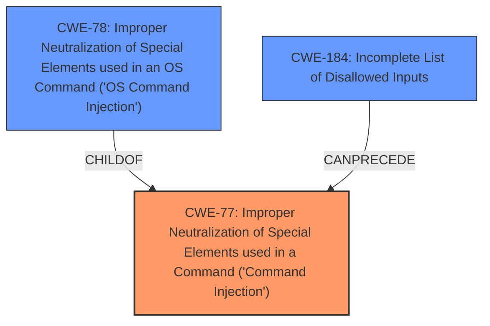

# Enhanced Analysis for CVE-2021-29070

# Summary
| CWE ID | CWE Name | Confidence | CWE Abstraction Level | CWE Vulnerability Mapping Label | CWE-Vulnerability Mapping Notes |
|---|---|---|---|---|---|
| CWE-77 | Improper Neutralization of Special Elements used in a Command ('Command Injection') | 0.9 | Class | Allowed-with-Review | Primary CWE. Vulnerability stems from the **improper neutralization** of special elements within a command, leading to **command injection**. |
| CWE-78 | Improper Neutralization of Special Elements used in an OS Command ('OS Command Injection') | 0.7 | Base | Allowed | Secondary candidate. The vulnerability is a specific case of **command injection** targeting the operating system, due to **improper neutralization** of OS command elements. |
| CWE-184 | Incomplete List of Disallowed Inputs | 0.4 | Base | Allowed | Secondary candidate. The vulnerability may be due to an **incomplete list of disallowed inputs** that could be used for command injection. |

## Evidence and Confidence

*   **Confidence Score:** 0.8
*   **Evidence Strength:** HIGH

## Relationship Analysis
The primary CWE, CWE-77, is a Class-level weakness that broadly describes **improper neutralization** of special elements in commands. A more specific child, CWE-78, addresses **improper neutralization** in OS commands. CWE-184 highlights that the root cause of the injection vulnerability might stem from an **incomplete list of disallowed inputs**.



## Vulnerability Chain
The vulnerability chain starts with a potential **incomplete list of disallowed inputs** (CWE-184). This allows an attacker to inject malicious commands because of the **improper neutralization of special elements** (CWE-77), which then leads to **OS command injection** (CWE-78).

## Summary of Analysis
The initial assessment strongly points to CWE-77 as the primary weakness, given the vulnerability description highlighting **command injection**. The CVE reference links confirm a post-authentication **command injection** vulnerability. The provided evidence states, "*Root cause of vulnerability*: Post-authentication command injection" and "*Weaknesses/vulnerabilities present*: The vulnerability allows for command injection after successful authentication."

CWE-78 is considered because the commands are likely OS commands. However, the description doesn't explicitly state that the **command injection** is limited to OS commands. Therefore, the broader Class CWE-77 is a better primary fit.

CWE-184 is considered as the root cause for the injection, which could be due to an **incomplete list of disallowed inputs**.

The final decision favors CWE-77 as the primary weakness because it directly addresses the identified **command injection** vulnerability, and it is at the appropriate level of abstraction as a Class.

Relevant CWE Information:

# Enhanced Context (25 CWEs)

## CWE-226: Sensitive Information in Resource Not Removed Before Reuse
**Abstraction Level**: Base
**Similarity Score**: 0.78
**Source**: dense

**Description**:
The product releases a resource such as memory or a file so that it can be made available for reuse, but it does not clear or "zeroize" the information contained in the resource before the product performs a critical state transition or makes the resource available for reuse by other entities.

**Mapping Guidance**:
- Usage: Allowed
- Rationale: This CWE entry is at the Base level of abstraction, which is a preferred level of abstraction for mapping to the root causes of vulnerabilities.

This CWE is not relevant because the vulnerability is related to **command injection**, not sensitive information reuse.

## CWE-404: Improper Resource Shutdown or Release
**Abstraction Level**: Class
**Similarity Score**: 0.78
**Source**: dense

**Description**:
The product does not release or incorrectly releases a resource before it is made available for re-use.

**Mapping Guidance**:
- Usage: Allowed-with-Review
- Rationale: This CWE entry is a Class and might have Base-level children that would be more appropriate

This CWE is not relevant because the vulnerability is related to **command injection**, not resource management.

## CWE-664: Improper Control of a Resource Through its Lifetime
**Abstraction Level**: Pillar
**Similarity Score**: 0.76
**Source**: dense

**Description**:
The product does not maintain or incorrectly maintains control over a resource throughout its lifetime of creation, use, and release.

**Mapping Guidance**:
- Usage: Discouraged
- Rationale: This CWE entry is high-level when lower-level children are available.

This CWE is not relevant because the vulnerability is related to **command injection**, not general resource control.

## CWE-772: Missing Release of Resource after Effective Lifetime
**Abstraction Level**: Base
**Similarity Score**: 0.76
**Source**: dense

**Description**:
The product does not release a resource after its effective lifetime has ended, i.e., after the resource is no longer needed.

**Mapping Guidance**:
- Usage: Allowed
- Rationale: This CWE entry is at the Base level of abstraction, which is a preferred level of abstraction for mapping to the root causes of vulnerabilities.

This CWE is not relevant because the vulnerability is related to **command injection**, not resource management.

## CWE-1325: Improperly Controlled Sequential Memory Allocation
**Abstraction Level**: Base
**Similarity Score**: 0.75
**Source**: dense

**Description**:
The product manages a group of objects or resources and performs a separate memory allocation for each object, but it does not properly limit the total amount of memory that is consumed by all of the combined objects.

**Mapping Guidance**:
- Usage: Allowed
- Rationale: This CWE entry is at the Base level of abstraction, which is a preferred level of abstraction for mapping to the root causes of vulnerabilities.

This CWE is not relevant because the vulnerability is related to **command injection**, not memory allocation issues.

## CWE-789: Memory Allocation with Excessive Size Value
**Abstraction Level**: Variant
**Similarity Score**: 0.74
**Source**: dense

**Description**:
The product allocates memory based on an untrusted, large size value, but it does not ensure that the size is within expected limits, allowing arbitrary amounts of memory to be allocated.

**Mapping Guidance**:
- Usage: Allowed
- Rationale: This CWE entry is at the Variant level of abstraction, which is a preferred level of abstraction for mapping to the root causes of vulnerabilities.

This CWE is not relevant because the vulnerability is related to **command injection**, not memory allocation issues.

## CWE-405: Asymmetric Resource Consumption (Amplification)
**Abstraction Level**: Class
**Similarity Score**: 0.74
**Source**: dense

**Description**:
The product does not properly control situations in which an adversary can cause the product to consume or produce excessive resources without requiring the adversary to invest equivalent work or otherwise prove authorization, i.e., the adversary's influence is "asymmetric."

**Mapping Guidance**:
- Usage: Allowed-with-Review
- Rationale: This CWE entry is a Class and might have Base-level children that would be more appropriate

This CWE is not relevant because the vulnerability is related to **command injection**, not asymmetric resource consumption.

## CWE-667: Improper Locking
**Abstraction Level**: Class
**Similarity Score**: 0.74
**Source**: dense

**Description**:
The product does not properly acquire or release a lock on a resource, leading to unexpected resource state changes and behaviors.

**Mapping Guidance**:
- Usage: Allowed-with-Review
- Rationale: This CWE entry is a Class and might have Base-level children that would be more appropriate

This CWE is not relevant because the vulnerability is related to **command injection**, not locking mechanisms.

## CWE-691: Insufficient Control Flow Management
**Abstraction Level**: Pillar
**Similarity Score**: 0.73
**Source**: dense

**Description**:
The code does not sufficiently manage its control flow during execution, creating conditions in which the control flow can be modified in unexpected ways.

**Mapping Guidance**:
- Usage: Discouraged
- Rationale: This CWE entry is extremely high-level, a Pillar. However, classification research is limited for weaknesses of this type, so there can be gaps or organizational difficulties within CWE that force use of this weakness, even at such a high level of abstraction.

This CWE is not relevant because the vulnerability is related to **command injection**, not general control flow management.

## CWE-775: Missing Release of File Descriptor or Handle after Effective Lifetime


## CWE Relationship Analysis

Current CWEs represent these abstraction levels: .


### Vulnerability Chain Analysis

**Chain starting from CWE-667:**
- 667 (Improper Locking) - ROOT


**Chain starting from CWE-691:**
- 691 (Insufficient Control Flow Management) - ROOT


### CWE Relationship Diagram

```mermaid
graph TD
    classDef primary fill:#f96,stroke:#333,stroke-width:2px
    classDef secondary fill:#69f,stroke:#333
    classDef tertiary fill:#9e9,stroke:#333
```