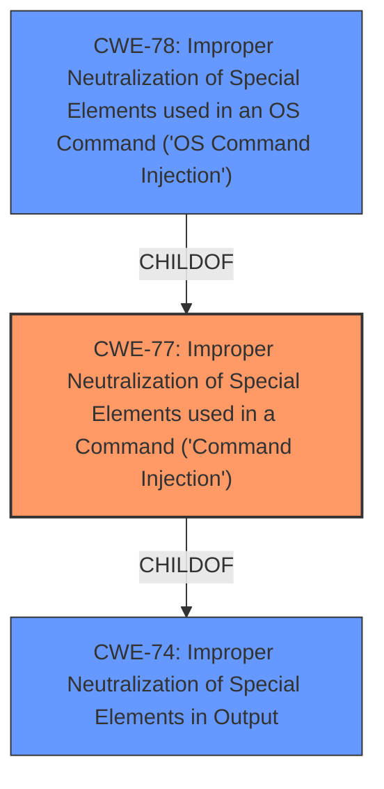

# Raw Analyzer Response for CVE-2021-29071

# Summary
| CWE ID  | CWE Name  | Confidence | CWE Abstraction Level | CWE Vulnerability Mapping Label | CWE-Vulnerability Mapping Notes |
|---|---|---|---|---|---|
| CWE-77 | Improper Neutralization of Special Elements used in a Command ('Command Injection') | 1.0 | Class | Allowed-with-Review | Primary CWE |

## Evidence and Confidence

*   **Confidence Score:** 1.0
*   **Evidence Strength:** HIGH

## Relationship Analysis
The primary relationship influencing my decision is the ChildOf relationship between CWE-77 and CWE-74 (Improper Neutralization of Special Elements in Output). CWE-77 is a Class-level CWE that is more specific than CWE-74 but less specific than CWE-78 (OS Command Injection), which is a Base-level CWE. Since the vulnerability description indicates a general **command injection** by an authenticated user, CWE-77 is the most appropriate choice. It covers command injection in general, not just OS command injection.

## Vulnerability Chain
The chain of root cause and weakness is as follows:
1.  **ROOT CAUSE:** Improper neutralization of special elements in a command.
2.  **WEAKNESS:** Command injection.
3.  **IMPACT:** An authenticated user can execute arbitrary commands on the device.

## Summary of Analysis
The initial analysis indicates a **command injection** vulnerability. The vulnerability description key phrases mention "weakness: **command injection**" and the CVE Reference Links Content Summary confirms "Root cause of vulnerability: Post-authentication **command injection**" and "Weaknesses/vulnerabilities present: **Command injection**".

The Retriever Results list CWE-77 (Improper Neutralization of Special Elements used in a Command ('Command Injection')) as the top candidate. The CWE description states: "The product constructs all or part of a command using externally-influenced input from an upstream component, but it does not neutralize or incorrectly neutralizes special elements that could modify the intended command when it is sent to a downstream component." This directly matches the vulnerability description.

The CWE-77 mapping guidance suggests a review because it's often misused when OS command injection (CWE-78) is intended. However, since the description does not explicitly mention OS commands, CWE-77 is more appropriate.

CWE-78 was considered but not used because the description doesn't specify that the commands are OS commands. CWE-94 was considered but not used because it refers to the improper control of the generation of code, which isn't the case here. CWE-79 was considered, because it was the primary CWE match for similar CVE Descriptions, but that CWE is for Cross-site Scripting which is not relevant here.

The selected CWE is at the optimal level of specificity because it precisely describes the weakness of improper neutralization of special elements in a command. This provides a clear understanding of the vulnerability and its potential impact.