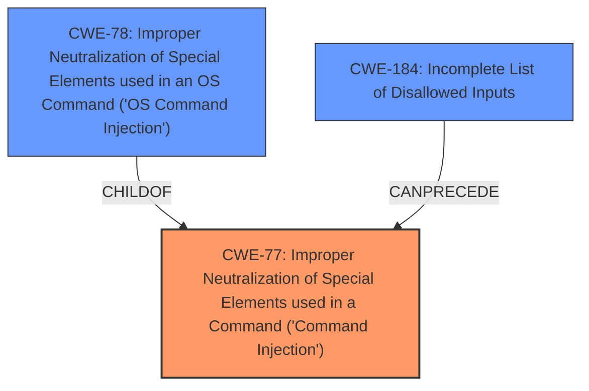

# Analysis Report for CVE-2021-29078

# Vulnerability Analysis Report: CVE-2021-29078

## Description


## Analysis (with Relationship Data)

# Summary
| CWE ID | CWE Name | Confidence | CWE Abstraction Level | CWE Vulnerability Mapping Label | CWE-Vulnerability Mapping Notes |
|---|---|---|---|---|---|
| CWE-77 | Improper Neutralization of Special Elements used in a Command ('Command Injection') | 0.9 | Class | Allowed-with-Review | Primary CWE |
| CWE-78 | Improper Neutralization of Special Elements used in an OS Command ('OS Command Injection') | 0.7 | Base | Allowed | Secondary Candidate |
| CWE-184 | Incomplete List of Disallowed Inputs | 0.6 | Base | Allowed | Secondary Candidate |

## Evidence and Confidence

*   **Confidence Score:** 0.8
*   **Evidence Strength:** HIGH

## Relationship Analysis
The primary CWE is CWE-77, a Class-level CWE, representing command injection in general. CWE-78, a Base-level CWE, is a child of CWE-77 and represents OS command injection, a more specific type of command injection. CWE-184, Incomplete List of Disallowed Inputs, can precede command injection vulnerabilities by failing to adequately filter malicious input.



## Vulnerability Chain
The vulnerability chain starts with a potential **incomplete list of disallowed inputs** (CWE-184), which allows an attacker to inject malicious commands. The device then fails to properly neutralize special elements in the command (CWE-77), leading to command execution. The end result is the attacker gaining control of the device.

## Summary of Analysis
The vulnerability description clearly states "**command injection** by an unauthenticated attacker." The primary CWE match from similar CVE descriptions is CWE-79, but this is "Improper Neutralization of Input During Web Page Generation ('Cross-site Scripting')" and not the best fit. The Top CWEs include CWE-77, CWE-787, and CWE-77. The CVE Reference Links Content Summary indicates "a pre-authentication **command injection** vulnerability," further supporting the selection of a command injection CWE.

The Retriever Results list CWE-77 as the top candidate. CWE-77 is "Improper Neutralization of Special Elements used in a Command ('Command Injection')" and is a Class-level CWE. The Mapping Guidance suggests Allowed-with-Review and warns that CWE-77 is often misused when OS command injection (CWE-78) was intended instead. However, since the initial description uses the broader term "command injection", CWE-77 is a better fit.

CWE-78, "Improper Neutralization of Special Elements used in an OS Command ('OS Command Injection')" is the second candidate from the Retriever Results and is a child of CWE-77. It is a Base-level CWE and the Mapping Guidance says it is Allowed. Since the advisory describes a generic **command injection** and does not specify that it is limited to OS commands, CWE-77 is selected. However, CWE-78 is included as a secondary candidate since it is possible the injected command is an OS command.

CWE-184, "Incomplete List of Disallowed Inputs" is also considered as a secondary weakness, because the root cause might be due to **missing** some special elements that should be neutralized.

Therefore, CWE-77 is the most appropriate primary CWE because the vulnerability description states "**command injection**" which is a general type of command injection.

Relevant CWE Information:

# Enhanced Context (25 CWEs)

## CWE-226: Sensitive Information in Resource Not Removed Before Reuse
**Abstraction Level**: Base
**Similarity Score**: 0.77
**Source**: dense

**Description**:
The product releases a resource such as memory or a file so that it can be made available for reuse, but it does not clear or "zeroize" the information contained in the resource before the product performs a critical state transition or makes the resource available for reuse by other entities.

**Mapping Guidance**:
- Usage: Allowed
- Rationale: This CWE entry is at the Base level of abstraction, which is a preferred level of abstraction for mapping to the root causes of vulnerabilities.

*This CWE is not related to the command injection vulnerability.*

## CWE-404: Improper Resource Shutdown or Release
**Abstraction Level**: Class
**Similarity Score**: 0.77
**Source**: dense

**Description**:
The product does not release or incorrectly releases a resource before it is made available for re-use.

**Mapping Guidance**:
- Usage: Allowed-with-Review
- Rationale: This CWE entry is a Class and might have Base-level children that would be more appropriate

*This CWE is not related to the command injection vulnerability.*

## CWE-664: Improper Control of a Resource Through its Lifetime
**Abstraction Level**: Pillar
**Similarity Score**: 0.76
**Source**: dense

**Description**:
The product does not maintain or incorrectly maintains control over a resource throughout its lifetime of creation, use, and release.

**Mapping Guidance**:
- Usage: Discouraged
- Rationale: This CWE entry is high-level when lower-level children are available.

*This CWE is not related to the command injection vulnerability.*

## CWE-772: Missing Release of Resource after Effective Lifetime
**Abstraction Level**: Base
**Similarity Score**: 0.75
**Source**: dense

**Description**:
The product does not release a resource after its effective lifetime has ended, i.e., after the resource is no longer needed.

**Mapping Guidance**:
- Usage: Allowed
- Rationale: This CWE entry is at the Base level of abstraction, which is a preferred level of abstraction for mapping to the root causes of vulnerabilities.

*This CWE is not related to the command injection vulnerability.*

## CWE-667: Improper Locking
**Abstraction Level**: Class
**Similarity Score**: 0.74
**Source**: dense

**Description**:
The product does not properly acquire or release a lock on a resource, leading to unexpected resource state changes and behaviors.

**Mapping Guidance**:
- Usage: Allowed-with-Review
- Rationale: This CWE entry is a Class and might have Base-level children that would be more appropriate

*This CWE is not related to the command injection vulnerability.*

## CWE-41: Improper Resolution of Path Equivalence
**Abstraction Level**: Base
**Similarity Score**: 0.74
**Source**: dense

**Description**:
The product is vulnerable to file system contents disclosure through path equivalence. Path equivalence involves the use of special characters in file and directory names. The associated manipulations are intended to generate multiple names for the same object.

**Mapping Guidance**:
- Usage: Allowed
- Rationale: This CWE entry is at the Base level of abstraction, which is a preferred level of abstraction for mapping to the root causes of vulnerabilities.

*This CWE is not related to the command injection vulnerability.*

## CWE-789: Memory Allocation with Excessive Size Value
**Abstraction Level**: Variant
**Similarity Score**: 0.74
**Source**: dense

**Description**:
The product allocates memory based on an untrusted, large size value, but it does not ensure that the size is within expected limits, allowing arbitrary amounts of memory to be allocated.

**Mapping Guidance**:
- Usage: Allowed
- Rationale: This CWE entry is at the Variant level of abstraction, which is a preferred level of abstraction for mapping to the root causes of vulnerabilities.

*This CWE is not related to the command injection vulnerability.*

## CWE-1325: Improperly Controlled Sequential Memory Allocation
**Abstraction Level**: Base
**Similarity Score**: 0.74
**Source**: dense

**Description**:
The product manages a group of objects or resources and performs a separate memory allocation for each object, but it does not properly limit the total amount of memory that is consumed by all of the combined objects.

**Mapping Guidance**:
- Usage: Allowed
- Rationale: This CWE entry is at the Base level of abstraction, which is a preferred level of abstraction for mapping to the root causes of vulnerabilities.

*This CWE is not related to the command injection vulnerability.*

## CWE-665: Improper Initialization
**Abstraction Level**: Class
**Similarity Score**: 0.74
**Source**: dense

**Description**:
The product does not initialize or incorrectly initializes a resource, which might leave the resource in an unexpected state when it is accessed or used.

**Mapping Guidance**:
- Usage: Discouraged
- Rationale: This CWE entry is a level-1 Class (i.e., a child of a Pillar). It might


## CWE Relationship Analysis

Current CWEs represent these abstraction levels: .


### Vulnerability Chain Analysis

**Chain starting from CWE-667:**
- 667 (Improper Locking) - ROOT


**Chain starting from CWE-787:**
- 787 (Out-of-bounds Write) - ROOT


### CWE Relationship Diagram

```mermaid
graph TD
    classDef primary fill:#f96,stroke:#333,stroke-width:2px
    classDef secondary fill:#69f,stroke:#333
    classDef tertiary fill:#9e9,stroke:#333
```


*Report generated on 2025-04-02 06:53:13*
