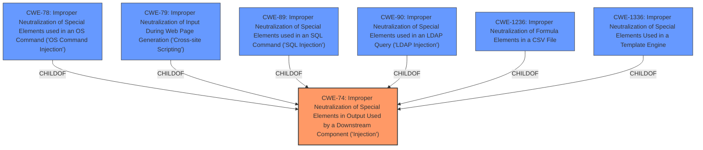

# Analysis Report for CVE-2021-29085

# Vulnerability Analysis Report: CVE-2021-29085

## Description


## Analysis (with Relationship Data)

# Summary
| CWE ID | CWE Name | Confidence | CWE Abstraction Level | CWE Vulnerability Mapping Label | CWE-Vulnerability Mapping Notes |
|---|---|---|---|---|---|
| CWE-74 | Improper Neutralization of Special Elements in Output Used by a Downstream Component ('Injection') | 1.0 | Class | Allowed-with-Review | Primary CWE |

## Evidence and Confidence

*   **Confidence Score:** 1.0
*   **Evidence Strength:** HIGH

## Relationship Analysis
The primary relationship that influenced the selection was the ChildOf relationship between CWE-74 and its potential children, such as CWE-78, CWE-79, and CWE-89, which represent specific types of injection. However, the provided description lacks the specificity to determine if the vulnerability is related to OS command, web page generation, or SQL command injection. The description mentions "Improper neutralization of special elements in output used by a downstream component (Injection) vulnerability", which directly aligns with CWE-74. Since the type of injection is unspecified, the Class-level CWE-74 is the most appropriate.



## Vulnerability Chain
The vulnerability chain starts with the **improper neutralization** of special elements in output, leading to an injection vulnerability. The impact is that remote attackers can read arbitrary files.

## Summary of Analysis
The initial assessment, based on the vulnerability description and the retriever results, points to CWE-74 as the primary weakness. The key phrase "Improper neutralization of special elements in output used by a downstream component (Injection) vulnerability" directly matches the description of CWE-74. The CVE Reference Links Content Summary also confirms this by stating "Root cause of vulnerability: Improper neutralization of special elements in output used by a downstream component ('Injection') vulnerability".

The retriever results also list several other CWEs related to injection, such as CWE-78 (OS Command Injection), CWE-79 (Cross-site Scripting), CWE-89 (SQL Injection), CWE-90 (LDAP Injection), CWE-1236 (Improper Neutralization of Formula Elements in a CSV File), and CWE-1336 (Improper Neutralization of Special Elements Used in a Template Engine). However, the provided information does not specify the type of injection vulnerability. Therefore, choosing a more specific CWE would be speculative.

The mapping guidance for CWE-74 suggests that it is often misused and that lower-level weaknesses are more appropriate. However, in this case, the lack of specific information about the injection type makes CWE-74 the most accurate choice.

Relevant CWE Information:

# Enhanced Context (25 CWEs)

## CWE-74: Improper Neutralization of Special Elements in Output Used by a Downstream Component ('Injection')
**Abstraction Level**: Class
**Similarity Score**: 0.77
**Source**: dense

**Description**:
The product constructs all or part of a command, data structure, or record using externally-influenced input from an upstream component, but it does not neutralize or incorrectly neutralizes special elements that could modify how it is parsed or interpreted when it is sent to a downstream component.

**Mapping Guidance**:
- Usage: Discouraged
- Rationale: CWE-74 is high-level and often misused when lower-level weaknesses are more appropriate.
The evidence provided is sufficient to justify the selection of CWE-74. The vulnerability description explicitly mentions "Improper neutralization of special elements in output used by a downstream component (Injection)", which aligns perfectly with the definition of CWE-74. While the mapping guidance discourages the use of CWE-74 when more specific CWEs are available, the lack of information about the specific type of injection prevents a more precise mapping. Therefore, CWE-74 is the most appropriate choice given the available evidence.


## CWE Relationship Analysis

Current CWEs represent these abstraction levels: .


### Vulnerability Chain Analysis

**Chain starting from CWE-79:**
- 79 (Improper Neutralization of Input During Web Page Generation ('Cross-site Scripting')) - ROOT


**Chain starting from CWE-1336:**
- 1336 (Improper Neutralization of Special Elements Used in a Template Engine) - ROOT


### CWE Relationship Diagram

```mermaid
graph TD
    classDef primary fill:#f96,stroke:#333,stroke-width:2px
    classDef secondary fill:#69f,stroke:#333
    classDef tertiary fill:#9e9,stroke:#333
```


*Report generated on 2025-04-02 11:59:11*
