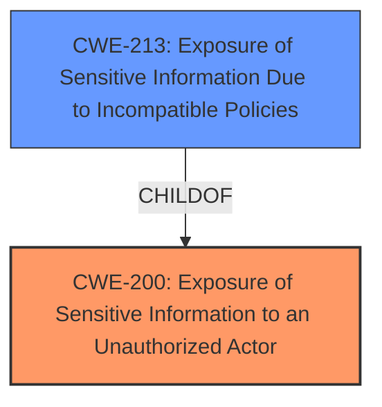

# Enhanced Analysis for CVE-2021-29086

# Summary
| CWE ID | CWE Name | Confidence | CWE Abstraction Level | CWE Vulnerability Mapping Label | CWE-Vulnerability Mapping Notes |
|---|---|---|---|---|---|
| CWE-200 | Exposure of Sensitive Information to an Unauthorized Actor | 0.8 | Class | Primary | Discouraged |
| CWE-213 | Exposure of Sensitive Information Due to Incompatible Policies | 0.6 | Base | Secondary | Allowed |

## Evidence and Confidence

*   **Confidence Score:** 0.7
*   **Evidence Strength:** MEDIUM

## Relationship Analysis
The primary CWE, CWE-200 [Exposure of Sensitive Information to an Unauthorized Actor], is a Class-level CWE. The secondary CWE, CWE-213 [Exposure of Sensitive Information Due to Incompatible Policies], is a Base-level CWE and a child of CWE-200. Choosing CWE-200 is influenced by the direct match to the vulnerability description's **impact**. However, CWE-200 is discouraged, and the description indicates the exposure may stem from incompatible policies, leading to considering CWE-213 despite its potential deprecation.



## Vulnerability Chain
The chain starts with an unspecified vector leading to **exposure of sensitive information** to an unauthorized actor. The weakness is **exposure of sensitive information**. The vulnerability description lacks specific details on the root cause, but the `CVE Reference Links Content Summary` states that the root cause is “Exposure of sensitive information to an unauthorized actor vulnerability”.

## Summary of Analysis
The initial assessment strongly points to CWE-200 [Exposure of Sensitive Information to an Unauthorized Actor] due to the **impact** described in the vulnerability: "Exposure of sensitive information to an unauthorized actor." The `CVE Reference Links Content Summary` section reinforces this by stating the root cause as "Exposure of sensitive information to an unauthorized actor vulnerability" and listing "Exposure of sensitive information" as a weakness. However, CWE-200 is a Class-level CWE and is generally discouraged. The description does not reveal the root cause of how the sensitive information was exposed but based on the weakness details, it may be due to incompatible policies (CWE-213). Thus, CWE-213 is included as a secondary candidate.

The evidence for the primary CWE is the vulnerability description itself, which explicitly mentions "Exposure of sensitive information to an unauthorized actor." The evidence for the secondary CWE (CWE-213) is based on the implicit understanding that the exposure might be due to conflicting security policies, as mentioned in the CWE description itself.

The selected CWEs are at the optimal level of specificity given the limited information provided in the vulnerability description. While more specific variants could exist, they cannot be determined based on the available evidence.

Relevant CWE Information:

# Enhanced Context (25 CWEs)

## CWE-538: Insertion of Sensitive Information into Externally-Accessible File or Directory
**Abstraction Level**: Base
**Similarity Score**: 0.78
**Source**: dense

**Description**:
The product places sensitive information into files or directories that are accessible to actors who are allowed to have access to the files, but not to the sensitive information.

**Mapping Guidance**:
- Usage: Allowed
- Rationale: This CWE entry is at the Base level of abstraction, which is a preferred level of abstraction for mapping to the root causes of vulnerabilities.

CWE-538 was considered but not selected. The vulnerability description states "unspecified vectors", which is not specific enough to determine if the sensitive information was placed into externally accessible files or directories.

## CWE-497: Exposure of Sensitive System Information to an Unauthorized Control Sphere
**Abstraction Level**: Base
**Similarity Score**: 0.77
**Source**: dense

**Description**:
The product does not properly prevent sensitive system-level information from being accessed by unauthorized actors who do not have the same level of access to the underlying system as the product does.

**Mapping Guidance**:
- Usage: Allowed
- Rationale: This CWE entry is at the Base level of abstraction, which is a preferred level of abstraction for mapping to the root causes of vulnerabilities.

CWE-497 was considered but not selected because the vulnerability description does not specify that the sensitive information is system-level.

## CWE-74: Improper Neutralization of Special Elements in Output Used by a Downstream Component ('Injection')
**Abstraction Level**: Class
**Similarity Score**: 0.77
**Source**: dense

**Description**:
The product constructs all or part of a command, data structure, or record using externally-influenced input from an upstream component, but it does not neutralize or incorrectly neutralizes special elements that could modify how it is parsed or interpreted when it is sent to a downstream component.

**Mapping Guidance**:
- Usage: Discouraged
- Rationale: CWE-74 is high-level and often misused when lower-level weaknesses are more appropriate.

CWE-74 was considered but not selected. The vulnerability description does not indicate that the vulnerability is due to an injection issue.

## CWE-668: Exposure of Resource to Wrong Sphere
**Abstraction Level**: Class
**Similarity Score**: 0.77
**Source**: dense

**Description**:
The product exposes a resource to the wrong control sphere, providing unintended actors with inappropriate access to the resource.

**Mapping Guidance**:
- Usage: Discouraged
- Rationale: CWE-668 is high-level and is often misused as a catch-all when lower-level CWE IDs might be applicable. It is sometimes used for low-information vulnerability reports [REF-1287]. It is a level-1 Class (i.e., a child of a Pillar). It is not useful for trend analysis.

CWE-668 was considered but not selected. The vulnerability description is more specific than simply exposing a resource to the wrong sphere; it is the exposure of *sensitive* information.

## CWE-552: Files or Directories Accessible to External Parties
**Abstraction Level**: Base
**Similarity Score**: 0.77
**Source**: dense

**Description**:
The product makes files or directories accessible to unauthorized actors, even though they should not be.

**Mapping Guidance**:
- Usage: Allowed
- Rationale: This CWE entry is at the Base level of abstraction, which is a preferred level of abstraction for mapping to the root causes of vulnerabilities.

CWE-552 was considered but not selected. The vulnerability description states "unspecified vectors", which is not specific enough to determine if the sensitive information was made accessible via files or directories.

## CWE-41: Improper Resolution of Path Equivalence
**Abstraction Level**: Base
**Similarity Score**: 0.76
**Source**: dense

**Description**:
The product is vulnerable to file system contents disclosure through path equivalence. Path equivalence involves the use of special characters in file and directory names. The associated manipulations are intended to generate multiple names for the same object.

**Mapping Guidance**:
- Usage: Allowed
- Rationale: This CWE entry is at the Base level of abstraction, which is a preferred level of abstraction for mapping to the root causes of vulnerabilities.

CWE-41 was considered but not selected. The vulnerability description does not mention path equivalence issues.

## CWE-184: Incomplete List of Disallowed Inputs
**Abstraction Level**: Base
**Similarity Score**: 0.76
**Source**: dense

**Description**:
The product implements a protection mechanism that relies on a list of inputs (or properties of inputs) that are not allowed by policy or otherwise require other action to neutralize before additional processing takes place, but the list is incomplete.

**Mapping Guidance**:
- Usage: Allowed
- Rationale: This CWE entry is at the Base level of abstraction, which is a preferred level of abstraction for mapping to the root causes of vulnerabilities.

CWE-184 was considered but not selected. The vulnerability description does not suggest an incomplete list of disallowed inputs.

## CWE-425: Direct Request ('Forced Browsing')
**Abstraction Level**: Base
**Similarity Score**: 0.76
**Source**: dense

**Description**:
The web application does not adequately enforce appropriate authorization on all restricted URLs, scripts, or files.

**Mapping Guidance**:
- Usage: Allowed
- Rationale: This CWE entry is at the Base level of abstraction, which is a preferred level of abstraction for mapping to the root causes of vulnerabilities.

CWE-425 was considered but not selected. The vulnerability description does not indicate authorization issues.

## CWE-212: Improper Removal of Sensitive Information Before Storage or Transfer
**Abstraction Level**: Base
**Similarity Score**: 0.76
**Source**: dense

**Description**:
The product stores, transfers, or shares a resource that contains sensitive information, but it does not properly remove that information before the product makes the resource available to unauthorized actors.

**Mapping Guidance**:
- Usage: Allowed


## CWE Relationship Analysis

Current CWEs represent these abstraction levels: .


### Vulnerability Chain Analysis

**Chain starting from CWE-497:**
- 497 (Exposure of Sensitive System Information to an Unauthorized Control Sphere) - ROOT


**Chain starting from CWE-41:**
- 41 (Improper Resolution of Path Equivalence) - ROOT


### CWE Relationship Diagram

```mermaid
graph TD
    classDef primary fill:#f96,stroke:#333,stroke-width:2px
    classDef secondary fill:#69f,stroke:#333
    classDef tertiary fill:#9e9,stroke:#333
```