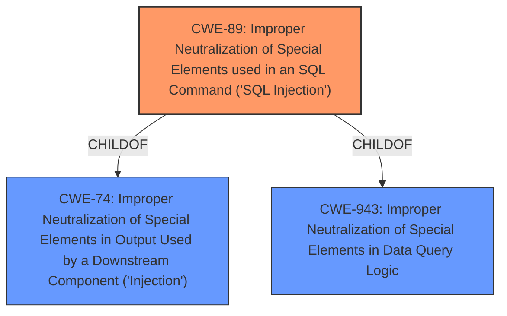

# Enhanced Analysis for CVE-2021-29089

# Summary
| CWE ID | CWE Name | Confidence | CWE Abstraction Level | CWE Vulnerability Mapping Label | CWE-Vulnerability Mapping Notes |
|---|---|---|---|---|---|
| CWE-89 | Improper Neutralization of Special Elements used in an SQL Command ('SQL Injection') | 1.0 | Base | Allowed | Primary CWE |

## Evidence and Confidence

*   **Confidence Score:** 1.0
*   **Evidence Strength:** HIGH

## Relationship Analysis
The primary relationship that influenced the decision was the ChildOf relationship between CWE-89 and CWE-74 (Improper Neutralization of Special Elements in Output Used by a Downstream Component ('Injection')), and CWE-943 (Improper Neutralization of Special Elements in Data Query Logic). CWE-89 is a more specific case of injection, focusing on SQL commands. The vulnerability description explicitly mentions SQL injection, making CWE-89 the most appropriate choice.



## Vulnerability Chain
The vulnerability chain consists of:
1.  **Root Cause:** **Improper neutralization of special elements** in SQL commands.
2.  **Weakness:** SQL Injection.
3.  **Impact:** Remote attackers can execute arbitrary SQL commands.

## Summary of Analysis
The analysis is based heavily on the provided evidence, which clearly points to SQL injection as the root cause of the vulnerability. The "**Improper neutralization of special elements** used in an SQL command" phrase from the vulnerability description directly aligns with CWE-89. The "CVE Reference Links Content Summary" section also explicitly mentions the "**Improper neutralization of special elements** used in an SQL command ('SQL Injection')" as the root cause.

CWE-89 is chosen because it is a Base level CWE that accurately represents the vulnerability. The retriever results also list CWE-89 as the top combined result. The relationships with other CWEs confirm the hierarchical structure, but CWE-89 remains the most specific and relevant choice.

Relevant CWE Information:

# Enhanced Context (25 CWEs)
The following CWEs were identified as potentially relevant to this vulnerability:

## CWE-1236: Improper Neutralization of Formula Elements in a CSV File
**Abstraction Level**: Base
**Similarity Score**: 0.81

## CWE-74: Improper Neutralization of Special Elements in Output Used by a Downstream Component ('Injection')
**Abstraction Level**: Class
**Similarity Score**: 0.77

## CWE-80: Improper Neutralization of Script-Related HTML Tags in a Web Page (Basic XSS)
**Abstraction Level**: Variant
**Similarity Score**: 0.75

## CWE-138: Improper Neutralization of Special Elements
**Abstraction Level**: Class
**Similarity Score**: 0.74

## CWE-917: Improper Neutralization of Special Elements used in an Expression Language Statement ('Expression Language Injection')
**Abstraction Level**: Base
**Similarity Score**: 0.73

## CWE-943: Improper Neutralization of Special Elements in Data Query Logic
**Abstraction Level**: Class
**Similarity Score**: 0.73

## CWE-116: Improper Encoding or Escaping of Output
**Abstraction Level**: Class
**Similarity Score**: 0.73

## CWE-184: Incomplete List of Disallowed Inputs
**Abstraction Level**: Base
**Similarity Score**: 0.73

## CWE-1289: Improper Validation of Unsafe Equivalence in Input
**Abstraction Level**: Base
**Similarity Score**: 0.73

## CWE-41: Improper Resolution of Path Equivalence
**Abstraction Level**: Base
**Similarity Score**: 0.72

## CWE-116: Improper Encoding or Escaping of Output
**Abstraction Level**: Class
**Similarity Score**: 7692.55

## CWE-1336: Improper Neutralization of Special Elements Used in a Template Engine
**Abstraction Level**: Base
**Similarity Score**: 7458.17

## CWE-138: Improper Neutralization of Special Elements
**Abstraction Level**: Class
**Similarity Score**: 7306.71

## CWE-943: Improper Neutralization of Special Elements in Data Query Logic
**Abstraction Level**: Class
**Similarity Score**: 7247.22

## CWE-89: Improper Neutralization of Special Elements used in an SQL Command ('SQL Injection')
**Abstraction Level**: Base
**Similarity Score**: 7169.53

## CWE-78: Improper Neutralization of Special Elements used in an OS Command ('OS Command Injection')
**Abstraction Level**: base
**Similarity Score**: 4.47

## CWE-89: Improper Neutralization of Special Elements used in an SQL Command ('SQL Injection')
**Abstraction Level**: base
**Similarity Score**: 4.33

## CWE-120: Buffer Copy without Checking Size of Input ('Classic Buffer Overflow')
**Abstraction Level**: base
**Similarity Score**: 4.33

## CWE-94: Improper Control of Generation of Code ('Code Injection')
**Abstraction Level**: base
**Similarity Score**: 4.33

## CWE-476: NULL Pointer Dereference
**Abstraction Level**: base
**Similarity Score**: 4.33

## CWE-252: Unchecked Return Value
**Abstraction Level**: base
**Similarity Score**: 4.33

## CWE-98: Improper Control of Filename for Include/Require Statement in PHP Program ('PHP Remote File Inclusion')
**Abstraction Level**: variant
**Similarity Score**: 3.89

## CWE-79: Improper Neutralization of Input During Web Page Generation ('Cross-site Scripting')
**Abstraction Level**: base
**Similarity Score**: 3.89

## CWE-456: Missing Initialization of a Variable
**Abstraction Level**: variant
**Similarity Score**: 3.88

## CWE-457: Use of Uninitialized Variable
**Abstraction Level**: variant
**Similarity Score**: 3.88

### Explanation of Unselected CWEs:

*   **CWE-74, CWE-943, CWE-138:** These are broader "Improper Neutralization" CWEs. While related, CWE-89 is more specific to SQL injection, making it a better fit.
*   **CWE-78:** This relates to OS command injection, which is not relevant to the described vulnerability.
*   **CWE-1336:** This concerns template engine injection, which is not mentioned in the description.
*   **CWE-82:** This addresses improper neutralization in IMG tags, indicating a Cross-Site Scripting (XSS) issue, which is unrelated to SQL injection.
*   **CWE-456:** This relates to missing initialization of a variable. While potentially present, it is not the primary weakness described.
*   **CWE-116:** While improper encoding or escaping could contribute to SQL injection, the description focuses on the lack of neutralization, making CWE-89 more direct.
*   **CWE-1236:** Deals with CSV injection, which is not relevant to SQL injection.


## CWE Relationship Analysis

Current CWEs represent these abstraction levels: .


### Vulnerability Chain Analysis

**Chain starting from CWE-116:**
- 116 (Improper Encoding or Escaping of Output) - ROOT


**Chain starting from CWE-94:**
- 94 (Improper Control of Generation of Code ('Code Injection')) - ROOT


### CWE Relationship Diagram

```mermaid
graph TD
    classDef primary fill:#f96,stroke:#333,stroke-width:2px
    classDef secondary fill:#69f,stroke:#333
    classDef tertiary fill:#9e9,stroke:#333
```