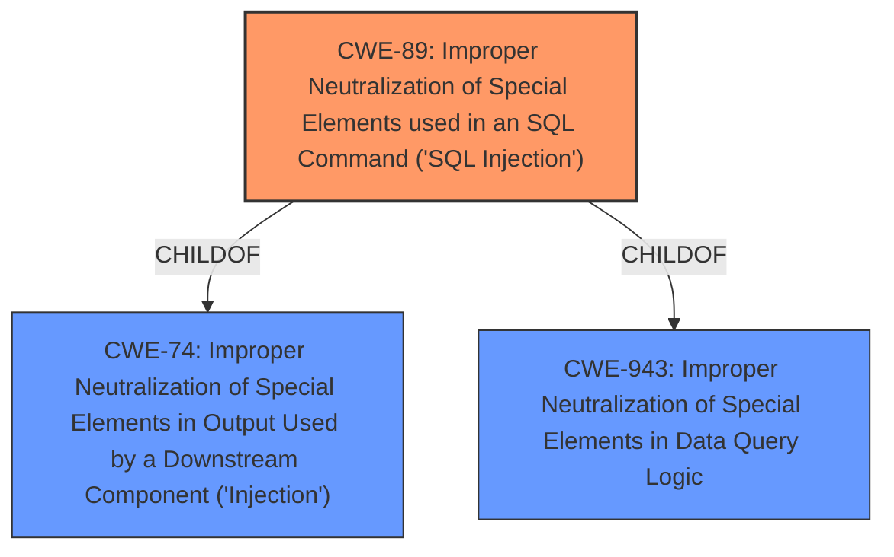

# Analysis Report for CVE-2021-29090

# Vulnerability Analysis Report: CVE-2021-29090

## Description


## Analysis (with Relationship Data)

# Summary
| CWE ID | CWE Name | Confidence | CWE Abstraction Level | CWE Vulnerability Mapping Label | CWE-Vulnerability Mapping Notes |
|---|---|---|---|---|---|
| CWE-89 | Improper Neutralization of Special Elements used in an SQL Command ('SQL Injection') | 1.0 | Base | Allowed | Primary CWE |

## Evidence and Confidence

*   **Confidence Score:** 1.0
*   **Evidence Strength:** HIGH

## Relationship Analysis
The primary CWE selected is CWE-89, which is a Base level CWE. It is a child of CWE-74 (Improper Neutralization of Special Elements in Output Used by a Downstream Component ('Injection')) and CWE-943 (Improper Neutralization of Special Elements in Data Query Logic), reflecting a hierarchical relationship. The relationship analysis confirms that CWE-89 is the most specific and appropriate choice for this vulnerability, as it directly addresses the SQL injection issue.



## Vulnerability Chain
The vulnerability chain starts with **improper input sanitization** in the PHP component, leading to a **SQL injection** vulnerability. This allows remote authenticated users to execute arbitrary SQL commands. The chain can be summarized as: Improper Input Sanitization -> SQL Injection -> Arbitrary SQL Command Execution.

## Summary of Analysis
The initial analysis identified CWE-89 as the primary candidate, which aligns well with the vulnerability description. The description explicitly mentions **"Improper neutralization of special elements used in an SQL command (SQL Injection)"** and "**SQL injection** vulnerability." The CVE Reference Links Content Summary also confirms this, stating the root cause is "Improper neutralization of special elements used in an SQL command" and the weakness is "**SQL Injection**." The retriever results also list CWE-89 as the top combined result with a score of 1.0. The relationship analysis also supports this by showing CWE-89 as a child of the more general CWE-74 and CWE-943.

The selection of CWE-89 is based on direct evidence from the vulnerability description and supporting information. The CWE is at the optimal level of specificity, addressing the root cause of the vulnerability. Other CWEs were considered but deemed less appropriate because they were either too general (e.g., CWE-74, CWE-138) or addressed different types of vulnerabilities (e.g., CWE-78, CWE-79). The MITRE mapping guidance supports the selection of CWE-89, as it is a Base level CWE and the Usage is "Allowed."
The evidence is: "**Root cause of vulnerability**: Improper neutralization of special elements used in an SQL command."
"**Weaknesses/vulnerabilities present**: SQL Injection."

Relevant CWE Information:
CWE-89: Improper Neutralization of Special Elements used in an SQL Command ('SQL Injection')
CWE-74: Improper Neutralization of Special Elements in Output Used by a Downstream Component ('Injection')
CWE-943: Improper Neutralization of Special Elements in Data Query Logic
CWE-138: Improper Neutralization of Special Elements
CWE-78: Improper Neutralization of Special Elements used in an OS Command ('OS Command Injection')
CWE-79: Improper Neutralization of Input During Web Page Generation ('Cross-site Scripting')


## CWE Relationship Analysis

Current CWEs represent these abstraction levels: .


### Vulnerability Chain Analysis

**Chain starting from CWE-79:**
- 79 (Improper Neutralization of Input During Web Page Generation ('Cross-site Scripting')) - ROOT


**Chain starting from CWE-943:**
- 943 (Improper Neutralization of Special Elements in Data Query Logic) - ROOT


### CWE Relationship Diagram

```mermaid
graph TD
    classDef primary fill:#f96,stroke:#333,stroke-width:2px
    classDef secondary fill:#69f,stroke:#333
    classDef tertiary fill:#9e9,stroke:#333
```


*Report generated on 2025-04-01 21:53:35*
