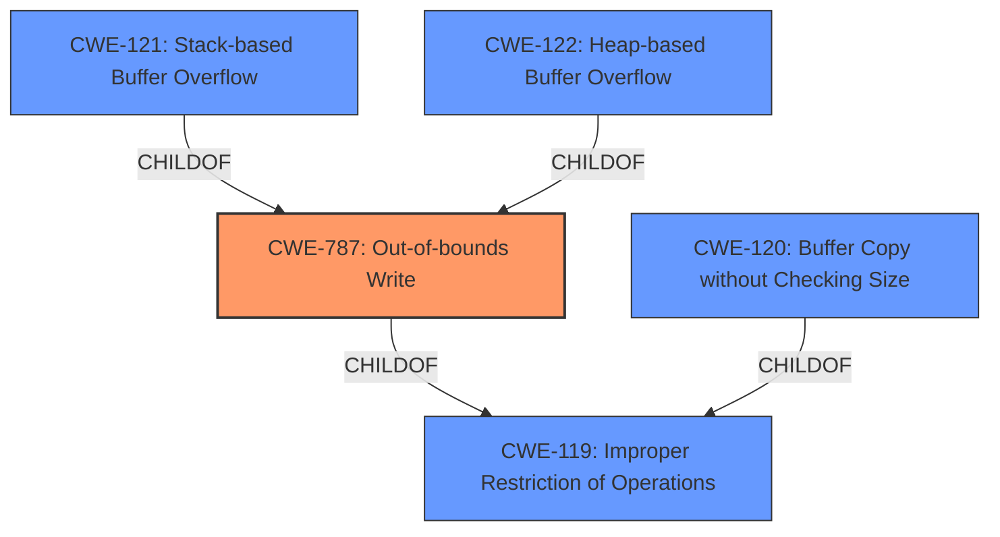

# Analysis for CVE-2021-29097

# Summary
| CWE ID | CWE Name | Confidence | CWE Abstraction Level | CWE Vulnerability Mapping Label | CWE-Vulnerability Mapping Notes |
|---|---|---|---|---|---|
| CWE-787 | Out-of-bounds Write | 1.0 | Base | Allowed | Primary CWE |
| CWE-120 | Buffer Copy without Checking Size of Input ('Classic Buffer Overflow') | 0.75 | Base | Allowed-with-Review | Secondary Candidate |
| CWE-121 | Stack-based Buffer Overflow | 0.75 | Variant | Allowed | Secondary Candidate |
| CWE-122 | Heap-based Buffer Overflow | 0.75 | Variant | Allowed | Secondary Candidate |

## Evidence and Confidence

*   **Confidence Score:** 0.9
*   **Evidence Strength:** HIGH

## Relationship Analysis
The primary CWE is CWE-787 (**CWE-787: Out-of-bounds Write**) which is a child of CWE-119 (**CWE-119: Improper Restriction of Operations**). CWE-120 (**CWE-120: Buffer Copy without Checking Size of Input ('Classic Buffer Overflow')**), CWE-121 (**CWE-121: Stack-based Buffer Overflow**), and CWE-122 (**CWE-122: Heap-based Buffer Overflow**) are also related to CWE-119. The vulnerability description explicitly states "multiple buffer overflow vulnerabilities," making CWE-787 a strong candidate. The specific types of buffer overflows (stack or heap) provide more granular details but are still related to the general out-of-bounds write issue.

## Vulnerability Chain
The chain starts with the lack of proper validation of user-supplied data length. This leads to a buffer overflow (CWE-787), which then allows for arbitrary code execution.

## Summary of Analysis
The initial analysis correctly identified the **buffer overflow** as a key weakness. The **CVE Reference Links Content Summary** section provided strong evidence, stating that the vulnerability occurs due to the **lack of proper validation of user-supplied data length** when parsing PMF files. The summary also states that "data is copied to a fixed-length buffer without checking if the data exceeds the buffer's capacity. This lack of validation allows for a buffer overflow." The report explicitly mentions both stack and heap based buffer overflows are possible.

The retriever results indicated CWE-787 (**CWE-787: Out-of-bounds Write**) as a strong candidate. The vulnerability description states "**Multiple buffer overflow vulnerabilities** when parsing a specially crafted file...allow an unauthenticated attacker to achieve arbitrary code execution." CWE-787 captures the essence of writing data past the end of the intended buffer.

CWE-120 (**CWE-120: Buffer Copy without Checking Size of Input ('Classic Buffer Overflow')**) is also a relevant candidate since the vulnerability involves copying data to a fixed-length buffer without proper size checks. However, it's slightly less specific than CWE-787. The mapping guidance for CWE-120 suggests that it's appropriate only for "Buffer Copy" operations where there is no "Checking [the] Size of Input".

CWE-121 (**CWE-121: Stack-based Buffer Overflow**) and CWE-122 (**CWE-122: Heap-based Buffer Overflow**) are also considered as they represent specific locations of the buffer overflow.

CWE-119 (**CWE-119: Improper Restriction of Operations within the Bounds of a Memory Buffer**) is a more general class and is discouraged as a primary mapping.

The final decision is to select CWE-787 (**CWE-787: Out-of-bounds Write**) as the primary CWE because it directly reflects the core issue of writing beyond the buffer's boundaries. CWE-120 (**CWE-120: Buffer Copy without Checking Size of Input ('Classic Buffer Overflow')**), CWE-121 (**CWE-121: Stack-based Buffer Overflow**) and CWE-122 (**CWE-122: Heap-based Buffer Overflow**) are added as secondary candidates. The evidence is strong, based on the vulnerability description and the CVE reference summary.

Other CWEs Considered:
- CWE-190 (**CWE-190: Integer Overflow or Wraparound**): While an integer overflow could potentially lead to a buffer overflow, the primary cause in this case is the **lack of input validation** and the subsequent out-of-bounds write, not an integer overflow.
- CWE-20 (**CWE-20: Improper Input Validation**): This is a high-level class and less specific than CWE-787 and CWE-120.