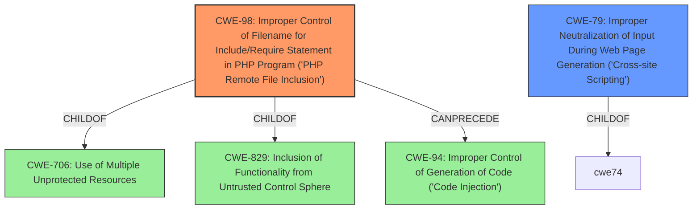

# Enhanced Analysis for CVE-2021-29113

# Summary
| CWE ID | CWE Name | Confidence | CWE Abstraction Level | CWE Vulnerability Mapping Label | CWE-Vulnerability Mapping Notes |
|---|---|---|---|---|---|
| CWE-98 | Improper Control of Filename for Include/Require Statement in PHP Program ('PHP Remote File Inclusion') | 0.9 | Variant | Allowed | Primary CWE |
| CWE-79 | Improper Neutralization of Input During Web Page Generation ('Cross-site Scripting') | 0.7 | Base | Allowed | Secondary Candidate |

## Evidence and Confidence

*   **Confidence Score:** 0.8
*   **Evidence Strength:** MEDIUM

## Relationship Analysis
The primary CWE selected is CWE-98 (Variant), which is a child of CWE-706 and CWE-829. It can precede CWE-94. The secondary CWE, CWE-79, is a base CWE. The choice of CWE-98 is based on the explicit mention of **remote file inclusion** in the vulnerability description, making it a more specific and accurate classification than its parent CWEs.



## Vulnerability Chain
The vulnerability chain starts with **remote file inclusion** (CWE-98), which allows an attacker to inject HTML into a page, leading to potential cross-site scripting (CWE-79).

## Summary of Analysis
The initial analysis focused on identifying the root cause of the vulnerability. The vulnerability description explicitly mentions "**remote file inclusion**," which strongly suggests CWE-98. The retriever results also support this, with CWE-98 being the top combined result.

The secondary consideration was whether the injection of HTML leads to XSS. Since the description states that the attacker can "inject attacker supplied html into a page," CWE-79 becomes a relevant secondary concern, representing the impact of the **remote file inclusion**.

The final decision to prioritize CWE-98 is based on the explicit mention of "**remote file inclusion**" in the vulnerability description: "A **remote file inclusion** vulnerability in the ArcGIS Server help documentation may allow a remote, unauthenticated attacker to inject attacker supplied html into a page." This is direct evidence that aligns with the core characteristics of CWE-98. The relationship data further supports this, showing that CWE-98 can lead to code injection (CWE-94), which could manifest as the ability to inject arbitrary HTML. CWE-98 is a Variant level CWE, which is the preferred level of abstraction.

Relevant CWE Information:

# Enhanced Context (25 CWEs)

## CWE-98: Improper Control of Filename for Include/Require Statement in PHP Program ('PHP Remote File Inclusion')
**Abstraction:** Variant
**Status:** Draft

### Description
The PHP application receives input from an upstream component, but it does not restrict or incorrectly restricts the input before its usage in "require," "include," or similar functions.

### Extended Description
In certain versions and configurations of PHP, this can allow an attacker to specify a URL to a remote location from which the product will obtain the code to execute. In other cases in association with path traversal, the attacker can specify a local file that may contain executable statements that can be parsed by PHP.


## CWE Relationship Analysis

Current CWEs represent these abstraction levels: .


### Vulnerability Chain Analysis

**Chain starting from CWE-79:**
- 79 (Improper Neutralization of Input During Web Page Generation ('Cross-site Scripting')) - ROOT


**Chain starting from CWE-829:**
- 829 (Inclusion of Functionality from Untrusted Control Sphere) - ROOT


### CWE Relationship Diagram

```mermaid
graph TD
    classDef primary fill:#f96,stroke:#333,stroke-width:2px
    classDef secondary fill:#69f,stroke:#333
    classDef tertiary fill:#9e9,stroke:#333
```