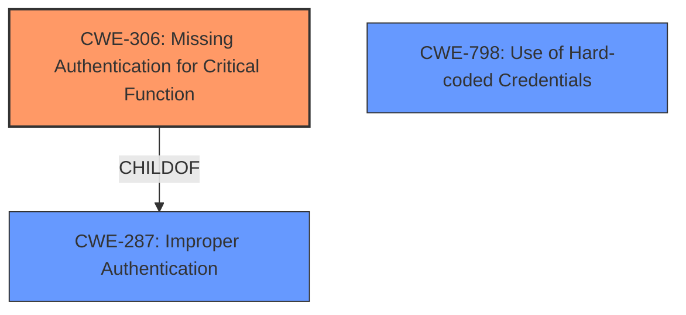

# Analysis for CVE-2021-29203

# Summary
| CWE ID | CWE Name | Confidence | CWE Abstraction Level | CWE Vulnerability Mapping Label | CWE-Vulnerability Mapping Notes |
|---|---|---|---|---|---|
| CWE-306 | Missing Authentication for Critical Function | 1.0 | Base | Primary | Allowed |
| CWE-798 | Use of Hard-coded Credentials | 0.7 | Base | Secondary | Allowed |

## Evidence and Confidence

*   **Confidence Score:** 0.85
*   **Evidence Strength:** HIGH

## Relationship Analysis
The primary CWE is CWE-306, which is a Base level weakness and a child of CWE-287 (Improper Authentication). This indicates a direct relationship where the critical function lacks authentication. CWE-798, while not directly related through parent-child relationships, can be a related vulnerability where hardcoded credentials may be leveraged after bypassing authentication. The selection is influenced by focusing on the root cause of the **missing authentication** rather than the broader class of authentication issues.

## Vulnerability Chain
The chain of vulnerabilities starts with **insufficient access control** on the password reset functionality, leading to the **missing authentication** for the password reset endpoint, which then allows an attacker to reset the Administrator password, eventually leading to arbitrary command execution and privilege escalation.

## Summary of Analysis
The initial assessment focused on identifying the root cause of the vulnerability, which is the **missing authentication** for a critical function, specifically resetting the administrator password. The "CVE Reference Links Content Summary" clearly states: "The vulnerability is due to **insufficient access control** on the password reset functionality. An unauthenticated attacker can reset the Administrator account password via the `/redfish/v1/SessionService/ResetPassword/1` endpoint." This maps directly to CWE-306 (Missing Authentication for Critical Function).

The selection of CWE-306 is further supported by the MITRE mapping guidance, which allows the usage of this CWE at the Base level of abstraction.

CWE-798 (Use of Hard-coded Credentials) was considered due to the mention of "Insecure default password handling" in the CVE Reference Links Content Summary. However, the primary issue is the ability to reset the password without authentication, making CWE-306 more directly relevant as the root cause. If the system *also* used hardcoded credentials *after* the authentication bypass, CWE-798 would have been a stronger secondary candidate, but the provided evidence does not confirm this.

The selected CWEs are at the optimal level of specificity because they accurately represent the vulnerability's root cause. CWE-306 precisely describes the **lack of authentication** for the password reset function, and CWE-798 highlights the risk of **insecure default password handling**.

Relevant CWE Information:
# Enhanced Context (25 CWEs)
The following CWEs were identified as potentially relevant to this vulnerability:

## CWE-1289: Improper Validation of Unsafe Equivalence in Input
**Abstraction Level**: Base
**Similarity Score**: 0.78

## CWE-807: Reliance on Untrusted Inputs in a Security Decision
**Abstraction Level**: Base
**Similarity Score**: 0.78

## CWE-74: Improper Neutralization of Special Elements in Output Used by a Downstream Component ('Injection')
**Abstraction Level**: Class
**Similarity Score**: 0.75

## CWE-184: Incomplete List of Disallowed Inputs
**Abstraction Level**: Base
**Similarity Score**: 0.75

## CWE-472: External Control of Assumed-Immutable Web Parameter
**Abstraction Level**: Base
**Similarity Score**: 0.75

## CWE-183: Permissive List of Allowed Inputs
**Abstraction Level**: Base
**Similarity Score**: 0.75

## CWE-138: Improper Neutralization of Special Elements
**Abstraction Level**: Class
**Similarity Score**: 0.74

## CWE-1391: Use of Weak Credentials
**Abstraction Level**: Class
**Similarity Score**: 0.74

## CWE-799: Improper Control of Interaction Frequency
**Abstraction Level**: Class
**Similarity Score**: 0.74

## CWE-179: Incorrect Behavior Order: Early Validation
**Abstraction Level**: Base
**Similarity Score**: 0.74

## CWE-79: Improper Neutralization of Input During Web Page Generation ('Cross-site Scripting')
**Abstraction Level**: Base
**Similarity Score**: 9045.37

## CWE-116: Improper Encoding or Escaping of Output
**Abstraction Level**: Class
**Similarity Score**: 8662.99

## CWE-287: Improper Authentication
**Abstraction Level**: Class
**Similarity Score**: 8613.38

## CWE-22: Improper Limitation of a Pathname to a Restricted Directory ('Path Traversal')
**Abstraction Level**: Base
**Similarity Score**: 8575.90

## CWE-863: Incorrect Authorization
**Abstraction Level**: Class
**Similarity Score**: 8560.69

## CWE-79: Improper Neutralization of Input During Web Page Generation ('Cross-site Scripting')
**Abstraction Level**: base
**Similarity Score**: 5.03

## CWE-22: Improper Limitation of a Pathname to a Restricted Directory ('Path Traversal')
**Abstraction Level**: base
**Similarity Score**: 4.33

## CWE-494: Download of Code Without Integrity Check
**Abstraction Level**: base
**Similarity Score**: 4.33

## CWE-73: External Control of File Name or Path
**Abstraction Level**: base
**Similarity Score**: 4.33

## CWE-770: Allocation of Resources Without Limits or Throttling
**Abstraction Level**: base
**Similarity Score**: 4.33

## CWE-190: Integer Overflow or Wraparound
**Abstraction Level**: base
**Similarity Score**: 4.33

## CWE-321: Use of Hard-coded Cryptographic Key
**Abstraction Level**: variant
**Similarity Score**: 4.01

## CWE-259: Use of Hard-coded Password
**Abstraction Level**: variant
**Similarity Score**: 4.01

## CWE-798: Use of Hard-coded Credentials
**Abstraction Level**: base
**Similarity Score**: 3.64

## CWE-257: Storing Passwords in a Recoverable Format
**Abstraction Level**: base
**Similarity Score**: 3.64

CWE-287 (Improper Authentication) was considered but rejected as a primary mapping because it is a Class-level CWE. CWE-306 (Missing Authentication for Critical Function) is a more specific Base-level CWE and is therefore preferred.

CWE-79 (Improper Neutralization of Input During Web Page Generation ('Cross-site Scripting')) and CWE-74 (Improper Neutralization of Special Elements in Output Used by a Downstream Component ('Injection')) were also considered. However, these CWEs relate to input validation and output handling, not the core authentication issue. Therefore, they are not relevant to this vulnerability.