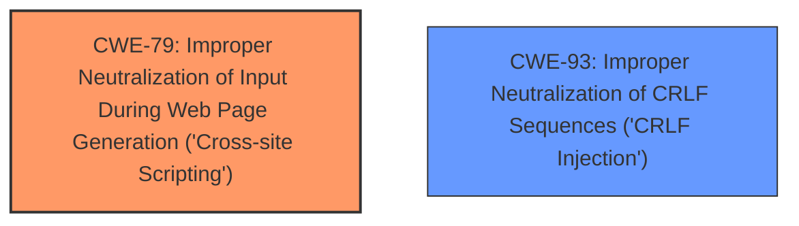

# Analysis for CVE-2021-29210

# Summary
| CWE ID | CWE Name | Confidence | CWE Abstraction Level | CWE Vulnerability Mapping Label | CWE-Vulnerability Mapping Notes |
|---|---|---|---|---|---|
| CWE-79 | Improper Neutralization of Input During Web Page Generation ('Cross-site Scripting') | 0.9 | Base | Allowed | Primary CWE for the **remote dom xss** vulnerability. |
| CWE-93 | Improper Neutralization of CRLF Sequences ('CRLF Injection') | 0.9 | Base | Allowed | Secondary CWE for the **crlf injection** vulnerability. |

## Evidence and Confidence

*   **Confidence Score:** 0.9
*   **Evidence Strength:** HIGH

## Relationship Analysis
The primary weakness is **remote dom xss**, best represented by CWE-79, which involves improper neutralization of input during web page generation. The secondary weakness is **crlf injection**, best represented by CWE-93, which involves improper neutralization of CRLF sequences. Both CWE-79 and CWE-93 are base-level CWEs, providing a good balance between specificity and generality.

## Vulnerability Chain
The vulnerability chain involves two distinct injection issues:
1.  **Remote DOM XSS (CWE-79):** User-controllable input is not properly neutralized before being used in a web page, leading to potential execution of malicious scripts in the user's browser.
2.  **CRLF Injection (CWE-93):** CRLF sequences are not properly neutralized, allowing an attacker to inject arbitrary headers or content into HTTP responses.

Both are root causes related to improper input handling.

## Summary of Analysis
The primary vulnerability is a **remote dom xss** vulnerability which maps to CWE-79. The vulnerability description states: "A **remote dom xss**, **crlf injection** vulnerability was discovered in HPE Integrated Lights-Out 4 (iLO 4) HPE SimpliVity 380 Gen9 HPE Integrated Lights-Out 5 (iLO 5) for HPE Gen10 Servers HPE SimpliVity 380 Gen10 HPE SimpliVity 2600 HPE SimpliVity 380 Gen10 G HPE SimpliVity 325 HPE SimpliVity 380 Gen10 H version(s) Prior to version 2.78."

Based on the vulnerability description and the retriever results, the **remote dom xss** vulnerability is best represented by CWE-79 and the **crlf injection** is best represented by CWE-93.

CWE-79 (Improper Neutralization of Input During Web Page Generation ('Cross-site Scripting')) is chosen as the primary CWE because the vulnerability involves a **remote dom xss** issue. The vulnerability occurs when user-controllable input is not properly neutralized before being used in a web page, which could lead to the execution of arbitrary scripts in the user's browser. This aligns directly with the description of CWE-79.

CWE-93 (Improper Neutralization of CRLF Sequences ('CRLF Injection')) is chosen as the secondary CWE because the vulnerability also involves a **crlf injection** issue. The vulnerability occurs when CRLF sequences are not properly neutralized, allowing an attacker to inject arbitrary headers or content into HTTP responses. This aligns directly with the description of CWE-93.

Other CWEs Considered:

*   CWE-74 (Improper Neutralization of Special Elements in Output Used by a Downstream Component ('Injection')): While injection is a general category, CWE-79 and CWE-93 are more specific to the types of injection occurring in this vulnerability. Therefore, CWE-74 is not used.
*   CWE-113 (Improper Neutralization of CRLF Sequences in HTTP Headers ('HTTP Request/Response Splitting')): This is a variant of CWE-93 and applies when the injection occurs specifically in HTTP headers. Since the description does not limit the CRLF injection to headers, CWE-93 is a more general and appropriate choice.
*   CWE-78 (Improper Neutralization of Special Elements used in an OS Command ('OS Command Injection')): This CWE relates to command injection, which is not mentioned in the vulnerability description.
*   CWE-117 (Improper Output Neutralization for Logs): This CWE relates to log injection, which is not mentioned in the vulnerability description.

# Enhanced Query for CVE-2021-29210

# Vulnerability Description

    A **remote dom xss**, **crlf injection** vulnerability was discovered in HPE Integrated Lights-Out 4 (iLO 4) HPE SimpliVity 380 Gen9 HPE Integrated Lights-Out 5 (iLO 5) for HPE Gen10 Servers HPE SimpliVity 380 Gen10 HPE SimpliVity 2600 HPE SimpliVity 380 Gen10 G HPE SimpliVity 325 HPE SimpliVity 380 Gen10 H version(s) Prior to version 2.78.

    # Keyphrase-Specific CWE Analysis
    This vulnerability contains multiple keyphrases that may map to different CWEs. 
    Please analyze each keyphrase separately and determine the most appropriate CWE(s) for each.

    ## WEAKNESS: 'remote dom xss'

Relevant CWEs for this WEAKNESS:

### 1. CWE-79: Improper Neutralization of Input During Web Page Generation ('Cross-site Scripting') (Score: 797.67)

The product does not neutralize or incorrectly neutralizes user-controllable input before it is placed in output that is used as a web page that is served to other users....

### 2. CWE-74: Improper Neutralization of Special Elements in Output Used by a Downstream Component ('Injection') (Score: 367.52)

The product constructs all or part of a command, data structure, or record using externally-influenced input from an upstream component, but it does not neutralize or incorrectly neutralizes special elements that could modify how it is parsed or interpreted when it is sent to a downstream component....

### 3. CWE-1004: Sensitive Cookie Without 'HttpOnly' Flag (Score: 301.22)

The product uses a cookie to store sensitive information, but the cookie is not marked with the HttpOnly flag....

### 4. CWE-321: Use of Hard-coded Cryptographic Key (Score: 220.52)

The use of a hard-coded cryptographic key significantly increases the possibility that encrypted data may be recovered....

### 5. CWE-327: Use of a Broken or Risky Cryptographic Algorithm (Score: 195.34)

The product uses a broken or risky cryptographic algorithm or protocol....

## WEAKNESS: 'crlf injection'

Relevant CWEs for this WEAKNESS:

### 1. CWE-79: Improper Neutralization of Input During Web Page Generation ('Cross-site Scripting') (Score: 797.67)

The product does not neutralize or incorrectly neutralizes user-controllable input before it is placed in output that is used as a web page that is served to other users....

### 2. CWE-74: Improper Neutralization of Special Elements in Output Used by a Downstream Component ('Injection') (Score: 367.52)

The product constructs all or part of a command, data structure, or record using externally-influenced input from an upstream component, but it does not neutralize or incorrectly neutralizes special elements that could modify how it is parsed or interpreted when it is sent to a downstream component....

### 3. CWE-1004: Sensitive Cookie Without 'HttpOnly' Flag (Score: 301.22)

The product uses a cookie to store sensitive information, but the cookie is not marked with the HttpOnly flag....

### 4. CWE-321: Use of Hard-coded Cryptographic Key (Score: 220.52)

The use of a hard-coded cryptographic key significantly increases the possibility that encrypted data may be recovered....

### 5. CWE-93: Improper Neutralization of CRLF Sequences ('CRLF Injection') (Score: 215.10)

The product uses CRLF (carriage return line feeds) as a special element, e.g. to separate lines or records, but it does not neutralize or incorrectly neutralizes CRLF sequences from inputs....

## PRODUCT: 'HPE Integrated Lights-Out 4'

Relevant CWEs for this PRODUCT:

### 1. CWE-79: Improper Neutralization of Input During Web Page Generation ('Cross-site Scripting') (Score: 797.67)

The product does not neutralize or incorrectly neutralizes user-controllable input before it is placed in output that is used as a web page that is served to other users....

### 2. CWE-74: Improper Neutralization of Special Elements in Output Used by a Downstream Component ('Injection') (Score: 367.52)

The product constructs all or part of a command, data structure, or record using externally-influenced input from an upstream component, but it does not neutralize or incorrectly neutralizes special elements that could modify how it is parsed or interpreted when it is sent to a downstream component....

### 3. CWE-1004: Sensitive Cookie Without 'HttpOnly' Flag (Score: 301.22)

The product uses a cookie to store sensitive information, but the cookie is not marked with the HttpOnly flag....

### 4. CWE-321: Use of Hard-coded Cryptographic Key (Score: 220.52)

The use of a hard-coded cryptographic key significantly increases the possibility that encrypted data may be recovered....

### 5. CWE-327: Use of a Broken or Risky Cryptographic Algorithm (Score: 195.34)

The product uses a broken or risky cryptographic algorithm or protocol....

## PRODUCT: 'HPE Integrated Lights-Out 5'

Relevant CWEs for this PRODUCT:

### 1. CWE-79: Improper Neutralization of Input During Web Page Generation ('Cross-site Scripting') (Score: 797.67)

The product does not neutralize or incorrectly neutralizes user-controllable input before it is placed in output that is used as a web page that is served to other users....

### 2. CWE-74: Improper Neutralization of Special Elements in Output Used by a Downstream Component ('Injection') (Score: 367.52)

The product constructs all or part of a command, data structure, or record using externally-influenced input from an upstream component, but it does not neutralize or incorrectly neutralizes special elements that could modify how it is parsed or interpreted when it is sent to a downstream component....

### 3. CWE-1004: Sensitive Cookie Without 'HttpOnly' Flag (Score: 301.22)

The product uses a cookie to store sensitive information, but the cookie is not marked with the HttpOnly flag....

### 4. CWE-321: Use of Hard-coded Cryptographic Key (Score: 220.52)

The use of a hard-coded cryptographic key significantly increases the possibility that encrypted data may be recovered....

### 5. CWE-327: Use of a Broken or Risky Cryptographic Algorithm (Score: 195.34)

The product uses a broken or risky cryptographic algorithm or protocol....

## VERSION: 'Prior to version 2.78'

Relevant CWEs for this VERSION:

### 1. CWE-79: Improper Neutralization of Input During Web Page Generation ('Cross-site Scripting') (Score: 797.67)

The product does not neutralize or incorrectly neutralizes user-controllable input before it is placed in output that is used as a web page that is served to other users....

### 2. CWE-74: Improper Neutralization of Special Elements in Output Used by a Downstream Component ('Injection') (Score: 367.52)

The product constructs all or part of a command, data structure, or record using externally-influenced input from an upstream component, but it does not neutralize or incorrectly neutralizes special elements that could modify how it is parsed or interpreted when it is sent to a downstream component....

### 3. CWE-1004: Sensitive Cookie Without 'HttpOnly' Flag (Score: 301.22)

The product uses a cookie to store sensitive information, but the cookie is not marked with the HttpOnly flag....

### 4. CWE-321: Use of Hard-coded Cryptographic Key (Score: 220.52)

The use of a hard-coded cryptographic key significantly increases the possibility that encrypted data may be recovered....

### 5. CWE-77: Improper Neutralization of Special Elements used in a Command ('Command Injection') (Score: 81.52)

The product constructs all or part of a command using externally-influenced input from an upstream component, but it does not neutralize or incorrectly neutralizes special elements that could modify the intended command when it is sent to a downstream component....

    # Analysis Instructions
    1. For each keyphrase, identify the most appropriate CWE(s) that represent the weakness.
    2. Consider how the different keyphrases might relate to each other in the vulnerability chain.
    3. Provide a final determination of primary CWE(s) and any secondary CWEs.
    4. Format your response using the standard analysis template.

    Please analyze how these different weaknesses interact and provide a comprehensive CWE classification.
    