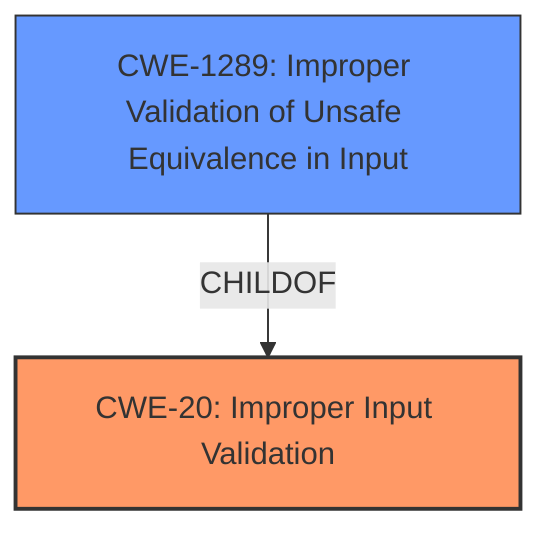

# Enhanced Analysis for CVE-2021-29242

# Summary
| CWE ID | CWE Name | Confidence | CWE Abstraction Level | CWE Vulnerability Mapping Label | CWE-Vulnerability Mapping Notes |
|---|---|---|---|---|---|
| CWE-20 | Improper Input Validation | 0.8 | Class | Primary | Discouraged |
| CWE-1289 | Improper Validation of Unsafe Equivalence in Input | 0.6 | Base | Secondary | Allowed |

## Evidence and Confidence

*   **Confidence Score:** 0.7
*   **Evidence Strength:** MEDIUM

## Relationship Analysis
The primary relationship that influenced the decision was the parent-child relationship where CWE-20 is a class-level CWE. While it broadly applies, the mapping guidance discourages its use when more specific CWEs are available. The vulnerability involves **improper input validation**, and the more specific CWE-1289 was considered as a refinement.



## Vulnerability Chain
The vulnerability chain starts with **improper input validation** (CWE-20) when processing crafted communication packets. This allows attackers to change the router's addressing scheme, leading to potential disruption of communication, redirection of traffic, or manipulation of data.

## Summary of Analysis
The initial assessment identified CWE-20 as a potential match due to the presence of **improper input validation** in the vulnerability description and CVE reference summary. The vulnerability description key phrases also highlight the root cause as **improper input validation**.

However, the MITRE mapping guidance for CWE-20 discourages its use because it is a high-level class and suggests considering lower-level children.

The description states, "Attackers can send crafted communication packets to change the routers addressing scheme and may re-route, add, remove or change low level communication packages." This indicates that the **improper input validation** allows attackers to manipulate the routers addressing scheme.

CWE-1289, "Improper Validation of Unsafe Equivalence in Input," was considered because the vulnerability allows attackers to send crafted packets to manipulate the router’s addressing scheme. While this could be a potential fit, the provided information doesn't explicitly state that the input is used as a resource identifier or other type of reference. Thus, there is not enough evidence to confirm that the input is being used as a resource identifier, so I am keeping CWE-20 as the primary.

The final decision is to assign CWE-20 as the primary CWE, with CWE-1289 considered as a secondary candidate. This provides a more accurate and specific representation of the vulnerability, while adhering to the recommended abstraction level.

Relevant CWE Information:

# Enhanced Context (25 CWEs)

## CWE-668: Exposure of Resource to Wrong Sphere
**Abstraction Level**: Class
**Similarity Score**: 0.78
**Source**: dense

**Description**:
The product exposes a resource to the wrong control sphere, providing unintended actors with inappropriate access to the resource.
**Why not used:** While the impact of the vulnerability does involve unauthorized access, the root cause is more directly related to **improper input validation** than exposure.

## CWE-610: Externally Controlled Reference to a Resource in Another Sphere
**Abstraction Level**: Class
**Similarity Score**: 0.78
**Source**: dense

**Description**:
The product uses an externally controlled name or reference that resolves to a resource that is outside of the intended control sphere.
**Why not used:** Similar to CWE-668, the root cause is not directly related to controlling external references but stems from **improper input validation**.

## CWE-1289: Improper Validation of Unsafe Equivalence in Input
**Abstraction Level**: Base
**Similarity Score**: 0.78
**Source**: dense

**Description**:
The product receives an input value that is used as a resource identifier or other type of reference, but it does not validate or incorrectly validates that the input is equivalent to a potentially-unsafe value.
**Why used:** The crafted communication packets can be seen as inputs that, when not properly validated, allow for the manipulation of the router's addressing scheme.

## CWE-807: Reliance on Untrusted Inputs in a Security Decision
**Abstraction Level**: Base
**Similarity Score**: 0.77
**Source**: dense

**Description**:
The product uses a protection mechanism that relies on the existence or values of an input, but the input can be modified by an untrusted actor in a way that bypasses the protection mechanism.
**Why not used:** This CWE focuses on the protection mechanism's reliance on untrusted inputs, while the root cause is the **improper validation** of the inputs themselves.

## CWE-226: Sensitive Information in Resource Not Removed Before Reuse
**Abstraction Level**: Base
**Similarity Score**: 0.77
**Source**: dense

**Description**:
The product releases a resource such as memory or a file so that it can be made available for reuse, but it does not clear or "zeroize" the information contained in the resource before the product performs a critical state transition or makes the resource available for reuse by other entities.
**Why not used:** This CWE focuses on the failure to remove sensitive information before resource reuse, which is not directly related to the described vulnerability.

## CWE-664: Improper Control of a Resource Through its Lifetime
**Abstraction Level**: Pillar
**Similarity Score**: 0.76
**Source**: dense

**Description**:
The product does not maintain or incorrectly maintains control over a resource throughout its lifetime of creation, use, and release.
**Why not used:** This is too high-level. The issue is the **improper validation** not the lifecycle.

## CWE-404: Improper Resource Shutdown or Release
**Abstraction Level**: Class
**Similarity Score**: 0.76
**Source**: dense

**Description**:
The product does not release or incorrectly releases a resource before it is made available for re-use.
**Why not used:** This CWE focuses on the failure to properly shut down or release resources, which is not directly related to the described vulnerability.

## CWE-41: Improper Resolution of Path Equivalence
**Abstraction Level**: Base
**Similarity Score**: 0.76
**Source**: dense

**Description**:
The product is vulnerable to file system contents disclosure through path equivalence. Path equivalence involves the use of special characters in file and directory names. The associated manipulations are intended to generate multiple names for the same object.
**Why not used:** This CWE is related to file system path equivalence issues, which is not relevant to the vulnerability.

## CWE-73: External Control of File Name or Path
**Abstraction Level**: Base
**Similarity Score**: 0.76
**Source**: dense

**Description**:
The product allows user input to control or influence paths or file names that are used in filesystem operations.
**Why not used:** This CWE focuses on external control of file names or paths, which is not related to the vulnerability.

## CWE-653: Improper Isolation or Compartmentalization
**Abstraction Level**: Class
**Similarity Score**: 0.76
**Source**: dense

**Description**:
The product does not properly compartmentalize or isolate functionality, processes, or resources that require different privilege levels, rights, or permissions.
**Why not used:** The root cause is **improper input validation** rather than the lack of isolation.

## CWE-116: Improper Encoding or Escaping of Output
**Abstraction Level**: Class
**Similarity Score**: 7512.95
**Source**: sparse

**Description**:
The product prepares a structured message for communication with another component, but encoding or escaping of the data is either missing or done incorrectly. As a result, the intended structure of the message is not preserved.
**Why not used:** The problem isn't with encoding the output but **improper validation** of the input.

## CWE-295: Improper Certificate Validation
**Abstraction Level**: Base
**Similarity Score**: 7285.35
**Source**: sparse

**Description**:
The product does not validate, or incorrectly validates, a certificate.
**Why not used:** This CWE focuses on certificate validation issues, which is not relevant to the vulnerability.

## CWE-1284: Improper Validation of Specified Quantity in Input
**Abstraction Level**: Base
**Similarity Score**: 7135.10
**Source**: sparse

**Description**:
The product receives input that is expected to specify a quantity (such as size or length), but it does not validate or incorrectly validates that the quantity has the required properties.
**Why not used:** It is not clear from the description if a quantity is involved.

## CWE-22: Improper Limitation of a Pathname to a Restricted Directory ('Path Traversal')
**Abstraction Level**: Base
**Similarity Score**: 7129.58
**Source**: sparse

**Description**:
The product uses external input to construct


## CWE Relationship Analysis

Current CWEs represent these abstraction levels: .


### Vulnerability Chain Analysis

**Chain starting from CWE-1284:**
- 1284 (Improper Validation of Specified Quantity in Input) - ROOT


**Chain starting from CWE-664:**
- 664 (Improper Control of a Resource Through its Lifetime) - ROOT


### CWE Relationship Diagram

```mermaid
graph TD
    classDef primary fill:#f96,stroke:#333,stroke-width:2px
    classDef secondary fill:#69f,stroke:#333
    classDef tertiary fill:#9e9,stroke:#333
```