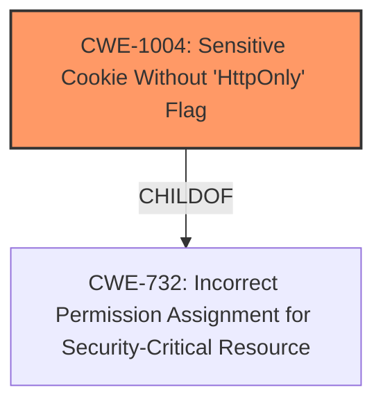

# Enhanced Analysis for CVE-2021-29247

# Summary
| CWE ID    | CWE Name                                                    | Confidence | CWE Abstraction Level | CWE Vulnerability Mapping Label | CWE-Vulnerability Mapping Notes |
| --------- | ----------------------------------------------------------- | ---------- | --------------------- | ------------------------------- | ------------------------------- |
| CWE-1004  | Sensitive Cookie Without 'HttpOnly' Flag                    | 1          | Variant               | Allowed                         | Primary CWE                     |

## Evidence and Confidence

*   **Confidence Score:** 1
*   **Evidence Strength:** HIGH

## Relationship Analysis
The analysis focuses on the hierarchical relationship of CWE-1004 as a variant of CWE-732. The primary relationship considered is ChildOf, to ensure that the selected CWE is the most specific representation of the vulnerability.



## Vulnerability Chain
The vulnerability chain consists of the **failure to set the HTTPOnly flag for a cookie**, leading to the potential compromise of sensitive information.
  - Root Cause: **failure to set the HTTPOnly flag for a cookie**
  - Impact: A remote attacker could obtain sensitive information.

## Summary of Analysis
The initial analysis identified CWE-311 as the primary CWE Match. However, after reviewing the retriever results and the complete CWE specifications, CWE-1004 was identified as the most appropriate match.

The vulnerability description states a **failure to set the HTTPOnly flag for a cookie**, leading to potential sensitive information disclosure. The primary evidence supporting this assessment comes directly from the "Vulnerability Description Key Phrases" and the "CVE Reference Links Content Summary".

CWE-1004 (Sensitive Cookie Without 'HttpOnly' Flag) is a Variant level CWE that specifically addresses the **failure to set the HTTPOnly flag for a cookie**. This aligns directly with the vulnerability description. The CWE description states: "The product uses a cookie to store sensitive information, but the cookie is not marked with the HttpOnly flag." The "CVE Reference Links Content Summary" section provides further evidence, noting the "lack of the `HttpOnly` flag on a cookie used for saving user preferences." This evidence strongly supports the selection of CWE-1004.

CWE-311 (Missing Encryption of Sensitive Data) was initially considered due to its presence in the "CWE for similar CVE Descriptions" section. However, CWE-311 is a Class-level CWE and is therefore a higher level of abstraction. Given the more specific match with CWE-1004, CWE-311 is not the optimal choice. The MITRE mapping guidance for CWE-311 explicitly discourages its use, stating: "CWE-311 is high-level with more precise children available. It is a level-1 Class (i.e., a child of a Pillar)."

CWE-614 (Sensitive Cookie in HTTPS Session Without 'Secure' Attribute) was considered because it addresses the absence of the "Secure" attribute in HTTPS sessions. However, the vulnerability description focuses on the absence of the HTTPOnly flag, not the Secure attribute. Therefore, CWE-614 is not the most accurate match.

CWE-319 (Cleartext Transmission of Sensitive Information) was considered but focuses on the transmission of sensitive data in cleartext, not the specific cookie attribute.

CWE-312 (Cleartext Storage of Sensitive Information) was considered but addresses the storage of sensitive information in cleartext, which isn't the core issue described.

CWE-201 (Insertion of Sensitive Information Into Sent Data) was also considered, but this CWE is related to the general insertion of sensitive information into sent data, rather than the specific case of missing HTTPOnly flags on cookies.

CWE-565 (Reliance on Cookies without Validation and Integrity Checking) was considered but focuses on the reliance on cookies without proper validation, which is distinct from the HTTPOnly flag issue.

Based on the evidence and the CWE specifications, CWE-1004 is the most specific and appropriate mapping for this vulnerability.

Relevant CWE Information:
- CWE-1004: Sensitive Cookie Without 'HttpOnly' Flag
- CWE-614: Sensitive Cookie in HTTPS Session Without 'Secure' Attribute
- CWE-319: Cleartext Transmission of Sensitive Information
- CWE-312: Cleartext Storage of Sensitive Information
- CWE-201: Insertion of Sensitive Information Into Sent Data
- CWE-565: Reliance on Cookies without Validation and Integrity Checking
- CWE-226: Sensitive Information in Resource Not Removed Before Reuse
- CWE-784: Reliance on Cookies without Validation and Integrity Checking in a Security Decision
- CWE-79: Improper Neutralization of Input During Web Page Generation ('Cross-site Scripting')
- CWE-311: Missing Encryption of Sensitive Data


## CWE Relationship Analysis

Current CWEs represent these abstraction levels: .


### Vulnerability Chain Analysis

**Chain starting from CWE-732:**
- 732 (Incorrect Permission Assignment for Critical Resource) - ROOT


**Chain starting from CWE-79:**
- 79 (Improper Neutralization of Input During Web Page Generation ('Cross-site Scripting')) - ROOT


### CWE Relationship Diagram

```mermaid
graph TD
    classDef primary fill:#f96,stroke:#333,stroke-width:2px
    classDef secondary fill:#69f,stroke:#333
    classDef tertiary fill:#9e9,stroke:#333
```