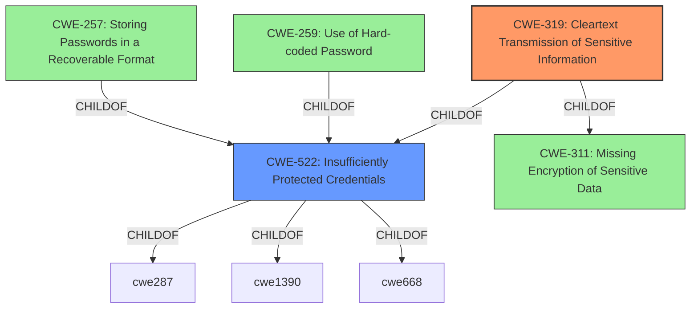

# Analysis Report for CVE-2021-29255

# Vulnerability Analysis Report: CVE-2021-29255

## Description


## Analysis (with Relationship Data)

# Summary
| CWE ID | CWE Name | Confidence | CWE Abstraction Level | CWE Vulnerability Mapping Label | CWE-Vulnerability Mapping Notes |
|---|---|---|---|---|---|
| CWE-319 | Cleartext Transmission of Sensitive Information | 1 | Base | Allowed | Primary CWE |
| CWE-522 | Insufficiently Protected Credentials | 0.75 | Class | Allowed-with-Review | Secondary Candidate |

## Evidence and Confidence

*   **Confidence Score:** 1
*   **Evidence Strength:** HIGH

## Relationship Analysis
The primary CWE is CWE-319, which is a Base level CWE. It is related to CWE-311 (Missing Encryption of Sensitive Data) as a child. The secondary CWE, CWE-522, is a class and parent of CWE-257, CWE-259, and CWE-319. The vulnerability involves sending credentials in cleartext, thus CWE-319 is a perfect fit. CWE-522 is more general and covers broader cases of insufficiently protected credentials.



## Vulnerability Chain
The vulnerability chain involves the **cleartext transmission** of sensitive information (admin credentials).
  - Root Cause: **Cleartext Transmission**
  - Weakness: **Lack of Encryption**
  - Impact: An attacker on the same network can capture these credentials.

## Summary of Analysis
The analysis is based on the vulnerability description and the CVE reference summary. The key evidence is that the device sends admin credentials in **cleartext**. This directly aligns with CWE-319's description: "The product transmits sensitive or security-critical data in cleartext in a communication channel that can be sniffed by unauthorized actors."

The graph relationships show that CWE-319 is a child of CWE-311 (Missing Encryption of Sensitive Data) which highlights that the **lack of encryption** is the underlying issue leading to the **cleartext transmission**.

CWE-319 is chosen because it specifically describes the **transmission of sensitive information in cleartext**, which is the core of this vulnerability. It is at the Base level of abstraction, providing a good balance between specificity and generality.

Relevant CWE Information:

# Enhanced Context (25 CWEs)

## CWE-312: Cleartext Storage of Sensitive Information
**Abstraction Level**: Base
**Similarity Score**: 0.77
**Source**: dense
- This CWE was not selected because the vulnerability concerns transmission, not storage.

## CWE-538: Insertion of Sensitive Information into Externally-Accessible File or Directory
**Abstraction Level**: Base
**Similarity Score**: 0.77
**Source**: dense
- This CWE was not selected because the vulnerability concerns transmission, not storage or file access.

## CWE-798: Use of Hard-coded Credentials
**Abstraction Level**: Base
**Similarity Score**: 0.76
**Source**: dense
- This CWE was not selected because the root cause is not the use of hard-coded credentials but rather the **transmission in cleartext**, regardless of how the credentials were created or stored.

## CWE-1391: Use of Weak Credentials
**Abstraction Level**: Class
**Similarity Score**: 0.76
**Source**: dense
- This CWE was not selected because the root cause is not the use of weak credentials but rather the **transmission in cleartext**, regardless of the strength of the credentials.

## CWE-319: Cleartext Transmission of Sensitive Information
**Abstraction Level**: Base
**Similarity Score**: 0.76
**Source**: dense

## CWE-212: Improper Removal of Sensitive Information Before Storage or Transfer
**Abstraction Level**: Base
**Similarity Score**: 0.75
**Source**: dense
- This CWE was not selected because the core issue isn't about removing sensitive information, but rather ensuring its confidentiality during transmission.

## CWE-345: Insufficient Verification of Data Authenticity
**Abstraction Level**: Class
**Similarity Score**: 0.75
**Source**: dense
- This CWE was not selected because the issue isn't about data authenticity, but about the confidentiality of transmitted data.

## CWE-226: Sensitive Information in Resource Not Removed Before Reuse
**Abstraction Level**: Base
**Similarity Score**: 0.74
**Source**: dense
- This CWE was not selected because the issue is about cleartext transmission, not reuse of resources.

## CWE-807: Reliance on Untrusted Inputs in a Security Decision
**Abstraction Level**: Base
**Similarity Score**: 0.74
**Source**: dense
- This CWE was not selected because the vulnerability doesn't involve reliance on untrusted inputs for security decisions.

## CWE-522: Insufficiently Protected Credentials
**Abstraction Level**: Class
**Similarity Score**: 0.74
**Source**: dense

## CWE-259: Use of Hard-coded Password
**Abstraction Level**: Variant
**Similarity Score**: 5479.12
**Source**: sparse
- This CWE was not selected because the root cause is not the use of hard-coded credentials but rather the **transmission in cleartext**, regardless of how the credentials were created or stored.

## CWE-798: Use of Hard-coded Credentials
**Abstraction Level**: Base
**Similarity Score**: 5477.32
**Source**: sparse
- This CWE was not selected because the root cause is not the use of hard-coded credentials but rather the **transmission in cleartext**, regardless of how the credentials were created or stored.

## CWE-321: Use of Hard-coded Cryptographic Key
**Abstraction Level**: Variant
**Similarity Score**: 5297.73
**Source**: sparse
- This CWE was not selected because the root cause is not the use of hard-coded cryptographic keys but rather the **transmission in cleartext**, regardless of how the credentials were created or stored.

## CWE-319: Cleartext Transmission of Sensitive Information
**Abstraction Level**: Base
**Similarity Score**: 5241.19
**Source**: sparse

## CWE-1391: Use of Weak Credentials
**Abstraction Level**: Class
**Similarity Score**: 5214.42
**Source**: sparse
- This CWE was not selected because the root cause is not the use of weak credentials but rather the **transmission in cleartext**, regardless of the strength of the credentials.

## CWE-322: Key Exchange without Entity Authentication
**Abstraction Level**: base
**Similarity Score**: 5.03
**Source**: graph
- This CWE was not selected because the vulnerability doesn't involve key exchange.

## CWE-123: Write-what-where Condition
**Abstraction Level**: base
**Similarity Score**: 4.33
**Source**: graph
- This CWE was not selected because this vulnerability doesn't relate to write-what-where conditions.

## CWE-120: Buffer Copy without Checking Size of Input ('Classic Buffer Overflow')
**Abstraction Level**: base
**Similarity Score**: 4.33
**Source**: graph
- This CWE was not selected because the vulnerability has nothing to do with buffer overflows.

## CWE-131: Incorrect Calculation of Buffer Size
**Abstraction Level**: base
**Similarity Score**: 4.33
**Source**: graph
- This CWE was not selected because the vulnerability has nothing to do with buffer size calculations.

## CWE-259: Use of Hard-coded Password
**Abstraction Level**: variant
**Similarity Score**: 4.01
**Source**: graph
- This CWE was not selected because the root cause is not the use of hard-coded credentials but rather the **transmission in cleartext**, regardless of how the credentials were created or stored.

## CWE-321: Use of Hard-coded Cryptographic Key
**Abstraction Level**:


## CWE Relationship Analysis

Current CWEs represent these abstraction levels: .


### Vulnerability Chain Analysis

**Chain starting from CWE-123:**
- 123 (Write-what-where Condition) - ROOT


**Chain starting from CWE-312:**
- 312 (Cleartext Storage of Sensitive Information) - ROOT


### CWE Relationship Diagram

```mermaid
graph TD
    classDef primary fill:#f96,stroke:#333,stroke-width:2px
    classDef secondary fill:#69f,stroke:#333
    classDef tertiary fill:#9e9,stroke:#333
```


*Report generated on 2025-04-02 16:50:17*
