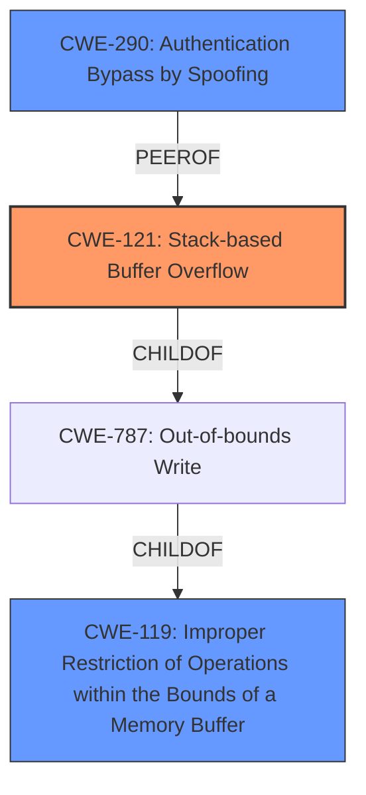

# Raw Analyzer Response for CVE-2021-29280

# Summary
| CWE ID | CWE Name | Confidence | CWE Abstraction Level | CWE Vulnerability Mapping Label | CWE-Vulnerability Mapping Notes |
|---|---|---|---|---|---|
| CWE-121 | Stack-based Buffer Overflow | 0.8 | Variant | Allowed | Primary CWE |
| CWE-290 | Authentication Bypass by Spoofing | 0.6 | Base | Allowed | Secondary Candidate |
| CWE-119 | Improper Restriction of Operations within the Bounds of a Memory Buffer | 0.5 | Class | Discouraged | Secondary Candidate |

## Evidence and Confidence

*   **Confidence Score:** 0.7
*   **Evidence Strength:** MEDIUM

## Relationship Analysis
The primary CWE is CWE-121, a variant of buffer overflows that occur on the stack. This choice is supported by the vulnerability description indicating a **buffer overflow** and the context of ARP poisoning, which often involves crafted packets exceeding expected buffer sizes.

CWE-119 is a more general class encompassing buffer overflows, but CWE-121 provides better specificity. While CWE-119 is discouraged, it is still relevant, because it describes the general issue of operating outside the bounds of a memory buffer.

CWE-290 is also possibly relevant because ARP poisoning can be seen as a form of spoofing, but it's less directly related to the **buffer overflow** impact.

## Vulnerability Chain
The vulnerability chain starts with the lack of proper ARP validation, leading to ARP poisoning, and culminating in a **buffer overflow**.
  - **Root Cause:** **Lack of ARP Validation**
  - **Weakness:** ARP Poisoning (sending malicious ARP packets)
  - **Impact:** **Buffer Overflow**

## Summary of Analysis
The initial assessment focused on identifying the most accurate CWE to represent the described **buffer overflow** caused by an ARP poisoning attack. The analysis considered various CWEs related to input validation, buffer handling, and authentication bypass. The final decision favored CWE-121 because it directly addresses the **stack-based buffer overflow**, which is the vulnerability's primary impact.

The selection of CWE-121 is strongly based on the vulnerability description's explicit mention of a **buffer overflow**. The supporting evidence includes:

*   **Vulnerability Description Key Phrases:** "**impact:** buffer overflow"
*   **CVE Reference Links Content Summary:** "ARP poisoning attack can cause buffer overflow"

The graph relationships helped in understanding the hierarchical structure of CWEs, specifically the relationship between CWE-119 (Improper Restriction of Operations within the Bounds of a Memory Buffer) and CWE-121 (Stack-based Buffer Overflow). CWE-121 is more specific and accurately reflects the vulnerability's nature, aligning with the recommendation to choose the most detailed CWE when possible.

Other CWEs Considered But Not Used:

*   CWE-20 (Improper Input Validation): While the ARP protocol **lacks validation**, this is more of a prerequisite condition than the direct cause of the **buffer overflow**.
*   CWE-113 (Improper Neutralization of CRLF Sequences in HTTP Headers ('HTTP Request/Response Splitting')): This is specific to HTTP headers and not relevant to ARP packets.
*   CWE-122 (Heap-based Buffer Overflow): There's no information to suggest the **buffer** is allocated on the heap, making CWE-121 a better fit.
*   CWE-805 (Buffer Access with Incorrect Length Value): This is a possible cause, but the information does not provide enough information on this.
*   CWE-290 (Authentication Bypass by Spoofing): Relevant to the ARP poisoning aspect but doesn't fully capture the **buffer overflow** impact.
*   CWE-1284 (Improper Validation of Specified Quantity in Input): This is a possible cause, but the information does not provide enough information on this.

The selected CWE is at the optimal level of specificity because it accurately describes the type of **buffer overflow** (stack-based) and is supported by clear evidence in the vulnerability description.