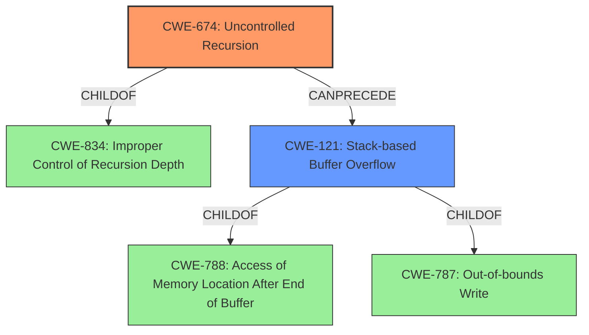

# Raw Analyzer Response for CVE-2021-29324

# Summary

| CWE ID | CWE Name | Confidence | CWE Abstraction Level | CWE Vulnerability Mapping Label | CWE-Vulnerability Mapping Notes |
|---|---|---|---|---|---|
| CWE-674 | Uncontrolled Recursion | 0.9 | Class | Allowed-with-Review | Primary CWE |
| CWE-121 | Stack-based Buffer Overflow | 0.8 | Variant | Allowed | Secondary Candidate |

## Evidence and Confidence

*   **Confidence Score:** 0.9
*   **Evidence Strength:** HIGH

## Relationship Analysis
The primary CWE is CWE-674, Uncontrolled Recursion, which is a Class-level CWE. The vulnerability description details a stack overflow caused by excessive recursion, making this a strong fit. CWE-674 is a child of CWE-834 (Improper Control of Recursion Depth).

CWE-121, Stack-based Buffer Overflow, is considered a secondary candidate because the root cause is uncontrolled recursion, leading to stack exhaustion. CWE-121 is a variant of CWE-788 (Access of Memory Location After End of Buffer) and CWE-787 (Out-of-bounds Write). While a stack overflow occurs, it is a consequence of the uncontrolled recursion.

## Vulnerability Chain
The vulnerability chain starts with the lack of control over recursion depth (CWE-674), leading to stack exhaustion and a stack overflow (CWE-121).
  - Initial Flaw: **Uncontrolled Recursion** (CWE-674)
  - Consequence: **Stack-based Buffer Overflow** (CWE-121) due to stack exhaustion.

## Summary of Analysis
The primary weakness is **uncontrolled recursion** in the `fxExponentiationExpression` function, as evidenced by the CVE Reference Links Content Summary. The report specifically states that the function is called recursively without limit, leading to stack exhaustion. This directly aligns with CWE-674 (Uncontrolled Recursion).

The vulnerability description key phrases also highlight "**stack overflow**" as the weakness. However, the root cause lies in the uncontrolled recursion that causes the stack to overflow. Therefore, CWE-674 more accurately represents the underlying issue.

CWE-121 (Stack-based Buffer Overflow) is a consequence of the uncontrolled recursion, making it a secondary concern. The selection of CWE-674 is at the Class level, and while there could be a more specific Base-level CWE, CWE-674 best captures the essence of the vulnerability given the available information.

The relationship analysis highlights that CWE-674 can precede CWE-121, further supporting the decision to prioritize CWE-674 as the primary CWE.

The evidence from the CVE Reference Links Content Summary is:
-   "The vulnerability is caused by excessive recursion during the parsing of a crafted JavaScript string. The `fxExponentiationExpression` function is called recursively without limit, leading to stack exhaustion."

Based on the evidence and relationship analysis, CWE-674 is the most appropriate primary CWE, with CWE-121 as a secondary candidate.

Relevant CWE Information:

# Enhanced Context (25 CWEs)

## CWE-124: Buffer Underwrite ('Buffer Underflow')
**Abstraction Level**: Base
**Similarity Score**: 0.77
**Source**: dense

**Description**:
The product writes to a buffer using an index or pointer that references a memory location prior to the beginning of the buffer.

**Mapping Guidance**:
- Usage: Allowed
- Rationale: This CWE entry is at the Base level of abstraction, which is a preferred level of abstraction for mapping to the root causes of vulnerabilities.

*Not selected because this vulnerability involves a stack overflow due to uncontrolled recursion, not a buffer underwrite.*

## CWE-191: Integer Underflow (Wrap or Wraparound)
**Abstraction Level**: Base
**Similarity Score**: 0.77
**Source**: dense

**Description**:
The product subtracts one value from another, such that the result is less than the minimum allowable integer value, which produces a value that is not equal to the correct result.

**Mapping Guidance**:
- Usage: Allowed
- Rationale: This CWE entry is at the Base level of abstraction, which is a preferred level of abstraction for mapping to the root causes of vulnerabilities.

*Not selected because the vulnerability does not involve integer underflow.*

## CWE-131: Incorrect Calculation of Buffer Size
**Abstraction Level**: Base
**Similarity Score**: 0.76
**Source**: dense

**Description**:
The product does not correctly calculate the size to be used when allocating a buffer, which could lead to a buffer overflow.

**Mapping Guidance**:
- Usage: Allowed
- Rationale: This CWE entry is at the Base level of abstraction, which is a preferred level of abstraction for mapping to the root causes of vulnerabilities.

*Not selected because the root cause is uncontrolled recursion, not incorrect buffer size calculation.*

## CWE-680: Integer Overflow to Buffer Overflow
**Abstraction Level**: Compound
**Similarity Score**: 0.75
**Source**: dense

**Description**:
The product performs a calculation to determine how much memory to allocate, but an integer overflow can occur that causes less memory to be allocated than expected, leading to a buffer overflow.

**Mapping Guidance**:
- Usage: Discouraged
- Rationale: This CWE entry is a named chain, which combines multiple weaknesses.

*Not selected because the vulnerability does not involve an integer overflow leading to a buffer overflow.*

## CWE-126: Buffer Over-read
**Abstraction Level**: Variant
**Similarity Score**: 0.75
**Source**: dense

**Description**:
The product reads from a buffer using buffer access mechanisms such as indexes or pointers that reference memory locations after the targeted buffer.

**Mapping Guidance**:
- Usage: Allowed
- Rationale: This CWE entry is at the Variant level of abstraction, which is a preferred level of abstraction for mapping to the root causes of vulnerabilities.

*Not selected because the vulnerability involves a stack overflow due to uncontrolled recursion, not a buffer over-read.*

## CWE-805: Buffer Access with Incorrect Length Value
**Abstraction Level**: Base
**Similarity Score**: 0.75
**Source**: dense

**Description**:
The product uses a sequential operation to read or write a buffer, but it uses an incorrect length value that causes it to access memory that is outside of the bounds of the buffer.

**Mapping Guidance**:
- Usage: Allowed
- Rationale: This CWE entry is at the Base level of abstraction, which is a preferred level of abstraction for mapping to the root causes of vulnerabilities.

*Not selected because the vulnerability involves a stack overflow due to uncontrolled recursion, not incorrect buffer length value.*

## CWE-190: Integer Overflow or Wraparound
**Abstraction Level**: Base
**Similarity Score**: 0.75
**Source**: dense

**Description**:
The product performs a calculation that can
         produce an integer overflow or wraparound when the logic
         assumes that the resulting value will always be larger than
         the original value. This occurs when an integer value is
         incremented to a value that is too large to store in the
         associated representation. When this occurs, the value may
         become a very small or negative number.

**Mapping Guidance**:
- Usage: Allowed
- Rationale: This CWE entry is at the Base level of abstraction, which is a preferred level of abstraction for mapping to the root causes of vulnerabilities.

*Not selected because the vulnerability does not involve an integer overflow or wraparound.*

## CWE-1325: Improperly Controlled Sequential Memory Allocation
**Abstraction Level**: Base
**Similarity Score**: 0.75
**Source**: dense

**Description**:
The product manages a group of objects or resources and performs a separate memory allocation for each object, but it does not properly limit the total amount of memory that is consumed by all of the combined objects.

**Mapping Guidance**:
- Usage: Allowed
- Rationale: This CWE entry is at the Base level of abstraction, which is a preferred level of abstraction for mapping to the root causes of vulnerabilities.

*