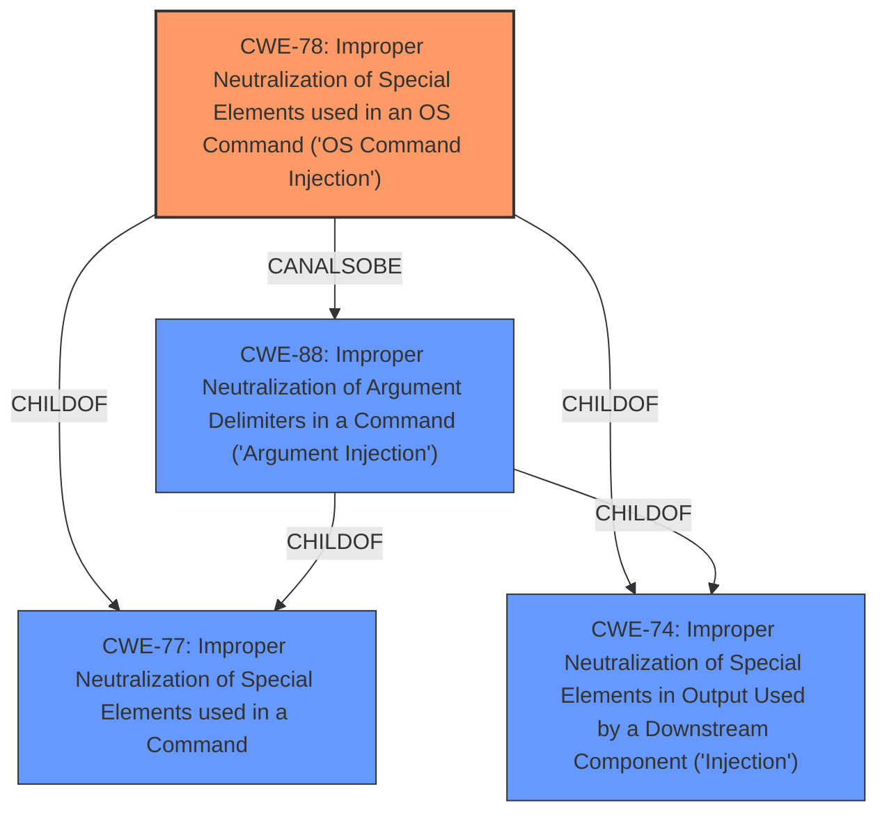

# Analysis Report for CVE-2021-29369

# Vulnerability Analysis Report: CVE-2021-29369

## Description


## Analysis (with Relationship Data)

# Summary
| CWE ID | CWE Name | Confidence | CWE Abstraction Level | CWE Vulnerability Mapping Label | CWE-Vulnerability Mapping Notes |
|---|---|---|---|---|---|
| CWE-78 | Improper Neutralization of Special Elements used in an OS Command ('OS Command Injection') | 1.0 | Base | Allowed | Primary CWE |
| CWE-88 | Improper Neutralization of Argument Delimiters in a Command ('Argument Injection') | 0.7 | Base | Allowed | Secondary Candidate |

## Evidence and Confidence

*   **Confidence Score:** 0.9
*   **Evidence Strength:** HIGH

## Relationship Analysis
The primary CWE is CWE-78, which is a Base level CWE. CWE-78 has child relationships to CWE-77 (Improper Neutralization of Special Elements used in a Command) and CWE-74 (Improper Neutralization of Special Elements in Output Used by a Downstream Component ('Injection')). CWE-78 also has a CanAlsoBe relationship to CWE-88 (Improper Neutralization of Argument Delimiters in a Command ('Argument Injection')). CWE-88 is also a Base level CWE and has a child relationship to CWE-77 and CWE-74.



## Vulnerability Chain
The vulnerability chain starts with the lack of proper sanitization of the filename provided to the `plot` function, leading to **Improper Neutralization of Special Elements used in an OS Command ('OS Command Injection') CWE-78**. The filename is directly used in the gnuplot command execution.

## Summary of Analysis
The initial analysis indicates that the primary weakness is **Improper Neutralization of Special Elements used in an OS Command ('OS Command Injection') CWE-78** with a confidence score of 1.0. The vulnerability description explicitly mentions code execution via shell metacharacters in Gnuplot commands, which directly aligns with the characteristics of CWE-78. The CVE Reference Links Content Summary further reinforces this by stating that the vulnerability stems from the lack of proper sanitization of the filename, allowing attackers to inject arbitrary commands.

The supporting evidence for **Improper Neutralization of Special Elements used in an OS Command ('OS Command Injection') CWE-78** is: "The vulnerability stems from the lack of proper sanitization of the filename provided to the `plot` function in the `@rkesters/gnuplot` npm package... Before this fix, a malicious user could inject arbitrary commands into the filename, leading to command injection."

The retriever results also list **Improper Neutralization of Special Elements used in an OS Command ('OS Command Injection') CWE-78** as the top match.

I am also considering **Improper Neutralization of Argument Delimiters in a Command ('Argument Injection') CWE-88**, but the primary issue is that the entire command is being constructed with unsanitized input, not just the arguments. Therefore, **Improper Neutralization of Special Elements used in an OS Command ('OS Command Injection') CWE-78** is the more appropriate primary CWE.

I considered but did not select **Improper Neutralization of Special Elements CWE-138**, which is a Class level CWE. The vulnerability is more specifically related to OS commands and therefore **Improper Neutralization of Special Elements used in an OS Command ('OS Command Injection') CWE-78** is a better fit.

I considered but did not select **Permissive Regular Expression CWE-625**, as the vulnerability is not due to a permissive regular expression, but rather the lack of sanitization of input used in an OS command.

I considered but did not select **Improper Neutralization of Directives in Dynamically Evaluated Code ('Eval Injection') CWE-95**, as the vulnerability is not due to the use of eval, but rather the execution of OS commands.

I considered but did not select **Command Shell in Externally Accessible Directory CWE-553**, as the vulnerability is not related to a command shell being in an externally accessible directory.

I considered but did not select **Permissive List of Allowed Inputs CWE-183**, as the vulnerability is not related to a permissive list of allowed inputs.

I considered but did not select **Improper Neutralization of CRLF Sequences ('CRLF Injection') CWE-93**, as the vulnerability is not related to CRLF injection.

I considered but did not select **Improper Neutralization of Whitespace CWE-156**, as the vulnerability is not related to improper neutralization of whitespace.

I considered but did not select **Inefficient Regular Expression Complexity CWE-1333**, as the vulnerability is not related to inefficient regular expression complexity.

My assessment is based on the provided evidence and the relationship analysis. The selected CWE is at the optimal level of specificity, accurately representing the weakness.


## CWE Relationship Analysis

Current CWEs represent these abstraction levels: .


### Vulnerability Chain Analysis

**Chain starting from CWE-88:**
- 88 (Improper Neutralization of Argument Delimiters in a Command ('Argument Injection')) - ROOT


**Chain starting from CWE-156:**
- 156 (Improper Neutralization of Whitespace) - ROOT


### CWE Relationship Diagram

```mermaid
graph TD
    classDef primary fill:#f96,stroke:#333,stroke-width:2px
    classDef secondary fill:#69f,stroke:#333
    classDef tertiary fill:#9e9,stroke:#333
```


*Report generated on 2025-04-02 09:43:55*
