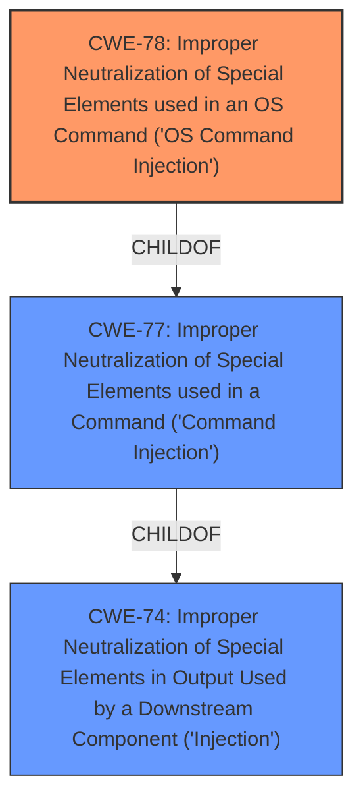

# Enhanced Analysis for CVE-2021-29379

# Summary
| CWE ID | CWE Name | Confidence | CWE Abstraction Level | CWE Vulnerability Mapping Label | CWE-Vulnerability Mapping Notes |
|---|---|---|---|---|---|
| CWE-78 | Improper Neutralization of Special Elements used in an OS Command ('OS Command Injection') | 1.0 | Base | Allowed | Primary CWE. The **command injection** occurs because the application fails to neutralize special elements in the input. |

## Evidence and Confidence

*   **Confidence Score:** 1.0
*   **Evidence Strength:** HIGH

## Relationship Analysis
The primary relationship is the ChildOf relationship between CWE-78 and CWE-77. CWE-78 is a more specific form of CWE-77, focusing on OS commands. The analysis clearly indicates that the **command injection** occurs within the context of OS commands, making CWE-78 the more appropriate choice.



## Vulnerability Chain
The vulnerability chain starts with the **improper neutralization** of input in the UPnP service, leading directly to OS **command injection**.

## Summary of Analysis
The initial analysis and the provided evidence strongly support the classification of this vulnerability as CWE-78 (Improper Neutralization of Special Elements used in an OS Command ('OS Command Injection')). The vulnerability description clearly states that the **command injection** occurs due to the lack of proper sanitization in the "ST" field of the SSDP M-SEARCH packet. The "CVE Reference Links Content Summary" section confirms this, stating: "Attackers can inject arbitrary commands into the "ST" field, which are then executed by the underlying operating system of the router."

The retriever results also list CWE-78 as a highly relevant CWE, with alternate_terms matching the search term **command injection**. The mapping guidance for CWE-78 allows its usage and specifies that it is at the Base level of abstraction.

The analysis of relationships further solidifies this decision. CWE-78 is a child of CWE-77 (Improper Neutralization of Special Elements used in a Command ('Command Injection')), but since the **command injection** is specifically related to OS commands, CWE-78 is the more specific and appropriate choice.

Other CWEs, such as CWE-77, CWE-79, CWE-95, and CWE-98 were considered, but they were not selected because they did not accurately represent the specific nature of the vulnerability. For example, CWE-79 is related to cross-site scripting, CWE-95 is related to eval injection, and CWE-98 is related to PHP remote file inclusion. The vulnerability in question is specifically about OS **command injection**, making CWE-78 the most accurate and specific classification.

The decision to classify this vulnerability as CWE-78 is based on the evidence provided in the vulnerability description, the retriever results, and the relationship analysis. The selected CWE is at the optimal level of specificity, accurately representing the root cause of the vulnerability.

Relevant CWE Information:
- CWE-78: Improper Neutralization of Special Elements used in an OS Command ('OS Command Injection')
- CWE-77: Improper Neutralization of Special Elements used in a Command ('Command Injection')
- CWE-74: Improper Neutralization of Special Elements in Output Used by a Downstream Component ('Injection')
- CWE-79: Improper Neutralization of Input During Web Page Generation ('Cross-site Scripting')
- CWE-95: Improper Neutralization of Directives in Dynamically Evaluated Code ('Eval Injection')
- CWE-98: Improper Control of Filename for Include/Require Statement in PHP Program ('PHP Remote File Inclusion')


## CWE Relationship Analysis

Current CWEs represent these abstraction levels: .


### Vulnerability Chain Analysis

**Chain starting from CWE-79:**
- 79 (Improper Neutralization of Input During Web Page Generation ('Cross-site Scripting')) - ROOT


**Chain starting from CWE-78:**
- 78 (Improper Neutralization of Special Elements used in an OS Command ('OS Command Injection')) - ROOT


### CWE Relationship Diagram

```mermaid
graph TD
    classDef primary fill:#f96,stroke:#333,stroke-width:2px
    classDef secondary fill:#69f,stroke:#333
    classDef tertiary fill:#9e9,stroke:#333
```