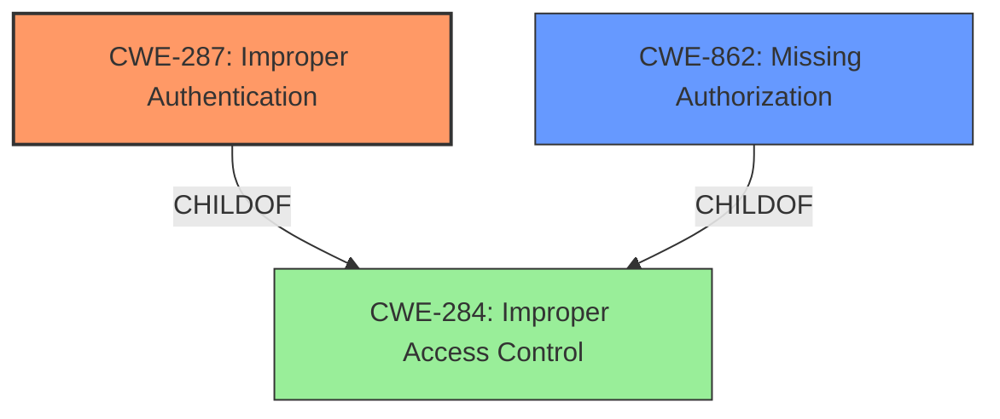

# Analysis Report for CVE-2021-29396

# Vulnerability Analysis Report: CVE-2021-29396

## Description


## Analysis (with Relationship Data)

# Summary
| CWE ID  | CWE Name                                                     | Confidence | CWE Abstraction Level | CWE Vulnerability Mapping Label | CWE-Vulnerability Mapping Notes |
| :-------- | :----------------------------------------------------------- | :--------- | :---------------------- | :------------------------------ | :------------------------------ |
| CWE-287 | Improper Authentication | 1.0        | Base                    | Primary                      | Allowed                       |
| CWE-862 | Missing Authorization | 0.8        | Class                    | Secondary                      | Allowed-with-Review                       |

## Evidence and Confidence

*   **Confidence Score:** 0.9
*   **Evidence Strength:** HIGH

## Relationship Analysis
The primary CWE is CWE-287 [CWE-287: Improper Authentication], which is a base level CWE. CWE-287 is a child of CWE-284 [CWE-284: Improper Access Control]. The secondary CWE is CWE-862 [CWE-862: Missing Authorization], which is a class level CWE and is also a child of CWE-284 [CWE-284: Improper Access Control].


## Vulnerability Chain
The chain of root cause and weaknesses that followed for the Vulnerability Description:
1.  **Root Cause:** **Insecure Permissions** leading to **Improper Authentication (CWE-287)**.
2.  **Weakness:** **Missing Authorization (CWE-862)** for high-privilege functionalities.
3.  **Impact:** Remote unauthenticated users can use functionalities without authentication, potentially leading to full system compromise, data breach, and system manipulation.

## Summary of Analysis
The initial assessment identified **Insecure Permissions** as the root cause, leading to the selection of CWE-287 [CWE-287: Improper Authentication] as the primary weakness. The **lack of authentication** allows attackers to bypass access controls. The secondary weakness, CWE-862 [CWE-862: Missing Authorization], highlights the absence of authorization checks for high-privilege functionalities.

The evidence from the "CVE Reference Links Content Summary" strongly supports these mappings:
*   "The root cause is a systemic **lack of proper authentication** in NorthStar Club Management 6.3."
*   "The application lacks proper checks to verify user identity before granting access to sensitive resources and functionalities. This leads to an authentication bypass vulnerability."
*   "Multiple high-privilege pages and resources, including file management and command execution interfaces, are exposed without any authentication requirements."

The graph relationships confirm that both CWE-287 [CWE-287: Improper Authentication] and CWE-862 [CWE-862: Missing Authorization] are related to CWE-284 [CWE-284: Improper Access Control], indicating a common theme of access control issues.

CWE-287 [CWE-287: Improper Authentication] is at the optimal level of specificity because the vulnerability stems from the application not properly verifying user identity. While CWE-862 [CWE-862: Missing Authorization] could also be considered, the **lack of authentication** is the more fundamental issue, making CWE-287 [CWE-287: Improper Authentication] the primary root cause. CWE-862 [CWE-862: Missing Authorization] is relevant because once authentication is bypassed, there are no further checks in place.

**CWEs Considered But Not Used:**

*   CWE-620 [CWE-620: Unverified Password Change]: This is not relevant because the vulnerability is about bypassing authentication altogether, not about password changes.
*   CWE-732 [CWE-732: Incorrect Permission Assignment for Critical Resource]: While **insecure permissions** are mentioned, the primary issue is the **lack of authentication**, not the incorrect assignment of permissions.
*   CWE-379 [CWE-379: Creation of Temporary File in Directory with Insecure Permissions] and CWE-378 [CWE-378: Creation of Temporary File With Insecure Permissions]: These are not relevant as temporary files are not part of the vulnerability description.
*   CWE-425 [CWE-425: Direct Request ('Forced Browsing')]: This is not the primary issue, although it could be a secondary factor. The main problem is the **lack of authentication** allowing direct access.
*   CWE-639 [CWE-639: Authorization Bypass Through User-Controlled Key]: This is not relevant because the vulnerability does not involve manipulating keys to bypass authorization.
*   CWE-471 [CWE-471: Modification of Assumed-Immutable Data (MAID)]: This is not relevant because the vulnerability does not involve modifying assumed-immutable data.
*   CWE-285 [CWE-285: Improper Authorization]: This is too high-level. More specific CWEs like CWE-862 [CWE-862: Missing Authorization] and CWE-287 [CWE-287: Improper Authentication] are more appropriate.
*   CWE-99 [CWE-99: Improper Control of Resource Identifiers ('Resource Injection')]: This is not relevant because the vulnerability does not involve injecting resource identifiers.


## CWE Relationship Analysis

Current CWEs represent these abstraction levels: .


### Vulnerability Chain Analysis

**Chain starting from CWE-732:**
- 732 (Incorrect Permission Assignment for Critical Resource) - ROOT


**Chain starting from CWE-862:**
- 862 (Missing Authorization) - ROOT


### CWE Relationship Diagram

```mermaid
graph TD
    classDef primary fill:#f96,stroke:#333,stroke-width:2px
    classDef secondary fill:#69f,stroke:#333
    classDef tertiary fill:#9e9,stroke:#333
```


*Report generated on 2025-04-02 00:10:20*
