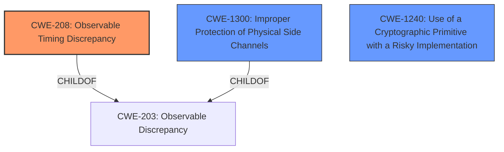

# Analysis Report for CVE-2021-29415

# Vulnerability Analysis Report: CVE-2021-29415

## Description


## Analysis (with Relationship Data)

# Summary
| CWE ID | CWE Name | Confidence | CWE Abstraction Level | CWE Vulnerability Mapping Label | CWE-Vulnerability Mapping Notes |
|---|---|---|---|---|---|
| CWE-208 | Observable Timing Discrepancy | 1.0 | Base | Primary | Allowed |
| CWE-1300 | Improper Protection of Physical Side Channels | 0.7 | Base | Secondary | Allowed |
| CWE-1240 | Use of a Cryptographic Primitive with a Risky Implementation | 0.6 | Base | Secondary | Allowed |

## Evidence and Confidence

*   **Confidence Score:** 0.9
*   **Evidence Strength:** HIGH

## Relationship Analysis
The primary relationship that influenced the decision was the ChildOf relationship between CWE-208 and CWE-203. While CWE-203 is a more general "Observable Discrepancy," CWE-208 is specifically about "Observable Timing Discrepancy," which directly aligns with the vulnerability description of a **non-constant time ECDSA implementation**. CWE-1300 is a peer of CWE-203 and is a child of CWE-203, which makes it a valid secondary candidate. CWE-1240 is related to the use of risky cryptographic implementations. The abstraction levels guided the choice towards more specific Base-level CWEs rather than broader Class-level CWEs when the evidence supported it.



## Vulnerability Chain
The vulnerability chain starts with the **non-constant time ECDSA implementation** (CWE-208) in the hardware accelerator. This **weakness** allows an adversary to recover the private ECC key, compromising the device's security. This can be thought of as:

1.  **Root Cause:** CWE-208 (Observable Timing Discrepancy) due to **non-constant time ECDSA implementation**.
2.  **Impact:** Private key recovery, leading to compromised device security.

## Summary of Analysis
The initial assessment focused on identifying the root cause of the vulnerability based on the provided description and key phrases. The vulnerability description clearly states a **"non-constant time ECDSA implementation"**, which directly points to an observable timing discrepancy.

The Retriever Results further supported this by listing CWE-208 as the top candidate. The Complete CWE Specifications for CWE-208 confirmed its relevance, describing it as "Two separate operations in a product require different amounts of time to complete, in a way that is observable to an actor and reveals security-relevant information about the state of the product." This aligns perfectly with the vulnerability, where the timing variation in the ECDSA implementation allows an attacker to recover the private key.

CWE-1300 "Improper Protection of Physical Side Channels" was also considered because a timing discrepancy could be observed through physical side channels like power consumption or electromagnetic emissions. This is supported by the "CVE Reference Links Content Summary" which discusses the need for "pen-like EM measurement probes for side-channel analysis." While CWE-208 directly addresses the timing issue, CWE-1300 adds context regarding the physical observability.

CWE-1240 "Use of a Cryptographic Primitive with a Risky Implementation" was considered because the ECDSA implementation might be considered risky due to its timing vulnerability.

The final selection of CWE-208 as the primary CWE is based on its direct alignment with the **root cause** described in the vulnerability, its high relevance score, and the MITRE mapping guidance that encourages using the most specific Base-level CWE when appropriate. CWE-1300 and CWE-1240 were selected as secondary CWEs due to the possibility of side channel attacks and the risky ECDSA implementation, respectively.

Relevant CWE Information:

# Enhanced Context (25 CWEs)
The following CWEs were identified as potentially relevant to this vulnerability:

## CWE-208: Observable Timing Discrepancy
**Abstraction Level**: Base
**Similarity Score**: 0.80
**Source**: dense

**Description**:
Two separate operations in a product require different amounts of time to complete, in a way that is observable to an actor and reveals security-relevant information about the state of the product, such as whether a particular operation was successful or not.

**Mapping Guidance**:
- Usage: Allowed
- Rationale: This CWE entry is at the Base level of abstraction, which is a preferred level of abstraction for mapping to the root causes of vulnerabilities.

## CWE-1300: Improper Protection of Physical Side Channels
**Abstraction Level**: Base
**Status:** Stable

### Description
The device does not contain sufficient protection mechanisms to prevent physical side channels from exposing sensitive information due to patterns in physically observable phenomena such as variations in power consumption, electromagnetic emissions (EME), or acoustic emissions.

### Extended Description
An adversary could monitor and measure physical phenomena to detect patterns and make inferences, even if it is not possible to extract the information in the digital domain.

### Alternative Terms
None

### Relationships
ChildOf -> CWE-203

### Mapping Guidance
**Usage:** Allowed
**Rationale:** This CWE entry is at the Base level of abstraction, which is a preferred level of abstraction for mapping to the root causes of vulnerabilities.

## CWE-1240: Use of a Cryptographic Primitive with a Risky Implementation
**Abstraction Level**: Base
**Status:** Draft

### Description
To fulfill the need for a cryptographic primitive, the product implements a cryptographic algorithm using a non-standard, unproven, or disallowed/non-compliant cryptographic implementation.

### Extended Description
Cryptographic protocols and systems depend on cryptographic primitives (and associated algorithms) as their basic building blocks. Some common examples of primitives are digital signatures, one-way hash functions, ciphers, and public key cryptography; however, the notion of "primitive" can vary depending on point of view. See "Terminology Notes" for further explanation of some concepts.

### Alternative Terms
None

### Relationships
ChildOf -> CWE-327

### Mapping Guidance
**Usage:** Allowed
**Rationale:** This CWE entry is at the Base level of abstraction, which is a preferred level of abstraction for mapping to the root causes of vulnerabilities.

## Technical Explanation for Selected CWEs:

*   **CWE-208 (Observable Timing Discrepancy):** The vulnerability's core issue is the **non-constant time ECDSA implementation**. This means the time taken for the ECDSA operation varies depending on the input, which can be observed by an attacker. This observable timing difference allows the attacker to infer information about the private key. The security implication is the potential compromise of the private key, leading to unauthorized access and data breaches. As a Base-level CWE and a child of CWE-203, it provides the most specific and accurate representation of the timing-related weakness. The MITRE mapping guidance allows its usage.
*   **CWE-1300 (Improper Protection of Physical Side Channels):** The timing discrepancy in ECDSA implementation could potentially be exploited via side-channel attacks, such as monitoring power consumption or electromagnetic emissions during the operation. The security implication is that an attacker with physical access to the device could extract the private key by analyzing these physical phenomena. As a Base-level CWE and child of CWE-203, it provides a relevant context of how the timing discrepancy could be exploited.
*   **CWE-1240 (Use of a Cryptographic Primitive with a Risky Implementation):** The implementation of the ECDSA algorithm is considered risky due to its timing vulnerability. The security implication is that a known weakness exists in the cryptographic primitive that can be exploited by an attacker.

## CWEs Considered But Not Used:

*   **CWE-203 (Observable Discrepancy):** While related, it's a more general case than CWE-208, which specifically addresses timing discrepancies. Since the vulnerability description clearly mentions a timing issue, CWE-208 is a more appropriate and specific choice.
*   **CWE-295 (Improper Certificate Validation):** This CWE is about certificate validation issues, which are not directly related to the ECDSA timing vulnerability. Therefore, it was not selected.
*   **CWE-916 (Use of Password Hash With Insufficient Computational Effort):** This CWE is about password hashing, which is not relevant to the ECDSA timing vulnerability. Therefore, it was not selected.
*   **CWE-385 (Covert Timing Channel):** This CWE is for covert timing channels. While related, CWE-208 is


## CWE Relationship Analysis

Current CWEs represent these abstraction levels: .


### Vulnerability Chain Analysis

**Chain starting from CWE-916:**
- 916 (Use of Password Hash With Insufficient Computational Effort) - ROOT


**Chain starting from CWE-1300:**
- 1300 (Improper Protection of Physical Side Channels) - ROOT


### CWE Relationship Diagram

```mermaid
graph TD
    classDef primary fill:#f96,stroke:#333,stroke-width:2px
    classDef secondary fill:#69f,stroke:#333
    classDef tertiary fill:#9e9,stroke:#333
```


*Report generated on 2025-04-02 12:40:03*
