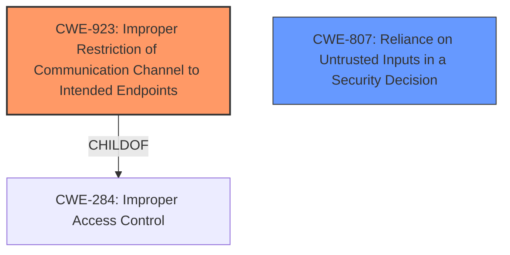

# Enhanced Analysis for CVE-2021-29416

# Summary
| CWE ID | CWE Name | Confidence | CWE Abstraction Level | CWE Vulnerability Mapping Label | CWE-Vulnerability Mapping Notes |
|---|---|---|---|---|---|
| CWE-923 | Improper Restriction of Communication Channel to Intended Endpoints | 0.75 | Class | Allowed-with-Review | Primary CWE.  The product does not properly ensure that it is communicating with the correct endpoint. |
| CWE-807 | Reliance on Untrusted Inputs in a Security Decision | 0.6 | Base | Allowed | Secondary CWE. The product uses a protection mechanism that relies on the existence or values of an input, but the input can be modified by an untrusted actor in a way that bypasses the protection mechanism. |

## Evidence and Confidence

*   **Confidence Score:** 0.7
*   **Evidence Strength:** MEDIUM

## Relationship Analysis
The primary CWE selected is CWE-923, a Class-level CWE. While it would be preferred to use a Base or Variant CWE, the available information does not point to a more specific weakness. CWE-923 is a child of CWE-284 which is "Improper Access Control". CWE-807 is a Base-level CWE.



## Vulnerability Chain
The vulnerability chain starts with the Burp Suite failing to respect its upstream proxy configuration. This leads to direct network connections, potentially leaking NetNTLM hashes on vulnerable Windows systems.

## Summary of Analysis
The initial assessment, based on the provided evidence, leans towards CWE-923 because Burp Suite, in certain scenarios, does not properly restrict its communication channel to the intended endpoint (the upstream proxy). The evidence includes the vulnerability description stating that "it can be manipulated into issuing a request that does not respect its upstream proxy configuration" and the CVE Reference Links Content Summary which confirms the "failure to consistently use the configured upstream proxy".

CWE-807 is also considered because the upstream proxy configuration is a security decision that relies on an input (the configuration itself), and this input can be bypassed by a malicious request.

The choice of CWE-923 is somewhat influenced by the available information. While a more specific CWE at the Base or Variant level would be ideal, the evidence does not provide sufficient detail to pinpoint a lower-level weakness. The decision to include CWE-807 acknowledges that the vulnerability involves a reliance on untrusted inputs for a security decision.

Relevant CWE Information:
```
Vulnerability Description Key Phrases:
- **impact:** leak NetNTLM hashes
- **vector:** malicious request
```

```
CVE Reference Links Content Summary:
*   **Root Cause:** The vulnerability stemmed from Burp Suite not respecting its configured upstream proxy settings in certain scenarios.
*   **Weaknesses/Vulnerabilities:** The primary vulnerability was a failure to consistently use the configured upstream proxy. This could lead to Burp Suite making direct network connections, bypassing the intended proxy.
```


## CWE Relationship Analysis

Current CWEs represent these abstraction levels: .


### Vulnerability Chain Analysis

**Chain starting from CWE-807:**
- 807 (Reliance on Untrusted Inputs in a Security Decision) - ROOT


**Chain starting from CWE-923:**
- 923 (Improper Restriction of Communication Channel to Intended Endpoints) - ROOT


### CWE Relationship Diagram

```mermaid
graph TD
    classDef primary fill:#f96,stroke:#333,stroke-width:2px
    classDef secondary fill:#69f,stroke:#333
    classDef tertiary fill:#9e9,stroke:#333
```