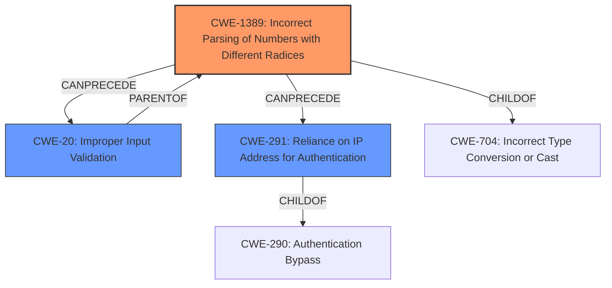

# Raw Analyzer Response for CVE-2021-29418

# Summary
| CWE ID  | CWE Name                                                                       | Confidence | CWE Abstraction Level | CWE Vulnerability Mapping Label | CWE-Vulnerability Mapping Notes |
| :-------- | :----------------------------------------------------------------------------- | :--------- | :---------------------- | :------------------------------ | :-------------------------------- |
| CWE-1389 | Incorrect Parsing of Numbers with Different Radices                           | 0.9        | Base                    | Primary                         | Allowed                           |
| CWE-291  | Reliance on IP Address for Authentication                                     | 0.6        | Variant                 | Secondary                       | Allowed                           |
| CWE-20   | Improper Input Validation                                                       | 0.5        | Class                   | Secondary                       | Allowed-with-Review               |

## Evidence and Confidence

*   **Confidence Score:** 0.8
*   **Evidence Strength:** HIGH

## Relationship Analysis
The primary CWE, CWE-1389, directly addresses the root cause of the vulnerability: incorrect parsing of numbers with different radices. While CWE-20 is a broader category, CWE-1389 pinpoints the specific parsing error. CWE-291 is included as it relates to reliance on IP addresses for authentication, which is the context where the parsing error leads to a security bypass.

## Vulnerability Chain
The vulnerability chain starts with:
1.  **Incorrect Parsing:** The **mishandling of unexpected characters in an IP address string** (CWE-1389).
2.  **Failed Input Validation:** Because the parsing is incorrect, the application **fails to properly validate** the IP address (CWE-20).
3.  **Authentication Bypass:** The **bypass of access control** occurs because the IP address is not correctly interpreted (CWE-291).

## Summary of Analysis
The initial assessment correctly identifies the core issue as a parsing error leading to an authentication bypass.

*   The analysis is heavily based on the provided evidence. The **Vulnerability Description Key Phrases** clearly states that the **rootcause** is the "**mishandling of certain unexpected characters in an IP address string**".
*   The **CVE Reference Links Content Summary** indicates that the vulnerability stems from the `node-netmask` package's incorrect parsing of IP addresses and that the **Improper Input Validation (CWE-20)** is a core weakness.
*   The hierarchical relationships in the graph support the decision to use CWE-1389 as the primary cause, as it's a specific type of input validation issue.
*   CWE-1389 is selected because it is the optimal level of specificity. The **Vulnerability Description** and **CVE Reference Links Content Summary** clearly define the **rootcause** as related to incorrect parsing of numbers with different radices in IP addresses.

Relevant CWE Information:

# Enhanced Context (25 CWEs)
The following CWEs were identified as potentially relevant to this vulnerability:

## CWE-1289: Improper Validation of Unsafe Equivalence in Input
**Abstraction Level**: Base
**Similarity Score**: 0.78
**Source**: dense

**Description**:
The product receives an input value that is used as a resource identifier or other type of reference, but it does not validate or incorrectly validates that the input is equivalent to a potentially-unsafe value.
**Rationale for Not Using:** Although there's validation involved, the core issue is about interpreting the radix.

## CWE-1389: Incorrect Parsing of Numbers with Different Radices
**Abstraction Level**: Base
**Similarity Score**: 0.77
**Source**: dense

**Description**:
The product parses numeric input assuming base 10 (decimal) values, but it does not account for inputs that use a different base number (radix).
**Reason for Using:** This aligns with the vulnerability where the netmask package mishandles octal digits.

## CWE-74: Improper Neutralization of Special Elements in Output Used by a Downstream Component ('Injection')
**Abstraction Level**: Class
**Similarity Score**: 0.77
**Source**: dense

**Description**:
The product constructs all or part of a command, data structure, or record using externally-influenced input from an upstream component, but it does not neutralize or incorrectly neutralizes special elements that could modify how it is parsed or interpreted when it is sent to a downstream component.
**Rationale for Not Using:** The issue isn't about neutralization but about initial interpretation of the number.

## CWE-138: Improper Neutralization of Special Elements
**Abstraction Level**: Class
**Similarity Score**: 0.76
**Source**: dense

**Description**:
The product receives input from an upstream component, but it does not neutralize or incorrectly neutralizes special elements that could be interpreted as control elements or syntactic markers when they are sent to a downstream component.
**Rationale for Not Using:** Similar to CWE-74, neutralization is not the primary concern.

## CWE-184: Incomplete List of Disallowed Inputs
**Abstraction Level**: Base
**Similarity Score**: 0.76
**Source**: dense

**Description**:
The product implements a protection mechanism that relies on a list of inputs (or properties of inputs) that are not allowed by policy or otherwise require other action to neutralize before additional processing takes place, but the list is incomplete.
**Rationale for Not Using:** The issue isn't about a list of disallowed inputs but about how numeric inputs are parsed.

## CWE-41: Improper Resolution of Path Equivalence
**Abstraction Level**: Base
**Similarity Score**: 0.76
**Source**: dense

**Description**:
The product is vulnerable to file system contents disclosure through path equivalence. Path equivalence involves the use of special characters in file and directory names. The associated manipulations are intended to generate multiple names for the same object.
**Rationale for Not Using:** This is specific to file paths and not relevant to the IP address parsing issue.

## CWE-212: Improper Removal of Sensitive Information Before Storage or Transfer
**Abstraction Level**: Base
**Similarity Score**: 0.76
**Source**: dense

**Description**:
The product stores, transfers, or shares a resource that contains sensitive information, but it does not properly remove that information before the product makes the resource available to unauthorized actors.
**Rationale for Not Using:** This is related to sensitive information handling, which is not the case here.

## CWE-252: Unchecked Return Value
**Abstraction Level**: Base
**Similarity Score**: 0.76
**Source**: dense

**Description**:
The product does not check the return value from a method or function, which can prevent it from detecting unexpected states and conditions.
**Rationale for Not Using:** The root cause is not a missed return value check.

## CWE-407: Inefficient Algorithmic Complexity
**Abstraction Level**: Class
**Similarity Score**: 0.76
**Source**: dense

**Description**:
An algorithm in a product has an inefficient worst-case computational complexity that may be detrimental to system performance and can be triggered by an attacker, typically using crafted manipulations that ensure that the worst case is being reached.
**Rationale for Not Using:** The inefficiency of an algorithm is not the primary problem.

## CWE-1286: Improper Validation of Syntactic Correctness of Input
**Abstraction Level**: Base
**Similarity Score**: 0.75
**Source**: dense

**Description**:
The product receives input that is expected to be well-formed - i.e., to comply with a certain syntax - but it does not validate or incorrectly validates that the input complies with the syntax.
**Rationale for Not Using:** Although related, CWE-1389 is more specific to the parsing issue.

## CWE-1389: Incorrect Parsing of Numbers with Different Radices
**Abstraction Level**: Base
**Similarity Score**: 6239.12
**Source**: sparse

**Description**:
The product parses numeric input assuming base 10 (decimal) values, but it does not account for inputs that use a different base number (radix).
**Reason for Using:** High score, directly related to the identified vulnerability.

## CWE-88: Improper Neutralization of Argument Delimiters in a Command ('Argument Injection')
**