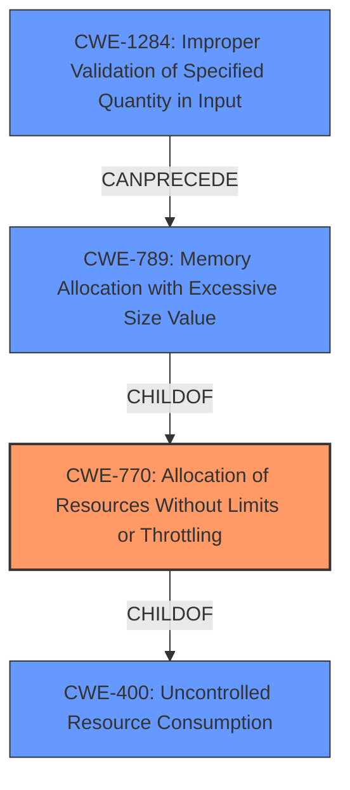

# Analysis for CVE-2021-29430

# Summary

| CWE ID | CWE Name | Confidence | CWE Abstraction Level | CWE Vulnerability Mapping Label | CWE-Vulnerability Mapping Notes |
|---|---|---|---|---|---|
| CWE-770 | Allocation of Resources Without Limits or Throttling | 1.0 | Base | Allowed | Primary CWE |
| CWE-400 | Uncontrolled Resource Consumption | 0.7 | Class | Discouraged | Secondary Candidate |
| CWE-789 | Memory Allocation with Excessive Size Value | 0.7 | Variant | Allowed | Secondary Candidate |
| CWE-1284 | Improper Validation of Specified Quantity in Input | 0.6 | Base | Allowed | Secondary Candidate |

## Evidence and Confidence

*   **Confidence Score:** 0.9
*   **Evidence Strength:** HIGH

## Relationship Analysis

The primary relationship that influenced the CWE selection is the parent-child relationship. CWE-770 (Allocation of Resources Without Limits or Throttling) is a child of CWE-400 (Uncontrolled Resource Consumption). CWE-789 (Memory Allocation with Excessive Size Value) is a child of CWE-770, representing a more specific scenario. CWE-1284 (Improper Validation of Specified Quantity in Input) can precede CWE-789, indicating a potential vulnerability chain.

## Vulnerability Chain

The vulnerability chain starts with the **lack of input validation** (CWE-1284), leading to an **uncontrolled allocation of resources** (CWE-770), which can then result in **excessive memory allocation** (CWE-789) and ultimately **denial of service** due to memory exhaustion.

## Summary of Analysis

The initial analysis identified several potential CWEs, with CWE-770 (Allocation of Resources Without Limits or Throttling) as the most relevant based on the vulnerability description. The vulnerability description clearly states that Sydent **does not limit the size of requests** it receives, which directly aligns with the definition of CWE-770.

The **CVE Reference Links Content Summary** reinforces this by stating that "The Sydent server did not limit the size of incoming HTTP requests or responses from remote Matrix homeservers, leading to potential resource exhaustion."

The retriever results also support this assessment, with CWE-770 having the highest score. While other CWEs like CWE-400, CWE-789, and CWE-1284 are also relevant, they represent different aspects or stages of the vulnerability.

CWE-770 is selected as the primary CWE because it accurately captures the root cause of the vulnerability, which is the **failure to limit resource allocation**. The other CWEs are considered secondary candidates, representing related aspects or consequences of this root cause.

CWE-400 is a class-level CWE that describes uncontrolled resource consumption in general. While the vulnerability does lead to uncontrolled resource consumption, CWE-770 is a more specific base-level CWE that describes the **allocation of resources without limits or throttling**, which is the direct cause of the resource consumption.

CWE-789 is a variant-level CWE that describes memory allocation with an excessive size value. While the vulnerability can lead to excessive memory allocation, it is not the only possible consequence. The vulnerability can also lead to excessive disk space usage, as mentioned in the CVE Reference Links Content Summary.

CWE-1284 is a base-level CWE that describes improper validation of a specified quantity in input. This CWE is relevant because the vulnerability involves the **lack of validation of the size of HTTP requests and responses**. However, it is not the direct cause of the denial of service. The denial of service is caused by the allocation of resources without limits or throttling.

The chosen CWEs are at the optimal level of specificity because they accurately represent the root cause and related aspects of the vulnerability. CWE-770 is a base-level CWE that directly describes the **lack of resource limits**, while the other CWEs represent related aspects or consequences.

Relevant CWE Information:

# Enhanced Context (25 CWEs)
The following CWEs were identified as potentially relevant to this vulnerability:

## CWE-226: Sensitive Information in Resource Not Removed Before Reuse
**Abstraction Level**: Base
**Similarity Score**: 0.80
**Source**: dense

**Description**:
The product releases a resource such as memory or a file so that it can be made available for reuse, but it does not clear or "zeroize" the information contained in the resource before the product performs a critical state transition or makes the resource available for reuse by other entities.

**Mapping Guidance**:
- Usage: Allowed
- Rationale: This CWE entry is at the Base level of abstraction, which is a preferred level of abstraction for mapping to the root causes of vulnerabilities.

## CWE-404: Improper Resource Shutdown or Release
**Abstraction Level**: Class
**Similarity Score**: 0.79
**Source**: dense

**Description**:
The product does not release or incorrectly releases a resource before it is made available for re-use.

**Mapping Guidance**:
- Usage: Allowed-with-Review
- Rationale: This CWE entry is a Class and might have Base-level children that would be more appropriate

## CWE-789: Memory Allocation with Excessive Size Value
**Abstraction Level**: Variant
**Similarity Score**: 0.78
**Source**: dense

**Description**:
The product allocates memory based on an untrusted, large size value, but it does not ensure that the size is within expected limits, allowing arbitrary amounts of memory to be allocated.

**Mapping Guidance**:
- Usage: Allowed
- Rationale: This CWE entry is at the Variant level of abstraction, which is a preferred level of abstraction for mapping to the root causes of vulnerabilities.

## CWE-772: Missing Release of Resource after Effective Lifetime
**Abstraction Level**: Base
**Similarity Score**: 0.77
**Source**: dense

**Description**:
The product does not release a resource after its effective lifetime has ended, i.e., after the resource is no longer needed.

**Mapping Guidance**:
- Usage: Allowed
- Rationale: This CWE entry is at the Base level of abstraction, which is a preferred level of abstraction for mapping to the root causes of vulnerabilities.

## CWE-405: Asymmetric Resource Consumption (Amplification)
**Abstraction Level**: Class
**Similarity Score**: 0.76
**Source**: dense

**Description**:
The product does not properly control situations in which an adversary can cause the product to consume or produce excessive resources without requiring the adversary to invest equivalent work or otherwise prove authorization, i.e., the adversary's influence is "asymmetric."

**Mapping Guidance**:
- Usage: Allowed-with-Review
- Rationale: This CWE entry is a Class and might have Base-level children that would be more appropriate

## CWE-1325: Improperly Controlled Sequential Memory Allocation
**Abstraction Level**: Base
**Similarity Score**: 0.76
**Source**: dense

**Description**:
The product manages a group of objects or resources and performs a separate memory allocation for each object, but it does not properly limit the total amount of memory that is consumed by all of the combined objects.

**Mapping Guidance**:
- Usage: Allowed
- Rationale: This CWE entry is at the Base level of abstraction, which is a preferred level of abstraction for mapping to the root causes of vulnerabilities.

## CWE-401: Missing Release of Memory after Effective Lifetime
**Abstraction Level**: Variant
**Similarity Score**: 0.75
**Source**: dense

**Description**:
The product does not sufficiently track and release allocated memory after it has been used, which slowly consumes remaining memory.

**Mapping Guidance**:
- Usage: Allowed
- Rationale: This CWE entry is at the Variant level of abstraction, which is a preferred level of abstraction for mapping to the root causes of vulnerabilities.

## CWE-131: Incorrect Calculation of Buffer Size
**Abstraction Level**: Base
**Similarity Score**: 0.75
**Source**: dense

**Description**:
The product does not correctly calculate the size to be used when allocating a buffer, which could lead to a buffer overflow.

**Mapping Guidance**:
- Usage: Allowed
- Rationale: This CWE entry is at the Base level of abstraction, which is a preferred level of abstraction for mapping to the root causes