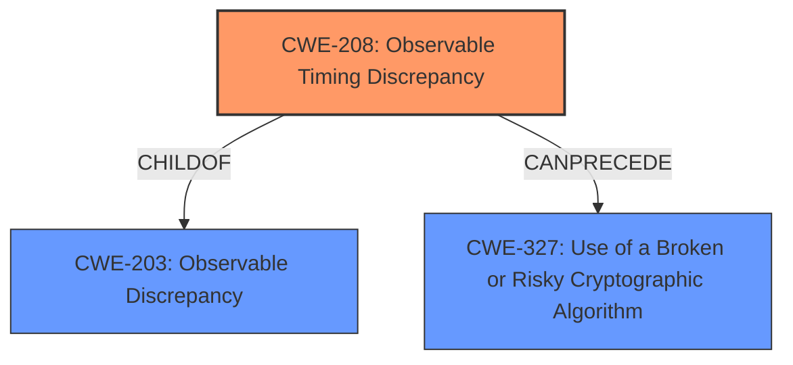

# Enhanced Analysis for CVE-2021-29445

# Summary
| CWE ID  | CWE Name                       | Confidence | CWE Abstraction Level | CWE Vulnerability Mapping Label | CWE-Vulnerability Mapping Notes |
|---------|--------------------------------|------------|-----------------------|---------------------------------|---------------------------------|
| CWE-208 | Observable Timing Discrepancy   | 0.9        | Base                  | Allowed                        | Primary CWE                     |
| CWE-327 | Use of a Broken or Risky Cryptographic Algorithm | 0.6        | Class                  | Allowed-with-Review            | Secondary Candidate                     |

## Evidence and Confidence

*   **Confidence Score:** 0.9
*   **Evidence Strength:** HIGH

## Relationship Analysis
The primary relationship that influenced the selection was the parent-child relationship between CWE-203 (Observable Discrepancy) and CWE-208 (Observable Timing Discrepancy). The vulnerability description specifically mentions a timing difference, which makes CWE-208 a more precise classification than its parent, CWE-203. CWE-327 (Use of a Broken or Risky Cryptographic Algorithm) was also considered because the vulnerability involves cryptographic algorithms, but the timing discrepancy is the more direct root cause.



## Vulnerability Chain
The vulnerability chain starts with the **improper** implementation of the AES_CBC_HMAC_SHA2 decryption, which leads to an **observable timing discrepancy** (CWE-208) when padding errors occur. This timing discrepancy creates a padding oracle that allows an attacker to decrypt data without the decryption key.

## Summary of Analysis
The initial assessment, guided by the "CWE for similar CVE Descriptions" section and the Retriever Results, pointed towards CWE-203 (Observable Discrepancy) as a strong candidate. However, a closer examination of the vulnerability description revealed that the discrepancy was specifically related to timing, leading to the selection of CWE-208 (Observable Timing Discrepancy) as the primary CWE. This decision is supported by the evidence in the CVE Reference Links Content Summary, which explicitly mentions a "timing discrepancy during padding error conditions." The choice of CWE-208 over CWE-203 is further justified by the hierarchical relationship between the two CWEs, with CWE-208 being a more specific child of CWE-203.

The selection of CWE-208 is based on the following evidence:

*   Vulnerability Description: "...a possibly observable difference in timing when padding error would occur while decrypting the ciphertext makes a padding oracle..."
*   CVE Reference Links Content Summary: "Timing discrepancy during error conditions, creating a padding oracle."

The graph relationships influenced the final selection by highlighting the relationship between CWE-203 and CWE-208, ensuring that the most specific and accurate CWE was chosen. The selected CWEs are at the optimal level of specificity because they directly address the root cause of the vulnerability, which is the **observable timing discrepancy** during CBC decryption.
The evidence is strong and directly supports the selection of CWE-208.

Relevant CWE Information:

# Enhanced Context (25 CWEs)
The following CWEs were identified as potentially relevant to this vulnerability:

## CWE-329: Generation of Predictable IV with CBC Mode
**Abstraction Level**: Variant
**Similarity Score**: 0.79
**Source**: dense

**Description**:
The product generates and uses a predictable initialization Vector (IV) with CBC Mode, which causes algorithms to be susceptible to dictionary attacks when they are encrypted under the same key.

**Mapping Guidance**:
- Usage: Allowed
- Rationale: This CWE entry is at the Variant level of abstraction, which is a preferred level of abstraction for mapping to the root causes of vulnerabilities.


## CWE-1204: Generation of Weak Initialization Vector (IV)
**Abstraction Level**: Base
**Similarity Score**: 0.78
**Source**: dense

**Description**:
The product uses a cryptographic primitive that uses an Initialization
			Vector (IV), but the product does not generate IVs that are
			sufficiently unpredictable or unique according to the expected
			cryptographic requirements for that primitive.
			

**Mapping Guidance**:
- Usage: Allowed
- Rationale: This CWE entry is at the Base level of abstraction, which is a preferred level of abstraction for mapping to the root causes of vulnerabilities.


## CWE-208: Observable Timing Discrepancy
**Abstraction Level**: Base
**Similarity Score**: 0.76
**Source**: dense

**Description**:
Two separate operations in a product require different amounts of time to complete, in a way that is observable to an actor and reveals security-relevant information about the state of the product, such as whether a particular operation was successful or not.

**Mapping Guidance**:
- Usage: Allowed
- Rationale: This CWE entry is at the Base level of abstraction, which is a preferred level of abstraction for mapping to the root causes of vulnerabilities.


## CWE-1240: Use of a Cryptographic Primitive with a Risky Implementation
**Abstraction Level**: Base
**Similarity Score**: 0.76
**Source**: dense

**Description**:
To fulfill the need for a cryptographic primitive, the product implements a cryptographic algorithm using a non-standard, unproven, or disallowed/non-compliant cryptographic implementation.

**Mapping Guidance**:
- Usage: Allowed
- Rationale: This CWE entry is at the Base level of abstraction, which is a preferred level of abstraction for mapping to the root causes of vulnerabilities.


## CWE-330: Use of Insufficiently Random Values
**Abstraction Level**: Class
**Similarity Score**: 0.75
**Source**: dense

**Description**:
The product uses insufficiently random numbers or values in a security context that depends on unpredictable numbers.

**Mapping Guidance**:
- Usage: Discouraged
- Rationale: This CWE entry is a level-1 Class (i.e., a child of a Pillar). It might have lower-level children that would be more appropriate


## CWE-203: Observable Discrepancy
**Abstraction Level**: Base
**Similarity Score**: 0.75
**Source**: dense

**Description**:
The product behaves differently or sends different responses under different circumstances in a way that is observable to an unauthorized actor, which exposes security-relevant information about the state of the product, such as whether a particular operation was successful or not.

**Mapping Guidance**:
- Usage: Allowed
- Rationale: This CWE entry is at the Base level of abstraction, which is a preferred level of abstraction for mapping to the root causes of vulnerabilities.


## CWE-834: Excessive Iteration
**Abstraction Level**: Class
**Similarity Score**: 0.74
**Source**: dense

**Description**:
The product performs an iteration or loop without sufficiently limiting the number of times that the loop is executed.

**Mapping Guidance**:
- Usage: Discouraged
- Rationale: This CWE entry is a level-1 Class (i.e., a child of a Pillar). It might have lower-level children that would be more appropriate


## CWE-1391: Use of Weak Credentials
**Abstraction Level**: Class
**Similarity Score**: 0.74
**Source**: dense

**Description**:
The product uses weak credentials (such as a default key or hard-coded password) that can be calculated, derived, reused, or guessed by an attacker.

**Mapping Guidance**:
- Usage: Allowed-with-Review
- Rationale: This CWE entry is a Class and might have Base-level children that would be more appropriate


## CWE-331: Insufficient Entropy
**Abstraction Level**: Base
**Similarity Score**: 0.74
**Source**: dense

**Description**:
The product uses an algorithm or scheme that produces insufficient entropy, leaving patterns or clusters of values that are more likely to occur than others.

**Mapping Guidance**:
- Usage: Allowed
- Rationale: This CWE entry is at the Base level of abstraction, which is a preferred level of abstraction for mapping to the root causes of vulnerabilities.


## CWE-345: Insufficient Verification of Data Authenticity
**Abstraction Level**: Class
**Similarity Score**: 0.73
**Source**: dense

**Description**:
The product does not sufficiently verify the origin or authenticity of data, in a way that causes it to accept invalid data.

**Mapping Guidance**:
- Usage: Discouraged
- Rationale: This CWE entry is a level-1 Class (i.e., a child of a Pillar). It might have lower-level children that would be more appropriate


## CWE-203: Observable Discrepancy
**


## CWE Relationship Analysis

Current CWEs represent these abstraction levels: .


### Vulnerability Chain Analysis

**Chain starting from CWE-834:**
- 834 (Excessive Iteration) - ROOT


**Chain starting from CWE-331:**
- 331 (Insufficient Entropy) - ROOT


### CWE Relationship Diagram

```mermaid
graph TD
    classDef primary fill:#f96,stroke:#333,stroke-width:2px
    classDef secondary fill:#69f,stroke:#333
    classDef tertiary fill:#9e9,stroke:#333
```