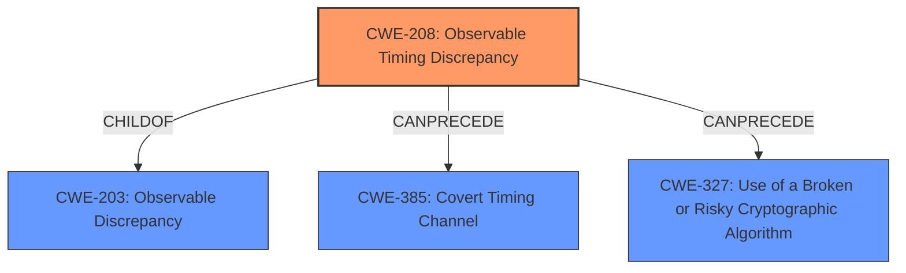

# Analysis Report for CVE-2021-29446

# Vulnerability Analysis Report: CVE-2021-29446

## Description


## Analysis (with Relationship Data)

# Summary
| CWE ID    | CWE Name                                                                                                                            | Confidence | CWE Abstraction Level | CWE Vulnerability Mapping Label | CWE-Vulnerability Mapping Notes |
| :---------- | :---------------------------------------------------------------------------------------------------------------------------------- | :--------- | :---------------------- | :------------------------------ | :------------------------------ |
| **CWE-208** | **Observable Timing Discrepancy**                                                                                                  | 1          | Base                    | Primary CWE                     | Allowed                         |
| CWE-203   | Observable Discrepancy                                                                                                            | 0.7        | Base                    | Secondary Candidate             | Allowed                         |
| CWE-327   | Use of a Broken or Risky Cryptographic Algorithm                                                                                   | 0.5        | Class                   | Secondary Candidate             | Allowed-with-Review             |

## Evidence and Confidence

*   **Confidence Score:** 0.9
*   **Evidence Strength:** HIGH

## Relationship Analysis
The primary CWE is CWE-208 Observable Timing Discrepancy, which is a child of CWE-203 Observable Discrepancy. CWE-208 can precede CWE-385 Covert Timing Channel and CWE-327 Use of a Broken or Risky Cryptographic Algorithm. Selecting CWE-208 provides a more specific classification than its parent, CWE-203.



## Vulnerability Chain
The vulnerability chain starts with the **improper** implementation of AES\_CBC\_HMAC\_SHA2 decryption, leading to a **padding oracle** due to observable timing differences. This allows an adversary to decrypt data without the key, resulting in a confidentiality breach.

## Summary of Analysis
The initial assessment and the retriever results both point towards timing-related issues. The vulnerability description mentions a "possibly observable difference in timing when padding error would occur while decrypting the ciphertext makes a **padding oracle**". The CVE Reference Links Content Summary confirms this by stating "The vulnerability stems from a timing discrepancy... a padding error during CBC decryption would cause a slight, observable timing difference." This timing discrepancy is the core of the **padding oracle** vulnerability.

CWE-208 (Observable Timing Discrepancy) is the most specific and appropriate CWE because it directly addresses the root cause, which is the timing difference that allows the attacker to distinguish between valid and invalid padding. This leads to the ability to decrypt data without knowing the key. The relationship analysis shows CWE-208 is a child of CWE-203 (Observable Discrepancy), making it more specific and preferred.

CWE-203 (Observable Discrepancy) was considered because it's a more general case of observable differences. However, CWE-208 is more precise as it specifically involves timing, which is the core of the **padding oracle** in this vulnerability.

CWE-327 (Use of a Broken or Risky Cryptographic Algorithm) was also considered but deemed less appropriate as the primary cause. While the use of AES_CBC_HMAC_SHA2 with the timing issue constitutes a risky cryptographic implementation, the timing discrepancy is the direct enabler of the **padding oracle**.
CWE-1204 was not selected since the issue is not the IV but the padding.
CWE-345 was not selected since the issue is not the data authenticity.

Relevant CWE Information:

# Enhanced Context (25 CWEs)
The following CWEs were identified as potentially relevant to this vulnerability:

## CWE-226: Sensitive Information in Resource Not Removed Before Reuse
**Abstraction Level**: Base
**Similarity Score**: 0.80
**Source**: dense

**Description**:
The product releases a resource such as memory or a file so that it can be made available for reuse, but it does not clear or "zeroize" the information contained in the resource before the product performs a critical state transition or makes the resource available for reuse by other entities.

**Mapping Guidance**:
- Usage: Allowed
- Rationale: This CWE entry is at the Base level of abstraction, which is a preferred level of abstraction for mapping to the root causes of vulnerabilities.


## CWE-203: Observable Discrepancy
**Abstraction Level**: Base
**Similarity Score**: 0.78
**Source**: dense

**Description**:
The product behaves differently or sends different responses under different circumstances in a way that is observable to an unauthorized actor, which exposes security-relevant information about the state of the product, such as whether a particular operation was successful or not.

**Mapping Guidance**:
- Usage: Allowed
- Rationale: This CWE entry is at the Base level of abstraction, which is a preferred level of abstraction for mapping to the root causes of vulnerabilities.


## CWE-212: Improper Removal of Sensitive Information Before Storage or Transfer
**Abstraction Level**: Base
**Similarity Score**: 0.77
**Source**: dense

**Description**:
The product stores, transfers, or shares a resource that contains sensitive information, but it does not properly remove that information before the product makes the resource available to unauthorized actors.

**Mapping Guidance**:
- Usage: Allowed
- Rationale: This CWE entry is at the Base level of abstraction, which is a preferred level of abstraction for mapping to the root causes of vulnerabilities.


## CWE-345: Insufficient Verification of Data Authenticity
**Abstraction Level**: Class
**Similarity Score**: 0.77
**Source**: dense

**Description**:
The product does not sufficiently verify the origin or authenticity of data, in a way that causes it to accept invalid data.

**Mapping Guidance**:
- Usage: Discouraged
- Rationale: This CWE entry is a level-1 Class (i.e., a child of a Pillar). It might have lower-level children that would be more appropriate


## CWE-208: Observable Timing Discrepancy
**Abstraction Level**: Base
**Similarity Score**: 0.76
**Source**: dense

**Description**:
Two separate operations in a product require different amounts of time to complete, in a way that is observable to an actor and reveals security-relevant information about the state of the product, such as whether a particular operation was successful or not.

**Mapping Guidance**:
- Usage: Allowed
- Rationale: This CWE entry is at the Base level of abstraction, which is a preferred level of abstraction for mapping to the root causes of vulnerabilities.


## CWE-667: Improper Locking
**Abstraction Level**: Class
**Similarity Score**: 0.76
**Source**: dense

**Description**:
The product does not properly acquire or release a lock on a resource, leading to unexpected resource state changes and behaviors.

**Mapping Guidance**:
- Usage: Allowed-with-Review
- Rationale: This CWE entry is a Class and might have Base-level children that would be more appropriate


## CWE-319: Cleartext Transmission of Sensitive Information
**Abstraction Level**: Base
**Similarity Score**: 0.75
**Source**: dense

**Description**:
The product transmits sensitive or security-critical data in cleartext in a communication channel that can be sniffed by unauthorized actors.

**Mapping Guidance**:
- Usage: Allowed
- Rationale: This CWE entry is at the Base level of abstraction, which is a preferred level of abstraction for mapping to the root causes of vulnerabilities.


## CWE-404: Improper Resource Shutdown or Release
**Abstraction Level**: Class
**Similarity Score**: 0.75
**Source**: dense

**Description**:
The product does not release or incorrectly releases a resource before it is made available for re-use.

**Mapping Guidance**:
- Usage: Allowed-with-Review
- Rationale: This CWE entry is a Class and might have Base-level children that would be more appropriate


## CWE-459: Incomplete Cleanup
**Abstraction Level**: Base
**Similarity Score**: 0.75
**Source**: dense

**Description**:
The product does not properly "clean up" and remove temporary or supporting resources after they have been used.

**Mapping Guidance**:
- Usage: Allowed
- Rationale: This CWE entry is at the Base level of abstraction, which is a preferred level of abstraction for mapping to the root causes of vulnerabilities.


## CWE-312: Cleartext Storage of Sensitive Information
**Abstraction Level**: Base
**Similarity Score**: 0.75
**Source**: dense

**Description**:
The product stores


## CWE Relationship Analysis

Current CWEs represent these abstraction levels: .


### Vulnerability Chain Analysis

**Chain starting from CWE-667:**
- 667 (Improper Locking) - ROOT


**Chain starting from CWE-404:**
- 404 (Improper Resource Shutdown or Release) - ROOT


### CWE Relationship Diagram

```mermaid
graph TD
    classDef primary fill:#f96,stroke:#333,stroke-width:2px
    classDef secondary fill:#69f,stroke:#333
    classDef tertiary fill:#9e9,stroke:#333
```


*Report generated on 2025-04-02 17:28:26*
