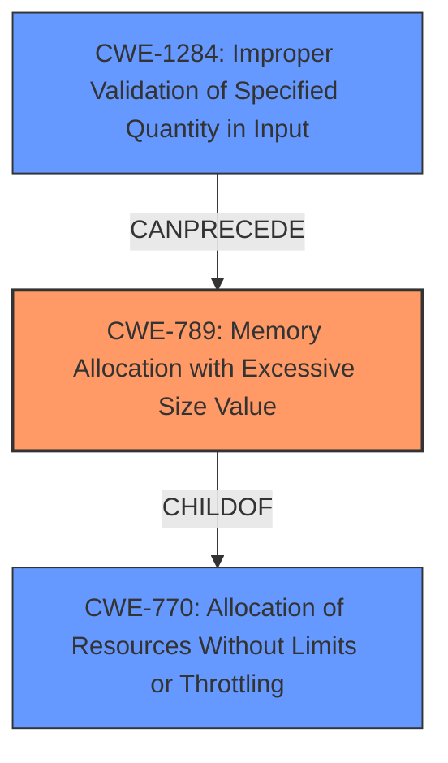

# Enhanced Analysis for CVE-2021-29453

# Summary
| CWE ID  | CWE Name                                          | Confidence | CWE Abstraction Level | CWE Vulnerability Mapping Label | CWE-Vulnerability Mapping Notes |
| :------- | :------------------------------------------------ | :--------- | :-------------------- | :------------------------------ | :------------------------------ |
| CWE-789  | Memory Allocation with Excessive Size Value       | 0.95       | Variant               | Allowed                         | Primary CWE                     |
| CWE-770  | Allocation of Resources Without Limits or Throttling | 0.80       | Base                  | Allowed                         | Secondary Candidate             |
| CWE-1284 | Improper Validation of Specified Quantity in Input | 0.70       | Base                  | Allowed                         | Secondary Candidate             |

## Evidence and Confidence

*   **Confidence Score:** 0.90
*   **Evidence Strength:** HIGH

## Relationship Analysis
The primary CWE, CWE-789 (Memory Allocation with Excessive Size Value), is a Variant of CWE-770 (Allocation of Resources Without Limits or Throttling), indicating a specific type of resource allocation issue. CWE-1284 (Improper Validation of Specified Quantity in Input) can precede CWE-789, suggesting a potential chain where **improper** input validation leads to excessive memory allocation. Selecting CWE-789 as primary is because it is a more specific variant that closely describes the vulnerability of small files expanding to very large memory allocations.



## Vulnerability Chain
The vulnerability chain starts with a **malicious** user uploading a crafted image (input). The application **fails to properly validate** the dimensions or complexity of this image during thumbnail generation. This leads to the application attempting to allocate an **excessive amount of memory** based on the expanded dimensions, resulting in memory exhaustion and ultimately a denial-of-service.

## Summary of Analysis
The initial assessment considered CWE-789, CWE-770, and CWE-1284 based on the retriever results and vulnerability description. After reviewing the vulnerability details and CWE specifications, CWE-789 (Memory Allocation with Excessive Size Value) was chosen as the primary CWE because it best captures the specific issue of allocating memory based on untrusted, large size values derived from maliciously crafted images. The **lack of proper validation** of image dimensions, as described in the "CVE Reference Links Content Summary", is a key indicator. CWE-770 and CWE-1284 are considered as secondary CWEs because they represent broader categories of resource allocation issues and input validation failures respectively. The choice of CWE-789 is at the optimal level of specificity, being a Variant level CWE that accurately reflects the vulnerability's root cause. The evidence supporting this decision is primarily from the "CVE Reference Links Content Summary" section, which describes the **improper handling** of malicious images and the resulting memory exhaustion during thumbnail generation.

Relevant CWE Information:

# Enhanced Context (25 CWEs)
The following CWEs were identified as potentially relevant to this vulnerability:

## CWE-799: Improper Control of Interaction Frequency
**Abstraction Level**: Class
**Similarity Score**: 0.76
**Source**: dense

**Description**:
The product does not properly limit the number or frequency of interactions that it has with an actor, such as the number of incoming requests.

**Mapping Guidance**:
- Usage: Allowed-with-Review
- Rationale: This CWE entry is a Class and might have Base-level children that would be more appropriate

*Not Selected:* This CWE describes a weakness where the frequency of interactions is not controlled. The vulnerability description focuses on the size of the image, not the number of images being uploaded.

## CWE-1289: Improper Validation of Unsafe Equivalence in Input
**Abstraction Level**: Base
**Similarity Score**: 0.75
**Source**: dense

**Description**:
The product receives an input value that is used as a resource identifier or other type of reference, but it does not validate or incorrectly validates that the input is equivalent to a potentially-unsafe value.

**Mapping Guidance**:
- Usage: Allowed
- Rationale: This CWE entry is at the Base level of abstraction, which is a preferred level of abstraction for mapping to the root causes of vulnerabilities.

*Not Selected:* This CWE focuses on validating equivalence to unsafe values. The vulnerability is not about equivalence, but the size of the image during thumbnail generation.

## CWE-405: Asymmetric Resource Consumption (Amplification)
**Abstraction Level**: Class
**Similarity Score**: 0.75
**Source**: dense

**Description**:
The product does not properly control situations in which an adversary can cause the product to consume or produce excessive resources without requiring the adversary to invest equivalent work or otherwise prove authorization, i.e., the adversary's influence is "asymmetric."

**Mapping Guidance**:
- Usage: Allowed-with-Review
- Rationale: This CWE entry is a Class and might have Base-level children that would be more appropriate

*Not Selected:* While there is an element of amplification (small image leading to large memory consumption), CWE-789 and CWE-770 are more specific to the **memory allocation** aspect of the vulnerability.

## CWE-653: Improper Isolation or Compartmentalization
**Abstraction Level**: Class
**Similarity Score**: 0.75
**Source**: dense

**Description**:
The product does not properly compartmentalize or isolate functionality, processes, or resources that require different privilege levels, rights, or permissions.

**Mapping Guidance**:
- Usage: Allowed
- Rationale: This CWE entry is at the Base level of abstraction, which is a preferred level of abstraction for mapping to the root causes of vulnerabilities.

*Not Selected:* This CWE is not relevant as the vulnerability does not involve isolation or compartmentalization issues.

## CWE-807: Reliance on Untrusted Inputs in a Security Decision
**Abstraction Level**: Base
**Similarity Score**: 0.74
**Source**: dense

**Description**:
The product uses a protection mechanism that relies on the existence or values of an input, but the input can be modified by an untrusted actor in a way that bypasses the protection mechanism.

**Mapping Guidance**:
- Usage: Allowed
- Rationale: This CWE entry is at the Base level of abstraction, which is a preferred level of abstraction for mapping to the root causes of vulnerabilities.

*Not Selected:* The vulnerability is more about **improper handling** of the image size, rather than relying on an untrusted input for a security decision.

## CWE-404: Improper Resource Shutdown or Release
**Abstraction Level**: Class
**Similarity Score**: 0.74
**Source**: dense

**Description**:
The product does not release or incorrectly releases a resource before it is made available for re-use.

**Mapping Guidance**:
- Usage: Allowed-with-Review
- Rationale: This CWE entry is a Class and might have Base-level children that would be more appropriate

*Not Selected:* The vulnerability focuses on **excessive allocation** of memory, not improper shutdown or release.

## CWE-300: Channel Accessible by Non-Endpoint
**Abstraction Level**: Class
**Similarity Score**: 0.74
**Source**: dense

**Description**:
The product does not adequately verify the identity of actors at both ends of a communication channel, or does not adequately ensure the integrity of the channel, in a way that allows the channel to be accessed or influenced by an actor that is not an endpoint.

**Mapping Guidance**:
- Usage: Discouraged
- Rationale: CWE-300 is commonly misused for vulnerabilities in which the prerequisites for exploitation require the adversary to be in a privileged "in-the-middle" position.

*Not Selected:* Not relevant as the vulnerability is not related to communication channels or endpoint verification.

## CWE-184: Incomplete List of Disallowed Inputs
**Abstraction Level**: Base
**Similarity Score**: 0.74
**Source**: dense

**Description**:
The product implements a protection mechanism that relies on a list of inputs (or properties of inputs) that are not allowed by policy or otherwise require other action to neutralize before additional processing takes place, but the list is incomplete.

**Mapping Guidance**:
- Usage: Allowed
- Rationale: This CWE entry is at the Base level of abstraction, which is a preferred level of abstraction for mapping to the root causes of vulnerabilities.

*Not Selected:* This CWE could potentially be considered, but it is not the primary issue. The vulnerability is not explicitly about an incomplete list of disallowed inputs, but rather the **failure to validate** the size and complexity of images.


## CWE Relationship Analysis

Current CWEs represent these abstraction levels: .


### Vulnerability Chain Analysis

**Chain starting from CWE-404:**
- 404 (Improper Resource Shutdown or Release) - ROOT


**Chain starting from CWE-653:**
- 653 (Improper Isolation or Compartmentalization) - ROOT


### CWE Relationship Diagram

```mermaid
graph TD
    classDef primary fill:#f96,stroke:#333,stroke-width:2px
    classDef secondary fill:#69f,stroke:#333
    classDef tertiary fill:#9e9,stroke:#333
```