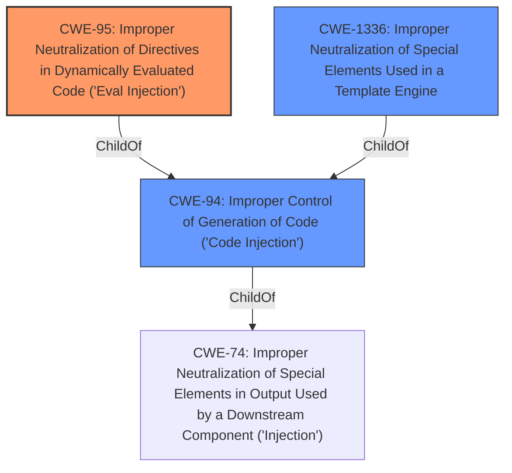

# Analysis for CVE-2021-29454

# Summary
| CWE ID | CWE Name | Confidence | CWE Abstraction Level | CWE Vulnerability Mapping Label | CWE-Vulnerability Mapping Notes |
|---|---|---|---|---|---|
| CWE-95 | Improper Neutralization of Directives in Dynamically Evaluated Code ('Eval Injection') | 0.9 | Variant | Allowed | Primary CWE |
| CWE-94 | Improper Control of Generation of Code ('Code Injection') | 0.7 | Base | Allowed-with-Review | Secondary Candidate |
| CWE-1336 | Improper Neutralization of Special Elements Used in a Template Engine | 0.6 | Base | Allowed | Secondary Candidate |

## Evidence and Confidence

*   **Confidence Score:** 0.9
*   **Evidence Strength:** HIGH

## Relationship Analysis
The primary CWE is CWE-95, which is a variant of CWE-94. CWE-94 is a child of CWE-74, which is a class-level CWE and therefore less specific. CWE-1336 is also related as it deals with template engines, but CWE-95 is more specific because it highlights the use of dynamic evaluation ('Eval Injection'). The relationships influenced the decision to choose CWE-95 as the primary due to its specific nature, and the others as secondary as they are more general.



## Vulnerability Chain
The vulnerability chain starts with a **maliciously crafted math string** provided by an attacker. This string is then passed to the `math` function, which uses PHP's `eval()` function to execute the string. Because the input is not properly neutralized, arbitrary PHP code can be executed.

Root Cause: **Improper Neutralization of Directives in Dynamically Evaluated Code ('Eval Injection')** CWE-95
Impact: Arbitrary PHP code execution.

## Summary of Analysis
The initial analysis focused on the fact that the vulnerability allows for arbitrary PHP code execution through a **malicious math string**. The key is that the `math` function in Smarty uses PHP's `eval()` function. This makes CWE-95 the most appropriate choice because it deals specifically with the **improper neutralization** of code syntax before using the input in a dynamic evaluation call (i.e., `eval()`). The evidence supporting this comes directly from the CVE Reference Links Content Summary, which states that the `{math}` function uses PHP's `eval()` function which allows for arbitrary code execution when user-supplied data is passed to the function.

CWE-94 is a more general case of code injection, and while it applies, CWE-95 is more specific. CWE-1336 deals with template engines, but it doesn't specifically address the dynamic evaluation aspect, making it less precise than CWE-95.

The choice of CWE-95 is at the optimal level of specificity because it captures the exact mechanism of the vulnerability: the use of `eval()` with user-supplied data. The other CWEs are either too general or don't fully capture the specifics of the vulnerability.

Relevant CWE Information:

# Enhanced Context (25 CWEs)
The following CWEs were identified as potentially relevant to this vulnerability:

## CWE-80: Improper Neutralization of Script-Related HTML Tags in a Web Page (Basic XSS)
**Abstraction Level**: Variant
**Similarity Score**: 0.75
**Source**: dense

**Description**:
The product receives input from an upstream component, but it does not neutralize or incorrectly neutralizes special characters such as "<", ">", and "&" that could be interpreted as web-scripting elements when they are sent to a downstream component that processes web pages.

**Mapping Guidance**:
- Usage: Allowed
- Rationale: This CWE entry is at the Variant level of abstraction, which is a preferred level of abstraction for mapping to the root causes of vulnerabilities.

## CWE-74: Improper Neutralization of Special Elements in Output Used by a Downstream Component ('Injection')
**Abstraction Level**: Class
**Similarity Score**: 0.75
**Source**: dense

**Description**:
The product constructs all or part of a command, data structure, or record using externally-influenced input from an upstream component, but it does not neutralize or incorrectly neutralizes special elements that could modify how it is parsed or interpreted when it is sent to a downstream component.

**Mapping Guidance**:
- Usage: Discouraged
- Rationale: CWE-74 is high-level and often misused when lower-level weaknesses are more appropriate.

## CWE-96: Improper Neutralization of Directives in Statically Saved Code ('Static Code Injection')
**Abstraction Level**: Base
**Similarity Score**: 0.74
**Source**: dense

**Description**:
The product receives input from an upstream component, but it does not neutralize or incorrectly neutralizes code syntax before inserting the input into an executable resource, such as a library, configuration file, or template.

**Mapping Guidance**:
- Usage: Allowed
- Rationale: This CWE entry is at the Base level of abstraction, which is a preferred level of abstraction for mapping to the root causes of vulnerabilities.

## CWE-1336: Improper Neutralization of Special Elements Used in a Template Engine
**Abstraction Level**: Base
**Similarity Score**: 0.74
**Source**: dense

**Description**:
The product uses a template engine to insert or process externally-influenced input, but it does not neutralize or incorrectly neutralizes special elements or syntax that can be interpreted as template expressions or other code directives when processed by the engine.

**Mapping Guidance**:
- Usage: Allowed
- Rationale: This CWE entry is at the Base level of abstraction, which is a preferred level of abstraction for mapping to the root causes of vulnerabilities.

## CWE-917: Improper Neutralization of Special Elements used in an Expression Language Statement ('Expression Language Injection')
**Abstraction Level**: Base
**Similarity Score**: 0.74
**Source**: dense

**Description**:
The product constructs all or part of an expression language (EL) statement in a framework such as a Java Server Page (JSP) using externally-influenced input from an upstream component, but it does not neutralize or incorrectly neutralizes special elements that could modify the intended EL statement before it is executed.

**Mapping Guidance**:
- Usage: Allowed
- Rationale: This CWE entry is at the Base level of abstraction, which is a preferred level of abstraction for mapping to the root causes of vulnerabilities.

## CWE-184: Incomplete List of Disallowed Inputs
**Abstraction Level**: Base
**Similarity Score**: 0.74
**Source**: dense

**Description**:
The product implements a protection mechanism that relies on a list of inputs (or properties of inputs) that are not allowed by policy or otherwise require other action to neutralize before additional processing takes place, but the list is incomplete.

**Mapping Guidance**:
- Usage: Allowed
- Rationale: This CWE entry is at the Base level of abstraction, which is a preferred level of abstraction for mapping to the root causes of vulnerabilities.

## CWE-915: Improperly Controlled Modification of Dynamically-Determined Object Attributes
**Abstraction Level**: Base
**Similarity Score**: 0.73
**Source**: dense

**Description**:
The product receives input from an upstream component that specifies multiple attributes, properties, or fields that are to be initialized or updated in an object, but it does not properly control which attributes can be modified.

**Mapping Guidance**:
- Usage: Allowed
- Rationale: This CWE entry is at the Base level of abstraction, which is a preferred level of abstraction for mapping to the root causes of vulnerabilities.

## CWE-138: Improper Neutralization of Special Elements
**Abstraction Level**: Class
**Similarity Score**: 0.73
**Source**: dense

**Description**:
The product receives input from an upstream component, but it does not neutralize or incorrectly neutralizes special elements that could be interpreted as control elements or syntactic markers when they are sent to a downstream component.

**Mapping Guidance**:
- Usage: Discouraged
- Rationale: This CWE entry is a level-1 Class (i.e., a child of a Pillar). It might have lower-level children that would be more appropriate

## CWE-1289: Improper Validation of Unsafe Equivalence in Input
**Abstraction Level**: Base
**Similarity Score**: 0.72
**Source**: dense

**Description**:
The

# Enhanced Query for CVE-2021-29454

## Vulnerability Description
Smarty is a template engine for PHP, facilitating the separation of presentation (HTML/CSS) from application logic. Prior to versions 3.1.42 and 4.0.2, template authors could run arbitrary PHP code by crafting a malicious math string. If a math string was passed through as user provided data to the math function, external users could run arbitrary PHP code by crafting a malicious math string. Users should upgrade to version 3.1.42 or 4.0.2 to receive a patch.

### Vulnerability Description Key Phrases
- **impact:** arbitrary PHP code execution
- **vector:** malicious math string
- **attacker:** external users
- **product:** Smarty
- **version:** prior to 3.1.42 and 4.0.2

## CVE Reference Links Content Summary
```
{
  "guidelines": "1. First verify if the content relates to the CVE specified based on the official description\n2. If the content does not relate to this CVE, respond with \"UNRELATED\"\n3. If no useful vulnerability information is found, respond with \"NOINFO\" \n4. For relevant content, extract:\n   - Root cause of vulnerability\n   - Weaknesses/vulnerabilities present\n   - Impact of exploitation\n   - Attack vectors\n   - Required attacker capabilities/position\n\nAdditional instructions:\n- Preserve original technical details and descriptions\n- Remove unrelated content\n- Translate non-English content to English\n- Note if the content provides more detail than the official CVE description",
  "response": [
    {
      "cve": "CVE-2021-29454",
      "content": "=== Content from security.gentoo.org_924c52cc_20250115_090731.html ===\n\n# Smarty: Multiple vulnerabilities — GLSA **202209-09**\n\nMultiple vulnerabilities have been found in Smarty, the worst of which could result in remote code execution\n\n### Affected packages\n\n| Package | **dev-php/smarty** on all architectures |\n| --- | --- |\n| Affected versions | < **4.2.1** |\n| Unaffected versions | >= **4.2.1** |\n\n### Background\n\nSmarty is a template engine for PHP. The \"template security\" feature of Smarty is designed to help reduce the risk of a system compromise when you have untrusted parties editing templates.\n\n### Description\n\nMultiple vulnerabilities have been discovered in Smarty. Please review the CVE identifiers referenced below for details.\n\n### Impact\n\nPlease review the referenced CVE identifiers for details.\n\n### Workaround\n\nThere is no known workaround at this time.\n\n### Resolution\n\nAll Smarty users should upgrade to the latest version:\n\n```\n # emerge --sync\n # emerge --ask --oneshot --verbose \">=dev-php/smarty-4.2.1\"\n```\n### References\n\n* [CVE-2018-25047](https://nvd.nist.gov/vuln/detail/CVE-2018-25047)\n* [CVE-2021-21408](https://nvd.nist.gov/vuln/detail/CVE-2021-21408)\n* [CVE-2021-29454](https://nvd.nist.gov/vuln/detail/CVE-2021-29454)\n* [CVE-2022-29221](https://nvd.nist.gov/vuln/detail/CVE-2022-29221)\n\n**Release date**\n\nSeptember 25, 2022\n\n**Latest revision**\n\nSeptember 25, 2022: 1\n\n**Severity**\n\nnormal\n\n**Exploitable**\n\nremote",
      "root_cause": "Multiple vulnerabilities have been discovered in Smarty.",
      "weaknesses": "Multiple vulnerabilities",
       "impact": "The worst of which could result in remote code execution",
      "attack_vectors": "remote",
      "required_capabilities": "unspecified"
    },
    {
      "cve": "CVE-2021-29454",
      "content": "=== Content from www.debian.org_8dab5206_20250115_090733.html ===\n\n# [SECURITY] [DSA 5151-1] smarty3 security update\n\nPackage        : smarty3\nCVE ID         : CVE-2021-21408 CVE-2021-26119 CVE-2021-26120 CVE-2021-29454\n                 CVE-2022-29221\nDebian Bug     : 1010375 1011758\n\nSeveral security vulnerabilities have been discovered in smarty3, the compiling\nPHP template engine. Template authors are able to run restricted static php\nmethods or even arbitrary PHP code by crafting a malicious math string or by\nchoosing an invalid {block} or {include} file name. If a math string was passed\nthrough as user provided data to the math function, remote users were able to\nrun arbitrary PHP code as well.\n\nFor the oldstable distribution (buster), these problems have been fixed\nin version 3.1.33+20180830.1.3a78a21f+selfpack1-1+deb10u1.\n\nFor the stable distribution (bullseye), these problems have been fixed in\nversion 3.1.39-2+deb11u1.\n\nWe recommend that you upgrade your smarty3 packages.",
      "root_cause": "Template authors are able to run arbitrary PHP code by crafting a malicious math string. If a math string was passed through as user provided data to the math function, remote users were able to run arbitrary PHP code as well.",
      "weaknesses": "Arbitrary PHP code execution via maliciously crafted math string",
      "impact": "Remote code execution",
      "attack_vectors": "Crafting a malicious math string that is passed through user provided data to the math function",
      "required_capabilities": "Ability to provide a malicious math string"
    },
       {
      "cve": "CVE-2021-29454",
      "content": "=== Content from github.com_f452dc67_20250115_090728.html ===\n\nPrevent arbitrary PHP code execution through maliciously crafted expression for the math function. This addresses [CVE-2021-29454](https://github.com/advisories/GHSA-29gp-2c3m-3j6m \"CVE-2021-29454\")",
      "root_cause": "Maliciously crafted expression for the math function",
      "weaknesses": "Arbitrary PHP code execution.",
      "impact": "Arbitrary PHP code execution",
      "attack_vectors": "Crafting a malicious math string.",
      "required_capabilities": "Ability to craft a malicious math string."
    },
     {
      "cve": "CVE-2021-29454",
      "content": "=== Content from github.com_1323a19c_20250115_221129.html ===\n\nMerge pull request from [GHSA-29gp-2c3m-3j6m](https://github.com/advisories/GHSA-29gp-2c3m-3j6m \"GHSA-29gp-2c3m-3j6m\")\n\n* Temporary fix. Waiting for CVE\n\n* Add CVE\n",
        "root_cause": "Maliciously crafted expression for the math function",
      "weaknesses": "Arbitrary PHP code execution.",
      "impact": "Arbitrary PHP code execution",
      "attack_vectors": "Crafting a malicious math string.",
      "required_capabilities": "Ability to craft a malicious math string."
    },
     {
      "cve": "CVE-2021-29454",
      "content": "=== Content from lists.fedoraproject.org_c7d1bfc0_20250115_090729.html ===\n\n## [3.1.42] - 2022-01-10 ### Security - Prevent arbitrary PHP code execution\nthrough maliciously crafted expression for the math function. This addresses\nCVE-2021-29454",
      "root_cause": "maliciously crafted expression for the math function",
      "weaknesses": "Arbitrary PHP code execution",
      "impact": "Arbitrary PHP code execution",
        "attack_vectors": "Crafting a malicious math string",
      "required_capabilities": "Ability to craft a malicious math string"
    },
    {
      "cve": "CVE-2021-29454",
      "content": "=== Content from github.com_81d1d1e2_20250115_090728.html ===\n\n# Sandbox Escape by math function\n\n### Impact\n\nTemplate authors could run arbitrary PHP code by crafting a malicious math string.\n\nIf a math string is passed through as user provided data to the math function, external users could run arbitrary PHP code by crafting a malicious math string.\n\n### Patches\n\nPlease upgrade to 4.0.2 or 3.1.42 or higher.\n\n### CVE ID\n\nCVE-2021-29454",
        "root_cause": "Malicious math string",
        "weaknesses": "Arbitrary PHP code execution",
        "impact": "Arbitrary PHP code execution",
        "attack_vectors": "Crafting a malicious math string.",
        "required_capabilities": "Ability to craft a malicious math string"
    },
    {
      "cve": "CVE-2021-29454",
     "content": "=== Content from lists.debian.org_34a14da8_20250115_090728.html ===\n\nPackage        : smarty3\nCVE ID         : CVE-2021-21408 CVE-2021-29454\n\nSmarty3, a template engine for PHP, allowed template authors to run restricted\nstatic php methods. The same authors could also run arbitrary PHP code by\ncrafting a malicious math string. If a math string was passed through as user\nprovided data to the math function, remote users were able to run arbitrary PHP\ncode as well.\n",
         "root_cause": "Malicious math string",
        "weaknesses": "Arbitrary PHP code execution",
        "impact": "Arbitrary PHP code execution",
         "attack_vectors": "Crafting a malicious math string that is passed through user provided data to the math function",
       "required_capabilities": "Ability to craft a malicious math string"
      },
        {
      "cve": "CVE-2021-29454",
      "content": "=== Content from www.smarty.net_7227da31_20250115_221130.html ===\n\n## {math}\n\n`{math}` allows the template designer to do math equations\nin the template.\n\n* Any numeric template variables may be used in the\n  equations, and the result is printed in place of the tag.\n* The variables used in the equation are passed as parameters,\n  which can be template variables or static values.\n* +, -, /, \*, abs, ceil, cos, exp, floor, log, log10, max, min,\n  pi, pow, rand, round, sin, sqrt, srans and tan are all valid operators.\n  Check the PHP documentation for further information on these\n  [math](http://php.net/eval) functions.\n* If you supply the *`assign`* attribute, the output of the\n  `{math}` function will be assigned to this template\n  variable instead of being output to the template.\n\n### Technical Note\n\n`{math}` is an expensive function in performance due to\nits use of the php [`eval()`](http://php.net/eval) function. Doing the math in PHP is much\nmore efficient, so whenever possible do the math calculations in the script\nand [`assign()`](api.assign.tpl \"assign()\")\nthe results to the template. Definitely avoid repetitive\n`{math}` function calls, eg within\n[`{section}`](language.function.section.tpl \"{section},{sectionelse}\") loops.\n",
         "root_cause": "The `{math}` function uses PHP's `eval()` function which allows for arbitrary code execution when user supplied data is passed to the function",
        "weaknesses": "Use of the `eval()` function with user provided data",
        "impact": "Arbitrary PHP code execution",
      "attack_vectors": "Crafting a malicious math string",
      "required_capabilities": "Ability to craft a malicious math string"
      },
    {
      "cve": "CVE-2021-29454",
      "content": "=== Content from bugzilla.redhat.com_aa253787_20250115_221145.html ===\n\n[**Bug 2044971**](show_bug.cgi?id=2044971)\n- [CVE-2021-29454](https://access.redhat.com/security/cve/CVE-2021-29454) php-Smarty: template authors could run arbitrary PHP code by crafting a malicious math string [epel-7]\n\n",
      "root_cause": "Maliciously crafted math string",
      "weaknesses": "Arbitrary PHP code execution",
      "impact": "Arbitrary PHP code execution",
      "attack_vectors": "Crafting a malicious math string",
      "required_capabilities": "Ability to craft a malicious math string"
    },
     {
      "cve": "CVE-2021-29454",
      "content": "=== Content from github.com_b91db577_20250115_221133.html ===\n\ntitle: Sandbox Escape by math functionlink: https://github.com/smarty-php/smarty/security/advisories/GHSA-29gp-2c3m-3j6mcve: CVE-2021-29454\n",
        "root_cause": "Maliciously crafted math string",
        "weaknesses": "Sandbox escape by arbitrary PHP code execution",
        "impact": "Arbitrary PHP code execution",
      "attack_vectors": "Crafting a malicious math string",
      "required_capabilities": "Ability to craft a malicious math string"
    },
     {
      "cve": "CVE-2021-29454",
      "content": "=== Content from bugzilla.redhat.com_36b22e74_20250115_221146.html ===\n\n[**Bug 2044970**](show_bug.cgi?id=2044970)\n- [CVE-2021-29454](https://access.redhat.com/security/cve/CVE-2021-29454) php-Smarty: template authors could run arbitrary PHP code by crafting a malicious math string [fedora-all]",
      "root_cause": "Maliciously crafted math string",
      "weaknesses": "Arbitrary PHP code execution",
      "impact": "Arbitrary PHP code execution",
      "attack_vectors": "Crafting a malicious math string",
      "required_capabilities": "Ability to craft a malicious math string"
    },
    {
      "cve": "CVE-2021-29454",
      "content": "=== Content from github.com_68f1e3f7_20250115_221141.html ===\n\nPrevent arbitrary PHP code execution through maliciously crafted expression for the math function. This addresses [CVE-2021-29454](https://github.com/advisories/GHSA-29gp-2c3m-3j6m \"CVE-2021-29454\")",
       "root_cause": "Maliciously crafted expression for the math function",
        "weaknesses": "Arbitrary PHP code execution",
        "impact": "Arbitrary PHP code execution",
      "attack_vectors": "Crafting a malicious math string",
      "required_capabilities": "Ability to craft a malicious math string"
      },
    {
      "cve":"CVE-2021-29454",
       "content":"=== Content from github.com_9b8a4bad_20250115_221147.html ===\n\n### Impact\n\nTemplate authors could run arbitrary PHP code by crafting a malicious math string.\n\nIf a math string is passed through as user provided data to the math function, external users could run arbitrary PHP code by crafting a malicious math string.\n",
        "root_cause":"Crafting a malicious math string",
        "weaknesses":"Arbitrary PHP code execution",
        "impact":"Arbitrary PHP code execution",
        "attack_vectors":"Malicious math string that is passed to the math function",
        "required_capabilities":"Ability to craft a malicious math string"
    },
    {
     "cve":"CVE-2021-29454",
     "content":"=== Content from github.com_7ee30539_20250115_221135.html ===\n\nPrevent arbitrary PHP code execution through maliciously crafted expression for the math function. This addresses [CVE-2021-29454](https://github.com/advisories/GHSA-29gp-2c3m-3j6m \"CVE-2021-29454\")",
       "root_cause": "Maliciously crafted expression for the math function",
       "weaknesses": "Arbitrary PHP code execution",
        "impact":"Arbitrary PHP code execution",
     "attack_vectors":"Crafting a malicious math string",
     "required_capabilities":"Ability to craft a malicious math string"
    },
    {
     "cve": "CVE-2021-29454",
      "content": "=== Content from github.com_a1b59367_20250115_221131.html ===\n\n### Find and fix vulnerabilities 7x faster\n\nWith AI-powered application security testing tools embedded in your development workflow, GitHub Advanced Security outperforms non-native add-ons by delivering 7x faster remediation rates for identified vulnerabilities.",
        "root_cause": "NOINFO",
        "weaknesses": "NOINFO",
        "impact": "NOINFO",
       "attack_vectors": "NOINFO",
       "required_capabilities": "NOINFO"
    },
     {
       "cve": "CVE-2021-29454",
        "content": "=== Content from github.com_59de2a02_20250115_221147.html ===\n\nSmarty is a template engine for PHP, facilitating the separation of presentation (HTML/CSS) from application logic.\n\n",
      "root_cause": "NOINFO",
        "weaknesses": "NOINFO",
        "impact": "NOINFO",
       "attack_vectors": "NOINFO",
       "required_capabilities": "NOINFO"
     }
  ]
}
```

## Retriever Results

### Top Combined Results

| Rank | CWE ID | Name | Abstraction | Usage  | Retrievers | Individual Scores |
|------|--------|------|-------------|-------|------------|-------------------|
| 1 | 1336 | Improper Neutralization of Special Elements Used in a Template Engine | Base | Allowed | sparse | 0.219 |
| 2 | 94 | Improper Control of Generation of Code ('Code Injection') | Base | Allowed-with-Review | sparse | 0.147 |
| 3 | 138 | Improper Neutralization of Special Elements | Class | Discouraged | sparse | 0.138 |
| 4 | 1333 | Inefficient Regular Expression Complexity | Base | Allowed | sparse | 0.137 |
| 5 | 79 | Improper Neutralization of Input During Web Page Generation ('Cross-site Scripting') | Base | Allowed | sparse | 0.130 |
| 6 | 96 | Improper Neutralization of Directives in Statically Saved Code ('Static Code Injection') | Base | Allowed | dense | 0.400 |
| 7 | 494 | Download of Code Without Integrity Check | Base | Allowed | graph | 0.002 |
| 8 | 95 | Improper Neutralization of Directives in Dynamically Evaluated Code ('Eval Injection') | Variant | Allowed | sparse | 0.129 |
| 9 | 502 | Deserialization of Untrusted Data | Base | Allowed | sparse | 0.129 |
| 10 | 88 | Improper Neutralization of Argument Delimiters in a Command ('Argument Injection') | Base | Allowed | sparse | 0.128 |


# Complete CWE Specifications


## CWE-1336: Improper Neutralization of Special Elements Used in a Template Engine
**Abstraction:** Base
**Status:** Incomplete

### Description
The product uses a template engine to insert or process externally-influenced input, but it does not neutralize or incorrectly neutralizes special elements or syntax that can be interpreted as template expressions or other code directives when processed by the engine.

### Extended Description


Many web applications use template engines that allow developers to insert externally-influenced values into free text or messages in order to generate a full web page, document, message, etc. Such engines include Twig, Jinja2, Pug, Java Server Pages, FreeMarker, Velocity, ColdFusion, Smarty, and many others - including PHP itself. Some CMS (Content Management Systems) also use templates.


Template engines often have their own custom command or expression language. If an attacker can influence input into a template before it is processed, then the attacker can invoke arbitrary expressions, i.e. perform injection attacks. For example, in some template languages, an attacker could inject the expression "{{7*7}}" and determine if the output returns "49" instead. The syntax varies depending on the language.


In some cases, XSS-style attacks can work, which can obscure the root cause if the developer does not closely investigate the root cause of the error.


Template engines can be used on the server or client, so both "sides" could be affected by injection. The mechanisms of attack or the affected technologies might be different, but the mistake is fundamentally the same.


### Alternative Terms
Server-Side Template Injection / SSTI: This term is used for injection into template engines being used by a server.
Client-Side Template Injection / CSTI: This term is used for injection into template engines being used by a client.

### Relationships
ChildOf -> CWE-94

### Mapping Guidance
**Usage:** Allowed
**Rationale:** This CWE entry is at the Base level of abstraction, which is a preferred level of abstraction for mapping to the root causes of vulnerabilities.
**Comments:** Carefully read both the name and description to ensure that this mapping is an appropriate fit. Do not try to 'force' a mapping to a lower-level Base/Variant simply to comply with this preferred level of abstraction.
**Reasons:**
- Acceptable-Use


### Additional Notes
**[Relationship]** Since expression languages are often used in templating languages, there may be some overlap with CWE-917 (Expression Language Injection). XSS (CWE-79) is also co-located with template injection.

**[Maintenance]** The interrelationships and differences between CWE-917 and CWE-1336 need to be further clarified.


### Observed Examples
- **CVE-2024-34359:** Chain: Python bindings for LLM library do not use a sandboxed environment when parsing a template and constructing a prompt, allowing jinja2 Server Side Template Injection and code execution - one variant of a "prompt injection" attack.
- **CVE-2017-16783:** server-side template injection in content management server
- **CVE-2020-9437:** authentication / identity management product has client-side template injection


## CWE-94: Improper Control of Generation of Code ('Code Injection')
**Abstraction:** Base
**Status:** Draft

### Description
The product constructs all or part of a code segment using externally-influenced input from an upstream component, but it does not neutralize or incorrectly neutralizes special elements that could modify the syntax or behavior of the intended code segment.

### Extended Description


When a product allows a user's input to contain code syntax, it might be possible for an attacker to craft the code in such a way that it will alter the intended control flow of the product. Such an alteration could lead to arbitrary code execution.


Injection problems encompass a wide variety of issues -- all mitigated in very different ways. For this reason, the most effective way to discuss these weaknesses is to note the distinct features which classify them as injection weaknesses. The most important issue to note is that all injection problems share one thing in common -- i.e., they allow for the injection of control plane data into the user-controlled data plane. This means that the execution of the process may be altered by sending code in through legitimate data channels, using no other mechanism. While buffer overflows, and many other flaws, involve the use of some further issue to gain execution, injection problems need only for the data to be parsed. The most classic instantiations of this category of weakness are SQL injection and format string vulnerabilities.


### Alternative Terms
None

### Relationships
ChildOf -> CWE-74
ChildOf -> CWE-74
ChildOf -> CWE-913

### Mapping Guidance
**Usage:** Allowed-with-Review
**Rationale:** This entry is frequently misused for vulnerabilities with a technical impact of "code execution," which does not by itself indicate a root cause weakness, since dozens of weaknesses can enable code execution.
**Comments:** This weakness only applies when the product's functionality intentionally constructs all or part of a code segment. It could be that executing code could be the result of other weaknesses that do not involve the construction of code segments.
**Reasons:**
- Frequent Misuse
- Frequent Misinterpretation


### Observed Examples
- **CVE-2023-29374:** Math component in an LLM framework translates user input into a Python expression that is input into the Python exec() method, allowing code execution - one variant of a "prompt injection" attack.
- **CVE-2024-5565:** Python-based library uses an LLM prompt containing user input to dynamically generate code that is then fed as input into the Python exec() method, allowing code execution - one variant of a "prompt injection" attack.
- **CVE-2024-4181:** Framework for LLM applications allows eval injection via a crafted response from a hosting provider.


## CWE-138: Improper Neutralization of Special Elements
**Abstraction:** Class
**Status:** Draft

### Description
The product receives input from an upstream component, but it does not neutralize or incorrectly neutralizes special elements that could be interpreted as control elements or syntactic markers when they are sent to a downstream component.

### Extended Description
Most languages and protocols have their own special elements such as characters and reserved words. These special elements can carry control implications. If product does not prevent external control or influence over the inclusion of such special elements, the control flow of the program may be altered from what was intended. For example, both Unix and Windows interpret the symbol < ("less than") as meaning "read input from a file".

### Alternative Terms
None

### Relationships
ChildOf -> CWE-707

### Mapping Guidance
**Usage:** Discouraged
**Rationale:** This CWE entry is a level-1 Class (i.e., a child of a Pillar). It might have lower-level children that would be more appropriate
**Comments:** Examine children of this entry to see if there is a better fit
**Reasons:**
- Abstraction


### Additional Notes
**[Relationship]** This weakness can be related to interpretation conflicts or interaction errors in intermediaries (such as proxies or application firewalls) when the intermediary's model of an endpoint does not account for protocol-specific special elements.

**[Relationship]** See this entry's children for different types of special elements that have been observed at one point or another. However, it can be difficult to find suitable CVE examples. In an attempt to be complete, CWE includes some types that do not have any associated observed example.

**[Research Gap]** This weakness is probably under-studied for proprietary or custom formats. It is likely that these issues are fairly common in applications that use their own custom format for configuration files, logs, meta-data, messaging, etc. They would only be found by accident or with a focused effort based on an understanding of the format.


### Observed Examples
- **CVE-2001-0677:** Read arbitrary files from mail client by providing a special MIME header that is internally used to store pathnames for attachments.
- **CVE-2000-0703:** Setuid program does not cleanse special escape sequence before sending data to a mail program, causing the mail program to process those sequences.
- **CVE-2003-0020:** Multi-channel issue. Terminal escape sequences not filtered from log files.


## CWE-1333: Inefficient Regular Expression Complexity
**Abstraction:** Base
**Status:** Draft

### Description
The product uses a regular expression with an inefficient, possibly exponential worst-case computational complexity that consumes excessive CPU cycles.

### Extended Description
Some regular expression engines have a feature called "backtracking". If the token cannot match, the engine "backtracks" to a position that may result in a different token that can match.
 Backtracking becomes a weakness if all of these conditions are met:


  - The number of possible backtracking attempts are exponential relative to the length of the input.

  - The input can fail to match the regular expression.

  - The input can be long enough.

 Attackers can create crafted inputs that intentionally cause the regular expression to use excessive backtracking in a way that causes the CPU consumption to spike. 

### Alternative Terms
ReDoS: ReDoS is an abbreviation of "Regular expression Denial of Service".
Regular Expression Denial of Service: While this term is attack-focused, this is commonly used to describe the weakness.
Catastrophic backtracking: This term is used to describe the behavior of the regular expression as a negative technical impact.

### Relationships
ChildOf -> CWE-407
ChildOf -> CWE-407

### Mapping Guidance
**Usage:** Allowed
**Rationale:** This CWE entry is at the Base level of abstraction, which is a preferred level of abstraction for mapping to the root causes of vulnerabilities.
**Comments:** Carefully read both the name and description to ensure that this mapping is an appropriate fit. Do not try to 'force' a mapping to a lower-level Base/Variant simply to comply with this preferred level of abstraction.
**Reasons:**
- Acceptable-Use


### Observed Examples
- **CVE-2020-5243:** server allows ReDOS with crafted User-Agent strings, due to overlapping capture groups that cause excessive backtracking.
- **CVE-2021-21317:** npm package for user-agent parser prone to ReDoS due to overlapping capture groups
- **CVE-2019-16215:** Markdown parser uses inefficient regex when processing a message, allowing users to cause CPU consumption and delay preventing processing of other messages.


## CWE-79: Improper Neutralization of Input During Web Page Generation ('Cross-site Scripting')
**Abstraction:** Base
**Status:** Stable

### Description
The product does not neutralize or incorrectly neutralizes user-controllable input before it is placed in output that is used as a web page that is served to other users.

### Extended Description


Cross-site scripting (XSS) vulnerabilities occur when:


  1. Untrusted data enters a web application, typically from a web request.

  1. The web application dynamically generates a web page that contains this untrusted data.

  1. During page generation, the application does not prevent the data from containing content that is executable by a web browser, such as JavaScript, HTML tags, HTML attributes, mouse events, Flash, ActiveX, etc.

  1. A victim visits the generated web page through a web browser, which contains malicious script that was injected using the untrusted data.

  1. Since the script comes from a web page that was sent by the web server, the victim's web browser executes the malicious script in the context of the web server's domain.

  1. This effectively violates the intention of the web browser's same-origin policy, which states that scripts in one domain should not be able to access resources or run code in a different domain.

There are three main kinds of XSS:

  -  **Type 1: Reflected XSS (or Non-Persistent)**  - The server reads data directly from the HTTP request and reflects it back in the HTTP response. Reflected XSS exploits occur when an attacker causes a victim to supply dangerous content to a vulnerable web application, which is then reflected back to the victim and executed by the web browser. The most common mechanism for delivering malicious content is to include it as a parameter in a URL that is posted publicly or e-mailed directly to the victim. URLs constructed in this manner constitute the core of many phishing schemes, whereby an attacker convinces a victim to visit a URL that refers to a vulnerable site. After the site reflects the attacker's content back to the victim, the content is executed by the victim's browser.

  -  **Type 2: Stored XSS (or Persistent)**  - The application stores dangerous data in a database, message forum, visitor log, or other trusted data store. At a later time, the dangerous data is subsequently read back into the application and included in dynamic content. From an attacker's perspective, the optimal place to inject malicious content is in an area that is displayed to either many users or particularly interesting users. Interesting users typically have elevated privileges in the application or interact with sensitive data that is valuable to the attacker. If one of these users executes malicious content, the attacker may be able to perform privileged operations on behalf of the user or gain access to sensitive data belonging to the user. For example, the attacker might inject XSS into a log message, which might not be handled properly when an administrator views the logs. 

  -  **Type 0: DOM-Based XSS**  - In DOM-based XSS, the client performs the injection of XSS into the page; in the other types, the server performs the injection. DOM-based XSS generally involves server-controlled, trusted script that is sent to the client, such as Javascript that performs sanity checks on a form before the user submits it. If the server-supplied script processes user-supplied data and then injects it back into the web page (such as with dynamic HTML), then DOM-based XSS is possible. 

Once the malicious script is injected, the attacker can perform a variety of malicious activities. The attacker could transfer private information, such as cookies that may include session information, from the victim's machine to the attacker. The attacker could send malicious requests to a web site on behalf of the victim, which could be especially dangerous to the site if the victim has administrator privileges to manage that site. Phishing attacks could be used to emulate trusted web sites and trick the victim into entering a password, allowing the attacker to compromise the victim's account on that web site. Finally, the script could exploit a vulnerability in the web browser itself possibly taking over the victim's machine, sometimes referred to as "drive-by hacking."

In many cases, the attack can be launched without the victim even being aware of it. Even with careful users, attackers frequently use a variety of methods to encode the malicious portion of the attack, such as URL encoding or Unicode, so the request looks less suspicious.


### Alternative Terms
XSS: A common abbreviation for Cross-Site Scripting.
HTML Injection: Used as a synonym of stored (Type 2) XSS.
CSS: In the early years after initial discovery of XSS, "CSS" was a commonly-used acronym. However, this would cause confusion with "Cascading Style Sheets," so usage of this acronym has declined significantly.

### Relationships
ChildOf -> CWE-74
ChildOf -> CWE-74
CanPrecede -> CWE-494
PeerOf -> CWE-352

### Mapping Guidance
**Usage:** Allowed
**Rationale:** This CWE entry is at the Base level of abstraction, which is a preferred level of abstraction for mapping to the root causes of vulnerabilities.
**Comments:** Carefully read both the name and description to ensure that this mapping is an appropriate fit. Do not try to 'force' a mapping to a lower-level Base/Variant simply to comply with this preferred level of abstraction.
**Reasons:**
- Acceptable-Use


### Additional Notes
**[Relationship]** 

There can be a close relationship between XSS and CSRF (CWE-352). An attacker might use CSRF in order to trick the victim into submitting requests to the server in which the requests contain an XSS payload. A well-known example of this was the Samy worm on MySpace [REF-956]. The worm used XSS to insert malicious HTML sequences into a user's profile and add the attacker as a MySpace friend. MySpace friends of that victim would then execute the payload to modify their own profiles, causing the worm to propagate exponentially. Since the victims did not intentionally insert the malicious script themselves, CSRF was a root cause.


**[Applicable Platform]** 

XSS flaws are very common in web applications, since they require a great deal of developer discipline to avoid them.


### Observed Examples
- **CVE-2021-25926:** Python Library Manager did not sufficiently neutralize a user-supplied search term, allowing reflected XSS.
- **CVE-2021-25963:** Python-based e-commerce platform did not escape returned content on error pages, allowing for reflected Cross-Site Scripting attacks.
- **CVE-2021-1879:** Universal XSS in mobile operating system, as exploited in the wild per CISA KEV.


## CWE-96: Improper Neutralization of Directives in Statically Saved Code ('Static Code Injection')
**Abstraction:** Base
**Status:** Draft

### Description
The product receives input from an upstream component, but it does not neutralize or incorrectly neutralizes code syntax before inserting the input into an executable resource, such as a library, configuration file, or template.

### Extended Description
Not provided

### Alternative Terms
None

### Relationships
ChildOf -> CWE-94

### Mapping Guidance
**Usage:** Allowed
**Rationale:** This CWE entry is at the Base level of abstraction, which is a preferred level of abstraction for mapping to the root causes of vulnerabilities.
**Comments:** Carefully read both the name and description to ensure that this mapping is an appropriate fit. Do not try to 'force' a mapping to a lower-level Base/Variant simply to comply with this preferred level of abstraction.
**Reasons:**
- Acceptable-Use


### Additional Notes
**[Relationship]** "HTML injection" (see CWE-79: XSS) could be thought of as an example of this, but the code is injected and executed on the client side, not the server side. Server-Side Includes (SSI) are an example of direct static code injection.


### Observed Examples
- **CVE-2002-0495:** Perl code directly injected into CGI library file from parameters to another CGI program.
- **CVE-2005-1876:** Direct PHP code injection into supporting template file.
- **CVE-2005-1894:** Direct code injection into PHP script that can be accessed by attacker.


## CWE-494: Download of Code Without Integrity Check
**Abstraction:** Base
**Status:** Draft

### Description
The product downloads source code or an executable from a remote location and executes the code without sufficiently verifying the origin and integrity of the code.

### Extended Description
An attacker can execute malicious code by compromising the host server, performing DNS spoofing, or modifying the code in transit.

### Alternative Terms
None

### Relationships
ChildOf -> CWE-345
ChildOf -> CWE-669
ChildOf -> CWE-669

### Mapping Guidance
**Usage:** Allowed
**Rationale:** This CWE entry is at the Base level of abstraction, which is a preferred level of abstraction for mapping to the root causes of vulnerabilities.
**Comments:** Carefully read both the name and description to ensure that this mapping is an appropriate fit. Do not try to 'force' a mapping to a lower-level Base/Variant simply to comply with this preferred level of abstraction.
**Reasons:**
- Acceptable-Use


### Additional Notes
**[Research Gap]** This is critical for mobile code, but it is likely to become more and more common as developers continue to adopt automated, network-based product distributions and upgrades. Software-as-a-Service (SaaS) might introduce additional subtleties. Common exploitation scenarios may include ad server compromises and bad upgrades.


### Observed Examples
- **CVE-2019-9534:** Satellite phone does not validate its firmware image.
- **CVE-2021-22909:** Chain: router's firmware update procedure uses curl with "-k" (insecure) option that disables certificate validation (CWE-295), allowing adversary-in-the-middle (AITM) compromise with a malicious firmware image (CWE-494).
- **CVE-2008-3438:** OS does not verify authenticity of its own updates.


## CWE-95: Improper Neutralization of Directives in Dynamically Evaluated Code ('Eval Injection')
**Abstraction:** Variant
**Status:** Incomplete

### Description
The product receives input from an upstream component, but it does not neutralize or incorrectly neutralizes code syntax before using the input in a dynamic evaluation call (e.g. "eval").

### Extended Description
This may allow an attacker to execute arbitrary code, or at least modify what code can be executed.

### Alternative Terms
None

### Relationships
ChildOf -> CWE-94

### Mapping Guidance
**Usage:** Allowed
**Rationale:** This CWE entry is at the Variant level of abstraction, which is a preferred level of abstraction for mapping to the root causes of vulnerabilities.
**Comments:** Carefully read both the name and description to ensure that this mapping is an appropriate fit. Do not try to 'force' a mapping to a lower-level Base/Variant simply to comply with this preferred level of abstraction.
**Reasons:**
- Acceptable-Use


### Additional Notes
**[Other]** Factors: special character errors can play a role in increasing the variety of code that can be injected, although some vulnerabilities do not require special characters at all, e.g. when a single function without arguments can be referenced and a terminator character is not necessary.


### Observed Examples
- **CVE-2024-4181:** Framework for LLM applications allows eval injection via a crafted response from a hosting provider.
- **CVE-2022-2054:** Python compiler uses eval() to execute malicious strings as Python code.
- **CVE-2021-22204:** Chain: regex in EXIF processor code does not correctly determine where a string ends (CWE-625), enabling eval injection (CWE-95), as exploited in the wild per CISA KEV.


## CWE-502: Deserialization of Untrusted Data
**Abstraction:** Base
**Status:** Draft

### Description
The product deserializes untrusted data without sufficiently ensuring that the resulting data will be valid.

### Extended Description
Not provided

### Alternative Terms
Marshaling, Unmarshaling: Marshaling and unmarshaling are effectively synonyms for serialization and deserialization, respectively.
Pickling, Unpickling: In Python, the "pickle" functionality is used to perform serialization and deserialization.
PHP Object Injection: Some PHP application researchers use this term when attacking unsafe use of the unserialize() function; but it is also used for CWE-915.

### Relationships
ChildOf -> CWE-913
ChildOf -> CWE-913
PeerOf -> CWE-915

### Mapping Guidance
**Usage:** Allowed
**Rationale:** This CWE entry is at the Base level of abstraction, which is a preferred level of abstraction for mapping to the root causes of vulnerabilities.
**Comments:** Carefully read both the name and description to ensure that this mapping is an appropriate fit. Do not try to 'force' a mapping to a lower-level Base/Variant simply to comply with this preferred level of abstraction.
**Reasons:**
- Acceptable-Use


### Additional Notes
**[Maintenance]** The relationships between CWE-502 and CWE-915 need further exploration. CWE-915 is more narrowly scoped to object modification, and is not necessarily used for deserialization.


### Observed Examples
- **CVE-2019-12799:** chain: bypass of untrusted deserialization issue (CWE-502) by using an assumed-trusted class (CWE-183)
- **CVE-2015-8103:** Deserialization issue in commonly-used Java library allows remote execution.
- **CVE-2015-4852:** Deserialization issue in commonly-used Java library allows remote execution.


## CWE-88: Improper Neutralization of Argument Delimiters in a Command ('Argument Injection')
**Abstraction:** Base
**Status:** Draft

### Description
The product constructs a string for a command to be executed by a separate component
in another control sphere, but it does not properly delimit the
intended arguments, options, or switches within that command string.

### Extended Description


When creating commands using interpolation into a string, developers may assume that only the arguments/options that they specify will be processed. This assumption may be even stronger when the programmer has encoded the command in a way that prevents separate commands from being provided maliciously, e.g. in the case of shell metacharacters. When constructing the command, the developer may use whitespace or other delimiters that are required to separate arguments when the command. However, if an attacker can provide an untrusted input that contains argument-separating delimiters, then the resulting command will have more arguments than intended by the developer. The attacker may then be able to change the behavior of the command. Depending on the functionality supported by the extraneous arguments, this may have security-relevant consequences.


### Alternative Terms
None

### Relationships
ChildOf -> CWE-77
ChildOf -> CWE-74
ChildOf -> CWE-77
ChildOf -> CWE-77

### Mapping Guidance
**Usage:** Allowed
**Rationale:** This CWE entry is at the Base level of abstraction, which is a preferred level of abstraction for mapping to the root causes of vulnerabilities.
**Comments:** Carefully read both the name and description to ensure that this mapping is an appropriate fit. Do not try to 'force' a mapping to a lower-level Base/Variant simply to comply with this preferred level of abstraction.
**Reasons:**
- Acceptable-Use


### Additional Notes
**[Relationship]** At one layer of abstraction, this can overlap other weaknesses that have whitespace problems, e.g. injection of javascript into attributes of HTML tags.


### Observed Examples
- **CVE-2022-36069:** Python-based dependency management tool avoids OS command injection when generating Git commands but allows injection of optional arguments with input beginning with a dash (CWE-88), potentially allowing for code execution.
- **CVE-1999-0113:** Canonical Example - "-froot" argument is passed on to another program, where the "-f" causes execution as user "root"
- **CVE-2001-0150:** Web browser executes Telnet sessions using command line arguments that are specified by the web site, which could allow remote attackers to execute arbitrary commands.

