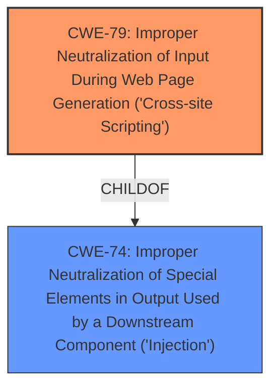

# Analysis Report for CVE-2021-29459

# Vulnerability Analysis Report: CVE-2021-29459

## Description


## Analysis (with Relationship Data)

# Summary
| CWE ID  | CWE Name                                                                    | Confidence | CWE Abstraction Level | CWE Vulnerability Mapping Label | CWE-Vulnerability Mapping Notes |
| :-------- | :-------------------------------------------------------------------------- | :--------- | :---------------------- | :------------------------------ | :------------------------------ |
| CWE-79   | Improper Neutralization of Input During Web Page Generation ('Cross-site Scripting') | 1          | Base                    | Primary                         | Allowed                       |

## Evidence and Confidence

*   **Confidence Score:** 1
*   **Evidence Strength:** HIGH

## Relationship Analysis
The primary relationship impacting the decision is the parent-child relationship between CWE-74 (Improper Neutralization of Special Elements in Output Used by a Downstream Component ('Injection')) and CWE-79, where CWE-79 is a specific type of injection related to web page generation. The vulnerability description explicitly mentions persistent script injection, making CWE-79 a more specific and accurate choice than its parent.



## Vulnerability Chain
The vulnerability chain starts with the **improper neutralization** of user-supplied input and results in **persistent script injection**. The sequence is:

1.  User provides malicious input.
2.  Input is stored without proper neutralization.
3.  The stored input is rendered in a web page.
4.  Malicious script executes in the user's browser (XSS).

## Summary of Analysis
The analysis is based on the provided evidence, which includes the vulnerability description and CVE reference summary. The key phrase "**persistent script injection**" points directly to Cross-Site Scripting (XSS). The CVE reference confirms the root cause as insufficient input sanitization, leading to persistent XSS.

The selection of CWE-79 is justified because it is a base-level CWE that specifically addresses the **improper neutralization** of input during web page generation, leading to XSS. This is the most specific CWE that accurately reflects the vulnerability. The retriever results also list CWE-79 as a relevant candidate.

The selection of CWE-79 is at the optimal level of specificity because it directly describes the nature of the vulnerability (XSS), whereas its parent CWE-74 (Improper Neutralization of Special Elements in Output Used by a Downstream Component ('Injection')) is more general.

Relevant CWE Information:

# Enhanced Context (25 CWEs)
The following CWEs were identified as potentially relevant to this vulnerability:

## CWE-74: Improper Neutralization of Special Elements in Output Used by a Downstream Component ('Injection')
**Abstraction Level**: Class
**Similarity Score**: 0.77
**Source**: dense

**Description**:
The product constructs all or part of a command, data structure, or record using externally-influenced input from an upstream component, but it does not neutralize or incorrectly neutralizes special elements that could modify how it is parsed or interpreted when it is sent to a downstream component.

**Mapping Guidance**:
- Usage: Discouraged
- Rationale: CWE-74 is high-level and often misused when lower-level weaknesses are more appropriate.

## CWE-79: Improper Neutralization of Input During Web Page Generation ('Cross-site Scripting')
**Abstraction Level**: Base
**Similarity Score**: 8102.76
**Source**: sparse

**Description**:
The product does not neutralize or incorrectly neutralizes user-controllable input before it is placed in output that is used as a web page that is served to other users.

**Mapping Guidance**:
- Usage: Allowed
- Rationale: This CWE entry is at the Base level of abstraction, which is a preferred level of abstraction for mapping to the root causes of vulnerabilities.

## CWE-1336: Improper Neutralization of Special Elements Used in a Template Engine
**Abstraction Level**: Base
**Similarity Score**: 7666.29
**Source**: sparse

**Description**:
The product uses a template engine to insert or process externally-influenced input, but it does not neutralize or incorrectly neutralizes special elements or syntax that can be interpreted as template expressions or other code directives when processed by the engine.

**Mapping Guidance**:
- Usage: Allowed
- Rationale: This CWE entry is at the Base level of abstraction, which is a preferred level of abstraction for mapping to the root causes of vulnerabilities.

## CWE-116: Improper Encoding or Escaping of Output
**Abstraction Level**: Class
**Similarity Score**: 0.75
**Source**: dense

**Description**:
The product prepares a structured message for communication with another component, but encoding or escaping of the data is either missing or done incorrectly. As a result, the intended structure of the message is not preserved.

**Mapping Guidance**:
- Usage: Allowed-with-Review
- Rationale: This CWE entry is a Class and might have Base-level children that would be more appropriate

### Other CWEs Considered

*   **CWE-74:** This was considered as a potential parent CWE, representing a broader class of injection vulnerabilities. However, CWE-79 is more specific to web page generation and XSS, making it a better fit.

*   **CWE-1336:** Improper Neutralization of Special Elements Used in a Template Engine. While the description mentions that users can fill in values of static lists using App Within Minutes, there is no specific mention of a template engine being the root cause. Therefore, this CWE was deemed less appropriate than CWE-79.

*   **CWE-116:** Improper Encoding or Escaping of Output. This was also considered, but it is a class-level CWE. Since the vulnerability is specifically related to XSS, CWE-79 is a more specific and appropriate choice.


## CWE Relationship Analysis

Current CWEs represent these abstraction levels: .


### Vulnerability Chain Analysis

**Chain starting from CWE-1336:**
- 1336 (Improper Neutralization of Special Elements Used in a Template Engine) - ROOT


**Chain starting from CWE-79:**
- 79 (Improper Neutralization of Input During Web Page Generation ('Cross-site Scripting')) - ROOT


### CWE Relationship Diagram

```mermaid
graph TD
    classDef primary fill:#f96,stroke:#333,stroke-width:2px
    classDef secondary fill:#69f,stroke:#333
    classDef tertiary fill:#9e9,stroke:#333
```


*Report generated on 2025-04-02 03:02:39*
