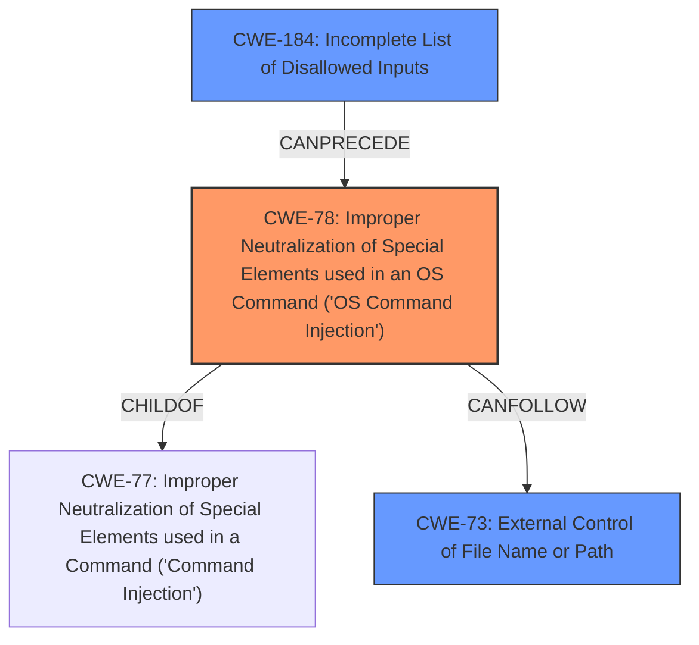

# Analysis Report for CVE-2021-29465

# Vulnerability Analysis Report: CVE-2021-29465

## Description


## Analysis (with Relationship Data)

# Summary
| CWE ID | CWE Name | Confidence | CWE Abstraction Level | CWE Vulnerability Mapping Label | CWE-Vulnerability Mapping Notes |
|---|---|---|---|---|---|
| CWE-78 | Improper Neutralization of Special Elements used in an OS Command ('OS Command Injection') | 0.9 | Base | Allowed | Primary CWE |
| CWE-73 | External Control of File Name or Path | 0.7 | Base | Allowed | Secondary Candidate |
| CWE-184 | Incomplete List of Disallowed Inputs | 0.6 | Base | Allowed | Secondary Candidate |

## Evidence and Confidence

*   **Confidence Score:** 0.8
*   **Evidence Strength:** HIGH

## Relationship Analysis
The primary CWE is CWE-78 (**Improper Neutralization of Special Elements used in an OS Command ('OS Command Injection')**), which is a base-level CWE and a child of CWE-77 (**Improper Neutralization of Special Elements used in a Command ('Command Injection')**). CWE-73 (**External Control of File Name or Path**) can follow CWE-78. CWE-184 (**Incomplete List of Disallowed Inputs**) can precede CWE-78, representing a defense mechanism that, if incomplete, allows the command injection to occur. The abstraction levels influenced the selection, favoring the base level where applicable.



## Vulnerability Chain
The vulnerability chain starts with the **improper sanitization** of user inputs, leading to **OS Command Injection** (CWE-78). This allows an attacker to **overwrite arbitrary files** (CWE-73) due to the command results and lack of restrictions when writing command results into files, which can then lead to **Remote Code Execution**. If there was an **incomplete list of disallowed inputs** (CWE-184), this would have prevented the **command injection**.

## Summary of Analysis
The analysis is based on the provided evidence, which clearly indicates a **command injection** vulnerability leading to remote code execution.

The vulnerability description states that "a remote attacker is able to overwrite any file on the system with the command results. This can result in remote code execution when the user overwrite important files on the system." The CVE Reference Links Content Summary further supports this by stating: "The application does not properly sanitize user inputs, specifically the lack of input sanitization for the command results and file overwrite functionality, allowing an attacker to inject malicious characters," and "The vulnerability is based on injecting characters that have special meaning in the command interpreter."

The graph relationships and retriever results reinforce the selection of CWE-78 as the primary CWE, as it accurately represents the root cause of the vulnerability. The other CWEs considered provide additional context, such as the possibility of external control of file names (CWE-73) and the presence of an incomplete list of disallowed inputs (CWE-184) as a failed preventative measure. The selected CWEs are at the optimal level of specificity, providing a detailed and accurate representation of the vulnerability.

Relevant CWE Information:

# Enhanced Context (25 CWEs)
The following CWEs were identified as potentially relevant to this vulnerability:

## CWE-74: Improper Neutralization of Special Elements in Output Used by a Downstream Component ('Injection')
**Abstraction Level**: Class
**Similarity Score**: 0.76
**Source**: dense

**Description**:
The product constructs all or part of a command, data structure, or record using externally-influenced input from an upstream component, but it does not neutralize or incorrectly neutralizes special elements that could modify how it is parsed or interpreted when it is sent to a downstream component.

**Mapping Guidance**:
- Usage: Discouraged
- Rationale: CWE-74 is high-level and often misused when lower-level weaknesses are more appropriate.

*   **Why it was not selected:** CWE-74 is a class-level CWE, and more specific CWEs such as CWE-78 are available.

## CWE-917: Improper Neutralization of Special Elements used in an Expression Language Statement ('Expression Language Injection')
**Abstraction Level**: Base
**Similarity Score**: 0.76
**Source**: dense

**Description**:
The product constructs all or part of an expression language (EL) statement in a framework such as a Java Server Page (JSP) using externally-influenced input from an upstream component, but it does not neutralize or incorrectly neutralizes special elements that could modify the intended EL statement before it is executed.

**Mapping Guidance**:
- Usage: Allowed
- Rationale: This CWE entry is at the Base level of abstraction, which is a preferred level of abstraction for mapping to the root causes of vulnerabilities.

*   **Why it was not selected:** The vulnerability description doesn't mention expression languages.

## CWE-184: Incomplete List of Disallowed Inputs
**Abstraction Level**: Base
**Similarity Score**: 0.75
**Source**: dense

**Description**:
The product implements a protection mechanism that relies on a list of inputs (or properties of inputs) that are not allowed by policy or otherwise require other action to neutralize before additional processing takes place, but the list is incomplete.

**Mapping Guidance**:
- Usage: Allowed
- Rationale: This CWE entry is at the Base level of abstraction, which is a preferred level of abstraction for mapping to the root causes of vulnerabilities.

*   **Why it was considered:** While not the primary issue, an incomplete list of disallowed inputs could contribute to the vulnerability.
*   **Why it was selected:** The description indicates the **lack of input sanitization**.

## CWE-1289: Improper Validation of Unsafe Equivalence in Input
**Abstraction Level**: Base
**Similarity Score**: 0.75
**Source**: dense

**Description**:
The product receives an input value that is used as a resource identifier or other type of reference, but it does not validate or incorrectly validates that the input is equivalent to a potentially-unsafe value.

**Mapping Guidance**:
- Usage: Allowed
- Rationale: This CWE entry is at the Base level of abstraction, which is a preferred level of abstraction for mapping to the root causes of vulnerabilities.

*   **Why it was not selected:** The vulnerability isn't explicitly about validating equivalence of inputs.

## CWE-80: Improper Neutralization of Script-Related HTML Tags in a Web Page (Basic XSS)
**Abstraction Level**: Variant
**Similarity Score**: 0.74
**Source**: dense

**Description**:
The product receives input from an upstream component, but it does not neutralize or incorrectly neutralizes special characters such as "<", ">", and "&" that could be interpreted as web-scripting elements when they are sent to a downstream component that processes web pages.

**Mapping Guidance**:
- Usage: Allowed
- Rationale: This CWE entry is at the Variant level of abstraction, which is a preferred level of abstraction for mapping to the root causes of vulnerabilities.

*   **Why it was not selected:** The vulnerability is not related to XSS.

## CWE-138: Improper Neutralization of Special Elements
**Abstraction Level**: Class
**Similarity Score**: 0.74
**Source**: dense

**Description**:
The product receives input from an upstream component, but it does not neutralize or incorrectly neutralizes special elements that could be interpreted as control elements or syntactic markers when they are sent to a downstream component.

**Mapping Guidance**:
- Usage: Discouraged
- Rationale: This CWE entry is a level-1 Class (i.e., a child of a Pillar). It might have lower-level children that would be more appropriate

*   **Why it was not selected:** This is a class-level CWE, and more specific CWEs are available.

## CWE-73: External Control of File Name or Path
**Abstraction Level**: Base
**Similarity Score**: 0.73
**Source**: dense

**Description**:
The product allows user input to control or influence paths or file names that are used in filesystem operations.

**Mapping Guidance**:
- Usage: Allowed
- Rationale: This CWE entry is at the Base level of abstraction, which is a preferred level of abstraction for mapping to the root causes of vulnerabilities.

*   **Why it was selected:** The attacker is able to overwrite any file on the system, so the attacker is able to control file names.

## CWE-88: Improper Neutralization of Argument Delimiters in a Command ('Argument Injection')
**


## CWE Relationship Analysis

Current CWEs represent these abstraction levels: .


### Vulnerability Chain Analysis

**Chain starting from CWE-88:**
- 88 (Improper Neutralization of Argument Delimiters in a Command ('Argument Injection')) - ROOT


**Chain starting from CWE-73:**
- 73 (External Control of File Name or Path) - ROOT


### CWE Relationship Diagram

```mermaid
graph TD
    classDef primary fill:#f96,stroke:#333,stroke-width:2px
    classDef secondary fill:#69f,stroke:#333
    classDef tertiary fill:#9e9,stroke:#333
```


*Report generated on 2025-04-01 21:39:36*
