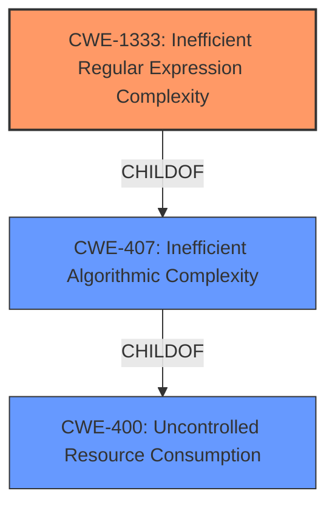

# Analysis Report for CVE-2021-29469

# Vulnerability Analysis Report: CVE-2021-29469

## Description


## Analysis (with Relationship Data)

# Summary
| CWE ID    | CWE Name                                            | Confidence | CWE Abstraction Level | CWE Vulnerability Mapping Label | CWE-Vulnerability Mapping Notes |
| :-------- | :-------------------------------------------------- | :--------- | :-------------------- | :------------------------------ | :------------------------------ |
| CWE-1333  | Inefficient Regular Expression Complexity           | 1          | Base                  | Primary                         | Allowed                         |
| CWE-400  | Uncontrolled Resource Consumption                   | 0.6        | Class                 | Secondary                       | Allowed-with-Review             |
| CWE-407 | Inefficient Algorithmic Complexity                  | 0.5        | Class                 | Secondary                       | Allowed-with-Review             |

## Evidence and Confidence

*   **Confidence Score:** 0.8
*   **Evidence Strength:** HIGH

## Relationship Analysis
The primary CWE is CWE-1333, which directly addresses the **inefficient regular expression** issue. CWE-407 (Inefficient Algorithmic Complexity) is a parent of CWE-1333 and is more general. CWE-400 (Uncontrolled Resource Consumption) is also a broader category, but it is relevant because the inefficient regex leads to resource consumption. The choice of CWE-1333 is more specific and thus preferred.



## Vulnerability Chain
The vulnerability chain starts with an **inefficient regular expression**. This leads to **excessive CPU consumption** due to exponential backtracking, which ultimately results in a **denial of service**.

## Summary of Analysis
The initial analysis strongly points towards CWE-1333, based on the vulnerability description and CVE reference summary which explicitly mentions the **weakness** being an **"inefficient regular expression denial of service"**. The retriever results also list CWE-1333 as the top match.

The evidence is strong, with the vulnerability description clearly stating "the regex begin used to detected monitor messages could cause exponential backtracking on some strings. This issue could lead to a denial of service." This aligns directly with CWE-1333's description: "The product uses a regular expression with an inefficient, possibly exponential worst-case computational complexity that consumes excessive CPU cycles."

The graph relationships show that CWE-1333 is a child of CWE-407 (Inefficient Algorithmic Complexity) and CWE-407 is a child of CWE-400 (Resource Consumption), which are broader categories. Choosing CWE-1333 provides the most specific and accurate representation of the vulnerability.

Relevant CWE Information:

# Enhanced Context (25 CWEs)
The following CWEs were identified as potentially relevant to this vulnerability:

## CWE-191: Integer Underflow (Wrap or Wraparound)
**Abstraction Level**: Base
**Similarity Score**: 0.77
**Source**: dense
## CWE-789: Memory Allocation with Excessive Size Value
**Abstraction Level**: Variant
**Similarity Score**: 0.76
**Source**: dense
## CWE-681: Incorrect Conversion between Numeric Types
**Abstraction Level**: Base
**Similarity Score**: 0.75
**Source**: dense
## CWE-190: Integer Overflow or Wraparound
**Abstraction Level**: Base
**Similarity Score**: 0.75
**Source**: dense
## CWE-197: Numeric Truncation Error
**Abstraction Level**: Base
**Similarity Score**: 0.75
**Source**: dense
## CWE-1325: Improperly Controlled Sequential Memory Allocation
**Abstraction Level**: Base
**Similarity Score**: 0.75
**Source**: dense
## CWE-131: Incorrect Calculation of Buffer Size
**Abstraction Level**: Base
**Similarity Score**: 0.75
**Source**: dense
## CWE-407: Inefficient Algorithmic Complexity
**Abstraction Level**: Class
**Similarity Score**: 0.75
**Source**: dense
## CWE-405: Asymmetric Resource Consumption (Amplification)
**Abstraction Level**: Class
**Similarity Score**: 0.74
**Source**: dense
## CWE-125: Out-of-bounds Read
**Abstraction Level**: Base
**Similarity Score**: 0.74
**Source**: dense
## CWE-1333: Inefficient Regular Expression Complexity
**Abstraction Level**: Base
**Similarity Score**: 6422.89
**Source**: sparse
## CWE-190: Integer Overflow or Wraparound
**Abstraction Level**: Base
**Similarity Score**: 6330.02
**Source**: sparse
## CWE-125: Out-of-bounds Read
**Abstraction Level**: Base
**Similarity Score**: 6047.03
**Source**: sparse
## CWE-407: Inefficient Algorithmic Complexity
**Abstraction Level**: Class
**Similarity Score**: 5936.26
**Source**: sparse
## CWE-770: Allocation of Resources Without Limits or Throttling
**Abstraction Level**: Base
**Similarity Score**: 5931.74
**Source**: sparse
## CWE-770: Allocation of Resources Without Limits or Throttling
**Abstraction Level**: base
**Similarity Score**: 4.33
**Source**: graph
## CWE-471: Modification of Assumed-Immutable Data (MAID)
**Abstraction Level**: base
**Similarity Score**: 4.33
**Source**: graph
## CWE-1284: Improper Validation of Specified Quantity in Input
**Abstraction Level**: base
**Similarity Score**: 4.33
**Source**: graph
## CWE-787: Out-of-bounds Write
**Abstraction Level**: base
**Similarity Score**: 4.33
**Source**: graph
## CWE-825: Expired Pointer Dereference
**Abstraction Level**: base
**Similarity Score**: 4.33
**Source**: graph
## CWE-476: NULL Pointer Dereference
**Abstraction Level**: base
**Similarity Score**: 4.33
**Source**: graph
## CWE-1321: Improperly Controlled Modification of Object Prototype Attributes ('Prototype Pollution')
**Abstraction Level**: variant
**Similarity Score**: 3.88
**Source**: graph
## CWE-128: Wrap-around Error
**Abstraction Level**: base
**Similarity Score**: 3.57
**Source**: graph
## CWE-1339: Insufficient Precision or Accuracy of a Real Number
**Abstraction Level**: base
**Similarity Score**: 3.57
**Source**: graph
## CWE-120: Buffer Copy without Checking Size of Input ('Classic Buffer Overflow')
**Abstraction Level**: base
**Similarity Score**: 3.36
**Source**: graph

*   **CWE-1333: Inefficient Regular Expression Complexity**
    *   **Technical Explanation:** The vulnerability stems from a regex used in `node-redis` to detect monitor messages. This regex is vulnerable to exponential backtracking.
    *   **Security Implications:** An attacker can craft specific strings that, when processed by the vulnerable regex, cause excessive computation time, leading to a denial-of-service condition.
    *   **Relationship:** This is a specific type of algorithmic inefficiency (CWE-407), which in turn can lead to uncontrolled resource consumption (CWE-400).
    *   **Primary/Secondary:** Primary.
    *   **MITRE Mapping Guidance:** Allowed. The description perfectly matches the weakness.
*   **CWE-400: Uncontrolled Resource Consumption**
    *   **Technical Explanation:** The inefficient regex leads to excessive CPU consumption.
    *   **Security Implications:** The resource consumption can lead to denial of service.
    *   **Relationship:** This is a parent of CWE-407.
    *   **Primary/Secondary:** Secondary.
    *   **MITRE Mapping Guidance:** Allowed-with-Review. This is a Class and might have Base-level children that would be more appropriate.
*   **CWE-407: Inefficient Algorithmic Complexity**
    *   **Technical Explanation:** The regex has an inefficient worst-case computational complexity.
    *   **Security Implications:** Crafted manipulations can ensure that the worst case is being reached, leading to performance degradation.
    *   **Relationship:** This is a parent of CWE-1333.
    *   **Primary/Secondary:** Secondary.
    *   **MIT


## CWE Relationship Analysis

Current CWEs represent these abstraction levels: .


### Vulnerability Chain Analysis

**Chain starting from CWE-787:**
- 787 (Out-of-bounds Write) - ROOT


**Chain starting from CWE-825:**
- 825 (Expired Pointer Dereference) - ROOT


### CWE Relationship Diagram

```mermaid
graph TD
    classDef primary fill:#f96,stroke:#333,stroke-width:2px
    classDef secondary fill:#69f,stroke:#333
    classDef tertiary fill:#9e9,stroke:#333
```


*Report generated on 2025-04-02 02:12:51*
