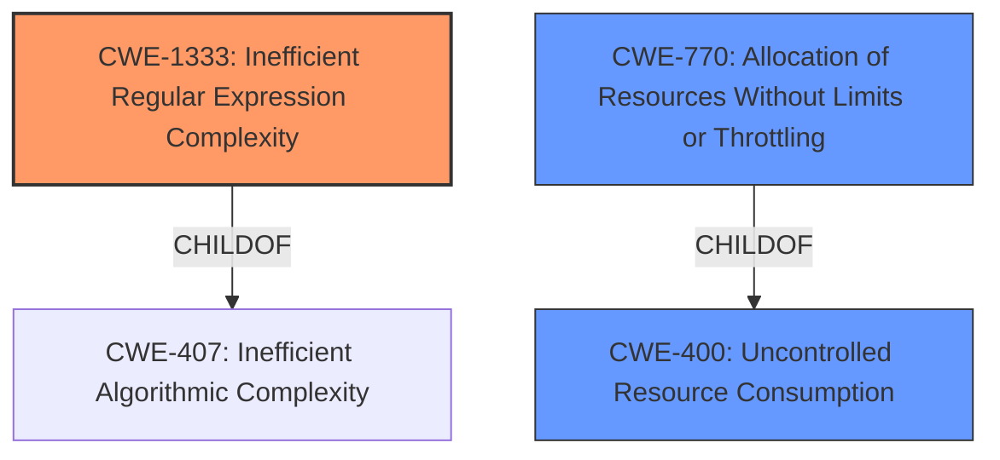

# Analysis Report for CVE-2021-29471

# Vulnerability Analysis Report: CVE-2021-29471

## Description


## Analysis (with Relationship Data)

# Summary
| CWE ID    | CWE Name                                                       | Confidence | CWE Abstraction Level | CWE Vulnerability Mapping Label | CWE-Vulnerability Mapping Notes |
| :-------- | :------------------------------------------------------------- | :--------- | :---------------------- | :------------------------------ | :------------------------------ |
| CWE-1333  | Inefficient Regular Expression Complexity                      | 0.9        | Base                    | Allowed                         | Primary CWE                     |
| CWE-770   | Allocation of Resources Without Limits or Throttling         | 0.7        | Base                    | Allowed                         | Secondary Candidate             |
| CWE-400   | Uncontrolled Resource Consumption                             | 0.6        | Class                   | Discouraged                     | Secondary Candidate             |

## Evidence and Confidence

*   **Confidence Score:** 0.8
*   **Evidence Strength:** HIGH

## Relationship Analysis
The primary CWE, CWE-1333, is a child of CWE-407 (Inefficient Algorithmic Complexity), indicating a more specific type of algorithmic inefficiency related to regular expressions. CWE-770 (Allocation of Resources Without Limits or Throttling) and CWE-400 (Uncontrolled Resource Consumption) are related, with CWE-770 being a child of CWE-400. This suggests that the inefficient regex could lead to excessive resource allocation, causing uncontrolled resource consumption. The relationships highlight the progression from an inefficient algorithm to potential resource exhaustion.



## Vulnerability Chain
The vulnerability chain starts with the **weakness** of allowing push rules with potentially complex patterns. This leads to **Inefficient Regex Generation**, which results in **Denial of Service (DoS)** due to excessive resource consumption.

## Summary of Analysis
Initially, the vulnerability description points to a performance issue with push rule matching in Synapse. The **Vulnerability Description Key Phrases** highlight the "very poor performance in the matching engine" as a key impact. The **CVE Reference Links Content Summary** provides stronger evidence, stating that "complex patterns involving multiple wildcards... can lead to extremely poor performance" and identifying "Inefficient Regex Generation" as a **weakness**. This evidence strongly supports CWE-1333 (Inefficient Regular Expression Complexity). The retriever results also listed CWE-1333 as the highest-ranked CWE.

CWE-770 (Allocation of Resources Without Limits or Throttling) and CWE-400 (Uncontrolled Resource Consumption) were also considered. The description mentions "consuming excessive server resources (CPU and/or memory)", which aligns with the impact of these CWEs. However, the root cause is the inefficient regex, making CWE-1333 more directly relevant. CWE-770 and CWE-400 are consequences of the inefficient regex, but are not the primary **weakness**.

CWE-79 (Improper Neutralization of Input During Web Page Generation ('Cross-site Scripting')) was considered but rejected because the vulnerability isn't related to web page generation or XSS. CWE-863 (Incorrect Authorization) and CWE-290 (Authentication Bypass by Spoofing) were also considered but rejected as the issue does not relate to authorization or authentication bypass.

The final decision to prioritize CWE-1333 is based on its direct relation to the root cause (inefficient regex) and its higher level of specificity compared to the other considered CWEs.

Relevant CWE Information:

# Enhanced Context (25 CWEs)
The following CWEs were identified as potentially relevant to this vulnerability:

## CWE-404: Improper Resource Shutdown or Release
**Abstraction Level**: Class
**Similarity Score**: 0.79
**Source**: dense

**Description**:
The product does not release or incorrectly releases a resource before it is made available for re-use.

**Mapping Guidance**:
- Usage: Allowed-with-Review
- Rationale: This CWE entry is a Class and might have Base-level children that would be more appropriate

## CWE-226: Sensitive Information in Resource Not Removed Before Reuse
**Abstraction Level**: Base
**Similarity Score**: 0.78
**Source**: dense

**Description**:
The product releases a resource such as memory or a file so that it can be made available for reuse, but it does not clear or "zeroize" the information contained in the resource before the product performs a critical state transition or makes the resource available for reuse by other entities.

**Mapping Guidance**:
- Usage: Allowed
- Rationale: This CWE entry is at the Base level of abstraction, which is a preferred level of abstraction for mapping to the root causes of vulnerabilities.

## CWE-405: Asymmetric Resource Consumption (Amplification)
**Abstraction Level**: Class
**Similarity Score**: 0.78
**Source**: dense

**Description**:
The product does not properly control situations in which an adversary can cause the product to consume or produce excessive resources without requiring the adversary to invest equivalent work or otherwise prove authorization, i.e., the adversary's influence is "asymmetric."

**Mapping Guidance**:
- Usage: Allowed-with-Review
- Rationale: This CWE entry is a Class and might have Base-level children that would be more appropriate

## CWE-772: Missing Release of Resource after Effective Lifetime
**Abstraction Level**: Base
**Similarity Score**: 0.78
**Source**: dense

**Description**:
The product does not release a resource after its effective lifetime has ended, i.e., after the resource is no longer needed.

**Mapping Guidance**:
- Usage: Allowed
- Rationale: This CWE entry is at the Base level of abstraction, which is a preferred level of abstraction for mapping to the root causes of vulnerabilities.

## CWE-664: Improper Control of a Resource Through its Lifetime
**Abstraction Level**: Pillar
**Similarity Score**: 0.77
**Source**: dense

**Description**:
The product does not maintain or incorrectly maintains control over a resource throughout its lifetime of creation, use, and release.

**Mapping Guidance**:
- Usage: Discouraged
- Rationale: This CWE entry is high-level when lower-level children are available.

## CWE-799: Improper Control of Interaction Frequency
**Abstraction Level**: Class
**Similarity Score**: 0.77
**Source**: dense

**Description**:
The product does not properly limit the number or frequency of interactions that it has with an actor, such as the number of incoming requests.

**Mapping Guidance**:
- Usage: Allowed-with-Review
- Rationale: This CWE entry is a Class and might have Base-level children that would be more appropriate

## CWE-668: Exposure of Resource to Wrong Sphere
**Abstraction Level**: Class
**Similarity Score**: 0.76
**Source**: dense

**Description**:
The product exposes a resource to the wrong control sphere, providing unintended actors with inappropriate access to the resource.

**Mapping Guidance**:
- Usage: Discouraged
- Rationale: CWE-668 is high-level and is often misused as a catch-all when lower-level CWE IDs might be applicable. It is sometimes used for low-information vulnerability reports [REF-1287]. It is a level-1 Class (i.e., a child of a Pillar). It is not useful for trend analysis.

## CWE-407: Inefficient Algorithmic Complexity
**Abstraction Level**: Class
**Similarity Score**: 0.75
**Source**: dense

**Description**:
An algorithm in a product has an inefficient worst-case computational complexity that may be detrimental to system performance and can be triggered by an attacker, typically using crafted manipulations that ensure that the worst case is being reached.

**Mapping Guidance**:
- Usage: Allowed-with-Review
- Rationale: This CWE entry is a Class and might have Base-level children that would be more appropriate

## CWE-41: Improper Resolution of Path Equivalence
**Abstraction Level**: Base
**Similarity Score**: 0.75
**Source**: dense

**Description**:
The product is vulnerable to file system contents disclosure through path equivalence. Path equivalence involves the use of special characters in file and directory names. The associated manipulations are intended to generate multiple names for the same object.

**Mapping Guidance**:
- Usage: Allowed
- Rationale: This CWE entry is at the Base level of abstraction, which is a preferred level of abstraction for mapping to the root causes of vulnerabilities.

## CWE-610: Externally Controlled Reference to a Resource in Another Sphere
**Abstraction Level**: Class
**Similarity Score**: 0.75
**Source**: dense


## CWE Relationship Analysis

Current CWEs represent these abstraction levels: .


### Vulnerability Chain Analysis

**Chain starting from CWE-664:**
- 664 (Improper Control of a Resource Through its Lifetime) - ROOT


**Chain starting from CWE-79:**
- 79 (Improper Neutralization of Input During Web Page Generation ('Cross-site Scripting')) - ROOT


### CWE Relationship Diagram

```mermaid
graph TD
    classDef primary fill:#f96,stroke:#333,stroke-width:2px
    classDef secondary fill:#69f,stroke:#333
    classDef tertiary fill:#9e9,stroke:#333
```


*Report generated on 2025-04-02 15:36:27*
