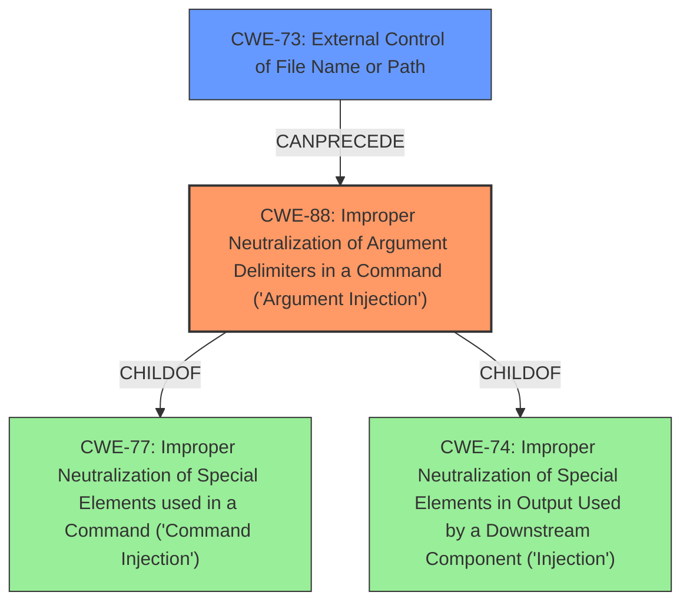

# Enhanced Analysis for CVE-2021-29472

# Summary
| CWE ID | CWE Name | Confidence | CWE Abstraction Level | CWE Vulnerability Mapping Label | CWE-Vulnerability Mapping Notes |
|---|---|---|---|---|---|
| CWE-88 | Improper Neutralization of Argument Delimiters in a Command ('Argument Injection') | 1.0 | Base | Allowed | Primary CWE |
| CWE-73 | External Control of File Name or Path | 0.7 | Base | Allowed | Secondary CWE |

## Evidence and Confidence

*   **Confidence Score:** 0.9
*   **Evidence Strength:** HIGH

## Relationship Analysis
The primary CWE, CWE-88, is a base-level CWE that focuses on the **improper neutralization of argument delimiters**, leading to argument injection. This is a child of CWE-77 and CWE-74, indicating a relationship to command injection and improper neutralization. CWE-73, a secondary CWE, is related to external control of file names or paths, which could be a prerequisite or contributing factor to the command injection. The relationships guide the selection towards the base level for the primary weakness.



## Vulnerability Chain
The vulnerability chain starts with **unsanitized URLs** (likely CWE-73), leading to **argument injection** (CWE-88), which then results in **arbitrary code execution**. The root cause is the lack of proper sanitization, which allows attackers to inject malicious parameters into the command.

## Summary of Analysis
The primary weakness is the **improper neutralization of argument delimiters in a command** (CWE-88), as the vulnerability description and CVE details explicitly state that **URLs are not sanitized correctly**, allowing for the injection of malicious parameters. Specifically, the CVE summary mentions that while `escapeshellarg()` is used, it does not prevent the injection of additional arguments starting with a dash (`-`).

The vulnerability description key phrases highlight the "**URLs for Mercurial repositories in the root composer.json and package source download URLs are not sanitized correctly**" as the root cause. The CVE reference content summary also confirms this, stating, "The vulnerability stems from the way Composer handles URLs for Mercurial repositories and package source downloads. Specifically, it fails to sanitize these URLs, allowing for the injection of malicious parameters."

CWE-88 aligns well with the root cause because it describes a scenario where the product constructs a command string but **does not properly delimit the intended arguments**, allowing an attacker to inject additional arguments.

CWE-73 (External Control of File Name or Path) is considered as a secondary CWE because the **unsanitized URLs** can be seen as a form of external control over file names or paths.

Other CWEs considered but not used:
* CWE-22 and CWE-23: While path traversal could be a component, the primary issue is argument injection in command execution, not directly related to file path manipulation.
* CWE-79: Cross-site scripting is not relevant because the vulnerability does not involve web page generation.
* CWE-434: Unrestricted Upload of File with Dangerous Type is not relevant as the issue is not related to uploading files.

The selected CWEs are at the optimal level of specificity, as CWE-88 is a base-level CWE that directly addresses the root cause of the vulnerability, and CWE-73 highlights the external control aspect.


## CWE Relationship Analysis

Current CWEs represent these abstraction levels: .


### Vulnerability Chain Analysis

**Chain starting from CWE-79:**
- 79 (Improper Neutralization of Input During Web Page Generation ('Cross-site Scripting')) - ROOT


**Chain starting from CWE-88:**
- 88 (Improper Neutralization of Argument Delimiters in a Command ('Argument Injection')) - ROOT


### CWE Relationship Diagram

```mermaid
graph TD
    classDef primary fill:#f96,stroke:#333,stroke-width:2px
    classDef secondary fill:#69f,stroke:#333
    classDef tertiary fill:#9e9,stroke:#333
```