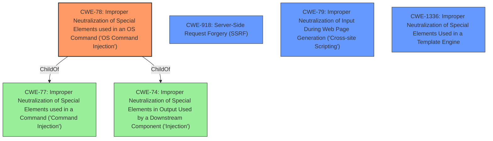

# Enhanced Analysis for CVE-2021-29475

# Summary
| CWE ID | CWE Name | Confidence | CWE Abstraction Level | CWE Vulnerability Mapping Label | CWE-Vulnerability Mapping Notes |
|---|---|---|---|---|---|
| CWE-78 | Improper Neutralization of Special Elements used in an OS Command ('OS Command Injection') | 0.9 | Base | Allowed | Primary CWE |
| CWE-918 | Server-Side Request Forgery (SSRF) | 0.7 | Base | Allowed | Secondary Candidate |
| CWE-79 | Improper Neutralization of Input During Web Page Generation ('Cross-site Scripting') | 0.6 | Base | Allowed | Secondary Candidate |
| CWE-1336 | Improper Neutralization of Special Elements Used in a Template Engine | 0.5 | Base | Allowed | Secondary Candidate |

## Evidence and Confidence

*   **Confidence Score:** 0.8
*   **Evidence Strength:** HIGH

## Relationship Analysis
The primary CWE is CWE-78, as it directly addresses the **code injection** leading to command execution. While CWE-918 (SSRF) is relevant because the attacker can force the server to make requests, CWE-78 more accurately captures the **injection** aspect. CWE-79 (XSS) is less relevant since the vulnerability primarily involves server-side **code injection** rather than client-side script execution. CWE-1336 (Improper Neutralization of Special Elements Used in a Template Engine) is also less relevant than CWE-78 because the **code injection** does not appear to be related to the use of a template engine.



## Vulnerability Chain
1.  **Code Injection** (CWE-78): Attacker injects malicious code into a note.
2.  PDF Export (Implicit): User triggers PDF export of the note.
3.  File Access (Implicit): The injected code leverages `file:///` references.
4.  Arbitrary File Read (Impact): Attacker is able to read arbitrary files from the file system.

## Summary of Analysis
The initial analysis pointed to a combination of **code injection** and file access. The primary CWE is determined to be CWE-78 because the core of the vulnerability lies in the **improper neutralization** of special elements used in an OS command. The vulnerability description key phrases mention "**code injection**" which aligns directly with CWE-78. The "CVE Reference Links Content Summary" section explicitly states, "Code Injection: The attacker can inject malicious JavaScript code into a note." This confirms the presence of **code injection**, making CWE-78 the most appropriate primary classification. The ability to read arbitrary files is the impact of this **code injection**.

CWE-918 (Server-Side Request Forgery) was considered due to the use of `file:///` references, but the primary issue is the **injection** of code that allows these references to be exploited. Therefore, it is not the root cause.

CWE-79 (Cross-site Scripting) was considered due to the mention of JavaScript, but the **code injection** happens on the server side during PDF generation, not in a web page served to other users, so it is not the primary weakness.

CWE-1336 (Improper Neutralization of Special Elements Used in a Template Engine) was considered because HedgeDoc might use a templating engine, the vulnerability description does not specifically mention the use of the template engine in the **code injection** process.

Therefore, CWE-78 is the most specific and accurate representation of the vulnerability's root cause.

Relevant CWE Information:
*   CWE-78: Improper Neutralization of Special Elements used in an OS Command ('OS Command Injection')
*   CWE-918: Server-Side Request Forgery (SSRF)
*   CWE-79: Improper Neutralization of Input During Web Page Generation ('Cross-site Scripting')
*   CWE-1336: Improper Neutralization of Special Elements Used in a Template Engine


## CWE Relationship Analysis

Current CWEs represent these abstraction levels: .


### Vulnerability Chain Analysis

**Chain starting from CWE-1336:**
- 1336 (Improper Neutralization of Special Elements Used in a Template Engine) - ROOT


**Chain starting from CWE-79:**
- 79 (Improper Neutralization of Input During Web Page Generation ('Cross-site Scripting')) - ROOT


### CWE Relationship Diagram

```mermaid
graph TD
    classDef primary fill:#f96,stroke:#333,stroke-width:2px
    classDef secondary fill:#69f,stroke:#333
    classDef tertiary fill:#9e9,stroke:#333
```