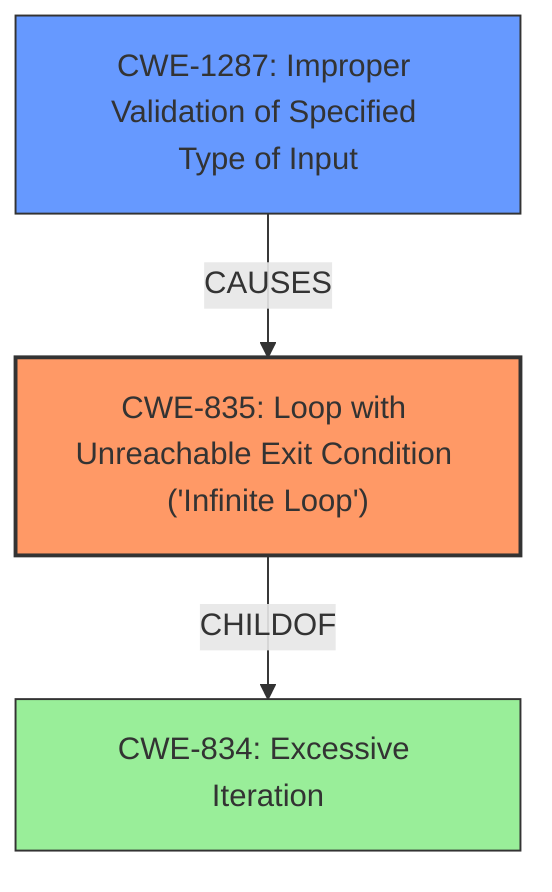

# Analysis for CVE-2021-29486

# Summary
| CWE ID | CWE Name | Confidence | CWE Abstraction Level | CWE Vulnerability Mapping Label | CWE-Vulnerability Mapping Notes |
|---|---|---|---|---|---|
| CWE-835 | Loop with Unreachable Exit Condition ('Infinite Loop') | 0.9 | Base | Primary | Allowed |
| CWE-1287 | Improper Validation of Specified Type of Input | 0.8 | Base | Secondary | Allowed |

## Evidence and Confidence

*   **Confidence Score:** 0.85
*   **Evidence Strength:** HIGH

## Relationship Analysis
The primary relationship is that **CWE-835 (Loop with Unreachable Exit Condition)** is a child of **CWE-834 (Excessive Iteration)**. The vulnerability results in an infinite loop, making CWE-835 a more specific and appropriate choice than CWE-834. Additionally, **CWE-1287 (Improper Validation of Specified Type of Input)** is related as the **lack of input validation** leads to the infinite loop.

## Vulnerability Chain
The vulnerability chain starts with **CWE-1287 (Improper Validation of Specified Type of Input)**, which allows malformed data (strings instead of numbers) to be processed. This then leads to **CWE-835 (Loop with Unreachable Exit Condition ('Infinite Loop'))**, resulting in a denial-of-service condition.

## Summary of Analysis
The initial analysis identified **CWE-835 (Loop with Unreachable Exit Condition)** as the primary weakness due to the direct evidence of an infinite loop in the vulnerability description. The **root cause** of the issue is the **lack of input validation**, leading to the loop. The selection is based on the evidence from the vulnerability description, specifically the phrases "**infinite loop** is possible when the cumulative-distribution-function is evaluated for a given point when the input data is string data rather than type `number`".

The graph relationships influenced the selection by highlighting the connection between improper input validation and the infinite loop.

The selected CWEs are at the optimal level of specificity because **CWE-835 (Loop with Unreachable Exit Condition)** directly represents the resulting infinite loop, and **CWE-1287 (Improper Validation of Specified Type of Input)** accurately identifies the underlying cause.

Relevant CWE Information:

# Enhanced Context (25 CWEs)
The following CWEs were identified as potentially relevant to this vulnerability:

## CWE-834: Excessive Iteration
**Abstraction Level**: Class
**Similarity Score**: 0.75
**Source**: dense

**Description**:
The product performs an iteration or loop without sufficiently limiting the number of times that the loop is executed.

**Mapping Guidance**:
- Usage: Discouraged
- Rationale: This CWE entry is a level-1 Class (i.e., a child of a Pillar). It might have lower-level children that would be more appropriate

**Analysis:** While the vulnerability does involve a loop, **CWE-835 (Loop with Unreachable Exit Condition)** is a more specific child that explicitly describes an infinite loop. Therefore, CWE-834 is less appropriate.

## CWE-407: Inefficient Algorithmic Complexity
**Abstraction Level**: Class
**Similarity Score**: 0.74
**Source**: dense

**Description**:
An algorithm in a product has an inefficient worst-case computational complexity that may be detrimental to system performance and can be triggered by an attacker, typically using crafted manipulations that ensure that the worst case is being reached.

**Mapping Guidance**:
- Usage: Allowed-with-Review
- Rationale: This CWE entry is a Class and might have Base-level children that would be more appropriate

**Analysis:** Although the infinite loop results in inefficient computation, the root cause is not the algorithm itself but rather the lack of input validation. Therefore, **CWE-407** is not the primary issue.

## CWE-606: Unchecked Input for Loop Condition
**Abstraction Level**: Base
**Similarity Score**: 0.73
**Source**: dense

**Description**:
The product does not properly check inputs that are used for loop conditions, potentially leading to a denial of service or other consequences because of excessive looping.

**Mapping Guidance**:
- Usage: Allowed
- Rationale: This CWE entry is at the Base level of abstraction, which is a preferred level of abstraction for mapping to the root causes of vulnerabilities.

**Analysis:** While relevant as a contributing factor, **CWE-1287 (Improper Validation of Specified Type of Input)** more directly addresses the **lack of type validation**, making it a better fit than **CWE-606**, which focuses on loop conditions more generally.

## CWE-667: Improper Locking
**Abstraction Level**: Class
**Similarity Score**: 0.73
**Source**: dense

**Description**:
The product does not properly acquire or release a lock on a resource, leading to unexpected resource state changes and behaviors.

**Mapping Guidance**:
- Usage: Allowed-with-Review
- Rationale: This CWE entry is a Class and might have Base-level children that would be more appropriate

**Analysis:** **CWE-667** is not relevant to this vulnerability, which is related to input validation and loop conditions rather than locking mechanisms.

## CWE-799: Improper Control of Interaction Frequency
**Abstraction Level**: Class
**Similarity Score**: 0.73
**Source**: dense

**Description**:
The product does not properly limit the number or frequency of interactions that it has with an actor, such as the number of incoming requests.

**Mapping Guidance**:
- Usage: Allowed-with-Review
- Rationale: This CWE entry is a Class and might have Base-level children that would be more appropriate

**Analysis:** **CWE-799** does not apply as the vulnerability isn't related to interaction frequency but to the handling of specific malformed inputs causing an infinite loop.

## CWE-1289: Improper Validation of Unsafe Equivalence in Input
**Abstraction Level**: Base
**Similarity Score**: 0.73
**Source**: dense

**Description**:
The product receives an input value that is used as a resource identifier or other type of reference, but it does not validate or incorrectly validates that the input is equivalent to a potentially-unsafe value.

**Mapping Guidance**:
- Usage: Allowed
- Rationale: This CWE entry is at the Base level of abstraction, which is a preferred level of abstraction for mapping to the root causes of vulnerabilities.

**Analysis:** **CWE-1289** is not a good fit. The vulnerability isn't about validating equivalence but about validating the *type* of input.

## CWE-754: Improper Check for Unusual or Exceptional Conditions
**Abstraction Level**: Class
**Similarity Score**: 0.72
**Source**: dense

**Description**:
The product does not check or incorrectly checks for unusual or exceptional conditions that are not expected to occur frequently during day to day operation of the product.

**Mapping Guidance**:
- Usage: Allowed-with-Review
- Rationale: This CWE entry is a Class and might have Base-level children that would be more appropriate

**Analysis:** While the lack of type validation could be considered an improper check for exceptional conditions, **CWE-1287 (Improper Validation of Specified Type of Input)** is more specific and therefore a better fit.

## CWE-703: Improper Check or Handling of Exceptional Conditions
**Abstraction Level**: Pillar
**Similarity Score**: 0.72
**Source**: dense

**Description**:
The product does not properly anticipate or handle exceptional conditions that rarely occur during normal operation of the product.

**Mapping Guidance**:
- Usage: Discouraged
- Rationale: This CWE entry is extremely high-level, a Pillar.

**Analysis:** **CWE-703** is too general and not appropriate given the availability of more specific CWEs like **CWE-1287 (Improper Validation of Specified Type of Input)**.

## CWE-1325: Improperly Controlled Sequential Memory Allocation
**Abstraction Level**: Base
**Similarity Score**: 0.72
**Source**: dense

**Description**:
The product manages a group of objects or resources and performs a separate memory allocation for each object, but it does not properly limit the total amount of memory that is consumed by all of the combined objects.

**Mapping Guidance**:
- Usage: Allowed
- Rationale: This CWE entry is at the Base level of abstraction, which is a